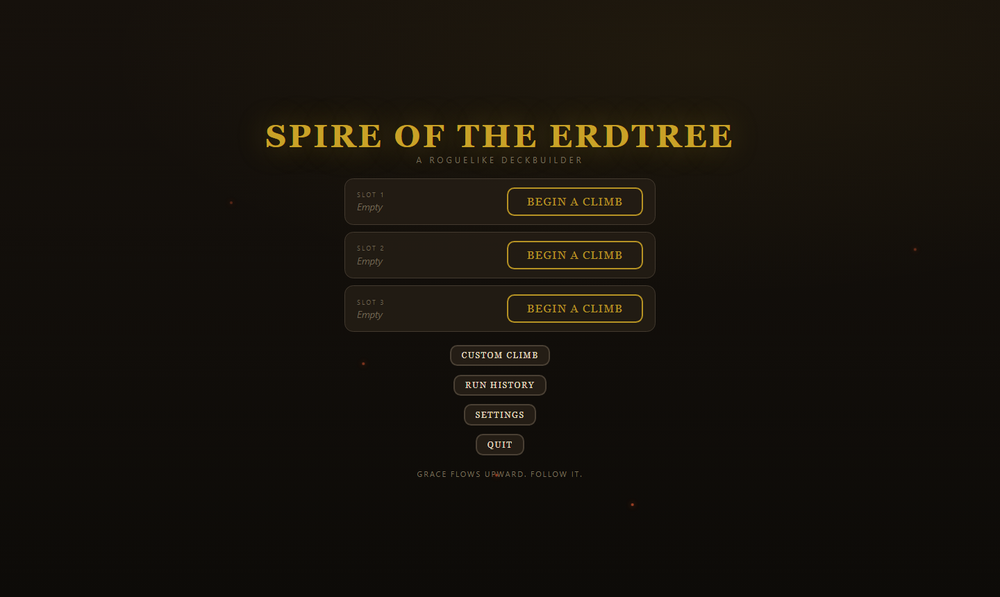
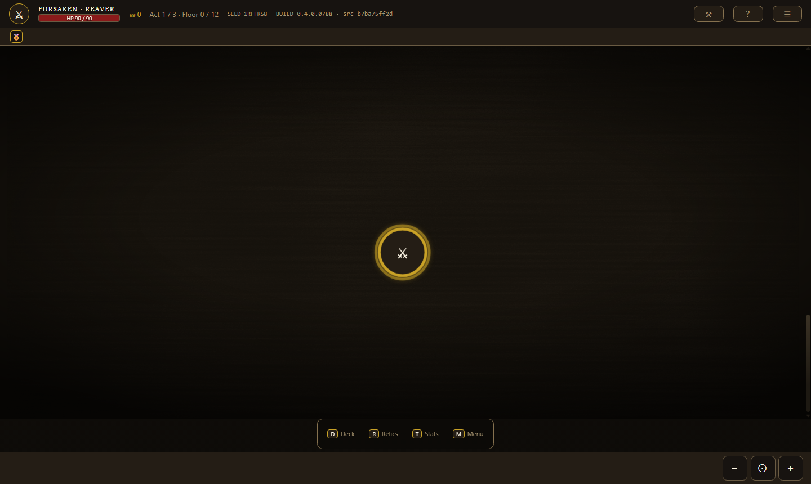
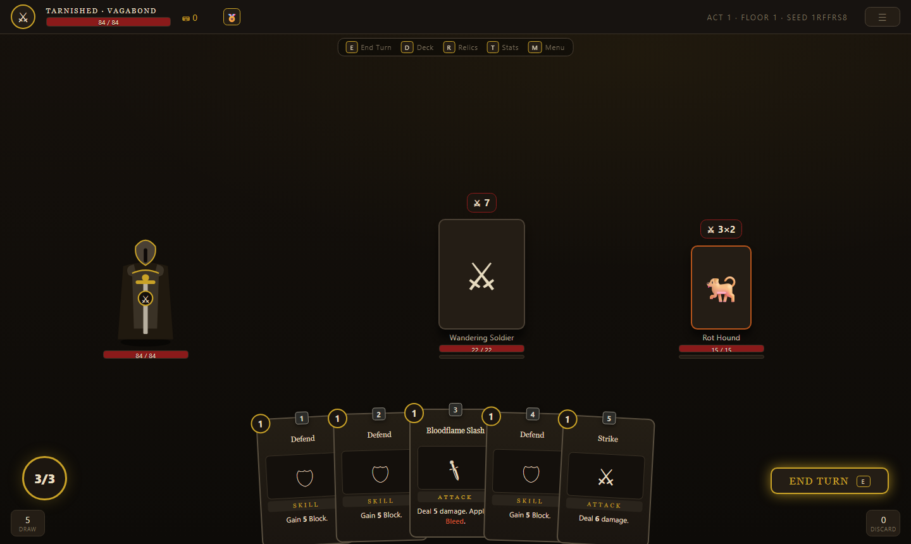

# AshenSpire — Ashen Spire

A single-player roguelike deckbuilder for the browser. Mechanically faithful to **Slay the Spire**, thematically inspired by (but legally distinct from) **Elden Ring**. Built with vanilla ES-module JavaScript, HTML, and CSS — no framework, no build step.

> **Status: feature-complete core loop.** Four classes, three acts, three bosses, seeded and save-resumable end to end. See [DEVELOPER.md](DEVELOPER.md) to run and extend it.

## Play the current development build

**[Play AshenSpire in your browser](https://cehinds.github.io/AshenSpire/AshenSpire.html)**

**[AshenSpire Project #4](https://github.com/users/cehinds/projects/4)** owns
workflow status. **[Status & Daily Briefs](https://github.com/cehinds/AshenSpire/issues/183)**
is the readable projection, with timestamped updates and Daily Briefs.

**[AshenSpire UI Component Catalog](https://cehinds.github.io/AshenSpire/docs/component-catalog.html)** —
the interactive reference for stable component IDs, model and renderer names,
live visual specimens, and reuse surfaces. UI delivery summaries list the exact
changed IDs; an origin-bound UI change updates both catalog formats in the same change.

**[QA Testing](docs/QA-TESTING.md)** and the
**[feature delivery loop](docs/FEATURE-DELIVERY-LOOP.md)** — the repeatable
design, build, responsive playtest, evidence, and documentation process used for
player-facing changes. The current Smith modal write-up is
[here](docs/qa/2026-08-25-smith-modal-design.md).

**[CHANGELOG.md](CHANGELOG.md)** — what changed, newest first, each entry
naming the pull request that landed it and the build number it shipped in.

**[Development governance](docs/governance/README.md)** — the versioned
authority, lifecycle, ticket, quality, decision, and runbook control plane.
The legacy **[coordination workflow](docs/COORDINATION-WORKFLOW.md)** remains a
compatibility entry point. The **[Art integration runbook](docs/governance/RUNBOOKS/art.md)**
defines the Proposal → Approved → Active lifecycle and, when active, the
mandatory integration package triggered by an approved art suggestion without
granting implementation, publication, or release authority. Its independently
reviewed governance head is Approved before canonical integration and Active
when that exact head is contained in canonical `dev`; no merge-time status or
version edit is required.

**[Architecture map](docs/ARCHITECTURE-MAP.md)** — the stable
composition/component redesign contract. The [current-`dev` architecture
snapshot](docs/ARCHITECTURE-CURRENT-DEV.md) is refreshed automatically after
every push to `dev` without rewriting the core contract.

That stable GitHub Pages URL publishes the repository-root `AshenSpire.html`
from `main` and follows the newest reviewed development build after GitHub Pages
finishes deploying it. This is a **development preview**, not a release, tag, or
production approval. Release status remains governed separately and is currently
**RED**.

Work reaches `main` only through the promotion gates in
[decision 0009](docs/governance/DECISIONS/0009-promotion-gates-a-through-f.md);
`dev` is the integration branch and is not published. A change merged to `dev`
is therefore not yet visible at the preview URL.

### Owner-facing views

Both are generated from validated repository state by `opsctl render` and
drift-gated by `opsctl verify`, so neither can quietly diverge from the control
plane it reports on:

- **[Review &amp; Approval Hub](https://cehinds.github.io/AshenSpire/review-approval-hub/)**
  — what needs the owner, every ticket with its authority and event chain,
  live writer leases, the authority tiers, and where a question goes.
- **[Owner HUD](https://cehinds.github.io/AshenSpire/hud/)** — the compact
  read-only status projection, with compare-and-swap decision links.

For offline play, download [`AshenSpire.html`](AshenSpire.html) from the
repository root and double-click it. It is a self-contained file and requires
no installation.

The root file is a discoverability alias for [`dist/AshenSpire.html`](dist/AshenSpire.html).
Both are generated from [`build/AshenSpire.html`](build/AshenSpire.html) by
`node tools/launch.mjs --build-only`, and `node tools/verify-shipped.mjs` fails if
either copy differs from that build. The file is development evidence, not a
release declaration; release status remains governed separately.

## Current development screenshots

These canonical images are captured from the exact `dev` tree by
`node tools/screenshot.mjs`. Regenerate and review them whenever the development
build changes; the visible build stamp ties each image to the tree that drew it.

> **Look at any image you regenerate before you commit it.** `tools/screenshot.mjs`
> sizes the *window* rather than the viewport, so under Chromium 141 it writes a
> picture whose bottom band is blank and still **exits 0**. Measured 2026-08-21 at
> `456b8ea`: its one-shot path produced **87 blank rows** at the bottom of a
> 1440x860 capture, where a CDP capture of the same page at the same size produced
> **0**. A green exit is not a good picture.

| Title | Act map | Combat |
|---|---|---|
| [](https://cehinds.github.io/AshenSpire/AshenSpire.html) | [](https://cehinds.github.io/AshenSpire/AshenSpire.html) | [](https://cehinds.github.io/AshenSpire/AshenSpire.html) |

Armoury reference captures: [Character](docs/preview/armoury-1191-character-desktop.png),
[Inventory](docs/preview/armoury-1191-inventory-desktop.png),
[Hybrid](docs/preview/armoury-1191-hybrid-desktop.png),
[whole-card hold progress](docs/preview/armoury-1191-hold-progress-desktop.png),
[comparison tooltip](docs/preview/armoury-1191-comparison-tooltip-desktop.png), and
[390×844 phone](docs/preview/armoury-1191-phone.png).

The in-game changelog is checked through the real title → Settings → Changelog route
by `node tools/about-changelog.mjs`.

## UI component library

Use the [AshenSpire component catalog](docs/component-catalog.html) for the
stable component IDs, model/factory names, renderers, reuse surfaces, and a
distinct visual miniature for every component. Select any component card for its
detail drawer; the [Folding Tray gallery](docs/tray-gallery.html) shows every
top/right/bottom/left folded and unfolded state. The [Markdown catalog](docs/COMPONENT-CATALOG.md) is the
chat-friendly reference. The [component model architecture](docs/COMPONENT-MODEL-ARCHITECTURE.md)
defines the model, renderer, host, behavior, service, and infrastructure
boundaries used as screens migrate. The [Folding Tray contract](docs/TRAY-COMPONENTS.md)
defines the shared Top, Right, Bottom, and Left disclosure grammar. The
[Armoury layout contract](docs/ARMOURY-LAYOUT-BRIEF.md) and
[asset-component index](docs/ASSET-COMPONENTS.md) name the exact Character,
Armaments, Inventory, Cards, Stats, card-hold, comparison, and resizing
surfaces shown in the current build. Any merge or PR that changes a UI element
or component must update the interactive and Markdown catalogs in the same
origin-bound change and include `Changed catalog components: <id...>` plus this
catalog link in its summary. If the surface has no stable ID, add one first.

The catalog now decomposes the complete title flow as reusable families:
`startup-gate` contains the transparent-on-phone folded mark, deterministic ash,
wordmark, subtitle, divider, and input-family prompt; `title-menu` contains the
six centered actions and their selection ornament; and `title-menu-modal`
contains the shared Load/New heading, slot list, slot receipts and states,
hold-to-delete control, and Back/Continue action group. Reference captures:
[folded wide](docs/preview/startup-folded-wide-1440x900.png),
[folded phone](docs/preview/startup-folded-mobile-390x844.png),
[title wide](docs/preview/title-menu-wide-1440x900.png), and
[Load phone](docs/preview/title-load-mobile-390x844.png). Catalog QA is recorded
at [title-family wide](docs/preview/component-catalog-title-wide-1440x900.png)
and [startup-family phone](docs/preview/component-catalog-startup-mobile-390x844.png).

More: the three [class sprites](docs/preview/class-sprites.svg).

## Playing

**One-click (recommended):** double-click **`run.bat`** (Windows) or run **`./run.sh`**
(macOS/Linux). This builds the standalone into `dist/`, serves the live app on
`http://localhost:8080`, and opens it in your browser. Requires
[Node.js](https://nodejs.org) (used only as a tiny static server + bundler — no
packages to install).

**Standalone file:** grab **[`AshenSpire.html`](AshenSpire.html)** from the root
(or the byte-identical [`dist/AshenSpire.html`](dist/AshenSpire.html)) — the
entire game compiled into one self-contained HTML file. Double-click to play,
no server needed. (External music folders need http; see [dist/README.md](dist/README.md).)

**Manually:** open `index.html` via any static server:

```
node tools/serve.mjs      # zero-dependency, opens the browser
# or
npx serve .
# or
python -m http.server
```

No install, no framework, no build step for the source.

## What is this?

- **A run:** pick a class → traverse a branching map across 3 acts → fight enemies with a deck of cards → collect relics, flasks, and cinders → beat the final boss or die trying (seeded, reproducible runs).
- **Four distinct classes:** Reaver leads with strike damage, Rogue with defense and actions, Starseer with magic, and Herald with a balanced martial-support kit. Their starting attributes and equipment are data-owned and validated through the shared character-creation flow.
- **One reusable run HUD:** Map and Combat compose the same model-driven header, vitals, Quick Access, relic, and potion components. Stable IDs and tuning tokens are documented in the component catalog so UI changes name the exact surface they affect.
- **One data-driven Armoury:** Character, Inventory, and Hybrid are presentations of the same equipment owner. Character places the contained figure beside expandable Combat Power, Attributes, and Relics; Inventory pairs procedural Armaments with the one shared carried-item list; Hybrid keeps the compact Character stack beside Armaments. Armaments, Inventory, Cards, and Stats use the shared Folding Tray grammar. Equipment cards drag as one surface and, when hold-confirm is enabled, fill across the whole folded or expanded card while equipping, moving, or unequipping. The fixed authored attack slots rebind in place to the active weapon package: a lone left- or right-hand weapon owns all of them, dual wield splits them right-first without deck growth, and the comparison receipt shows the exact before/after counts.
- **Faithful StS mechanics:** 3 energy / draw 5 turns, block that expires, telegraphed enemy intents, exhaust/ethereal/retain keywords, exact StS damage-order math.
- **Elden Ring flavor with real mechanics:** Bleed as a build-up meter that bursts for %-max-HP damage, Crimson Blight as a non-decaying timed DoT, and a Poise/Stagger system that skips enemy turns and opens damage windows.
- **Character creation, one panel at a time:** six folded picks — class, starting kit, keepsake, sigil, tint, sprite — each pick opens the next, and the column reads your choices back in words. Below them, **starting armour** and **stat points** sit open as rows of their own: both change the run, so neither folds, and editing them never marches you on to the next section. Mouse, keyboard, and pad all walk the same flow; pressing Confirm repeatedly accepts the defaults.
- **Rewards you open before you collect:** post-fight spoils are a menu — cinders, cards, flasks, armaments, relics — and nothing joins your run until you take it, so you can look first and back out unchanged. A reward you have no room for says so on its own row, and is the only row that offers Skip. Continue is always pressable; Settings → Advanced → Reward collection decides whether it sweeps up the rest for you or simply means *done*.
- **A merchant who buys back:** the shop is five collapsing bars — cards, relics, flasks, remove-a-card, and Sell — one open at a time. He buys back relics and flasks at half his own cheapest price, and the Sell bar can be switched off entirely in Settings.
- **An in-game development changelog:** Settings → Changelog reads the repository changelog as concise expandable rows, while development build stamps link back to the exact source repository and release-shaped standalone files remain inert.
- **Responsive browser play:** portrait and fitting short-wide landscape layouts stay playable down to 340 CSS pixels high; smaller viewports show a clear, recoverable short-screen warning instead of a clipped board — a warning that reads whole even at the largest accessibility text size. Fullscreen is one toggle, first under Settings → Display.

Full design: **[SPEC.md](SPEC.md)** (rules, schemas, numbers) and **[docs/GDD.md](docs/GDD.md)** (design intent, UI mockups, art direction). The original brief: **[PROMPT.md](PROMPT.md)**.

## Roadmap

| Milestone | Scope | Status |
|---|---|---|
| **M1** | Combat vertical slice — Reaver class, 24 cards, Act 1 enemies + elite + boss, full combat UI | **shipped** |
| **M2** | The run — map generation, rewards, relics, flasks, shops, events, save/continue, seeds | **shipped** |
| **M3** | Content — Rogue, Starseer & Herald classes, Acts 2–3, full relic/event pools, balance pass | **core content shipped**: 4 classes, 3 acts, 40 relics, 10 events, ~30 cards/class + colorless, first balance pass ([BALANCE.md](docs/BALANCE.md)). Deeper pools (~50) & win-rate tuning await playtest telemetry (M4) |
| **M4** | Polish — fx, run history, keyboard shortcuts, asset pass | **shipped**: fx, customization, run-history + win-rate telemetry, keyboard shortcuts (1–9 / E / Esc), first-run tutorial, sfx hooks, DEVELOPER.md walkthroughs + perf notes, placeholder art tuned across all acts. Bundling real external art/audio is a deliberate v1 deferral (SPEC §11 non-goal) — the generated-placeholder system is the shipped visual style |

Acceptance criteria per milestone are in [SPEC.md §9](SPEC.md).

## Repository layout

```
PROMPT.md        the build brief
SPEC.md          the full design + technical specification (source of truth)
AshenSpire.html  current standalone development build (root convenience copy)
index.html       game entry point (lands with M1)
styles/          CSS
src/model/       schemas, registries, formula evaluator, validation
src/engine/      generic interpreters + procedural generators — no DOM access
src/content/     ALL game data: cards, statuses, enemies, relics, events, tuning
src/ui/          rendering and input
tests/           headless engine tests (open tests/index.html, expect all green)
DEVELOPER.md     how to add a card/relic/enemy/event (lands with M1)
docs/            design, component, and development-coordination documentation
CREDITS.md       every asset's source and license
```

Design rule: adding a new card touches exactly **one** file in `src/content/`.

## Branches

| Branch | Purpose |
|---|---|
| `main` | Stable, playable. Only receives merges from `release`. |
| `release` | Release staging — final checks before merging to `main`. |
| `dev` | Integration branch. Feature branches merge here. |
| `test` | Balance/playtest experiments that may never ship. Branched from `dev`. |
| `feature/*` | One branch per unit of work (e.g. `feature/m1-combat-slice`), branched from `dev`, merged back via PR. |

Flow: `feature/* → dev → release → main`. See [CONTRIBUTING.md](CONTRIBUTING.md).

## Legal

Code is MIT ([LICENSE](LICENSE)). This is a fan-inspired original work: it contains **no** FromSoftware assets, music, or proper nouns, and is not affiliated with or endorsed by FromSoftware or Bandai Namco. All art assets are CC0/CC-BY/OFL and attributed in [CREDITS.md](CREDITS.md).
