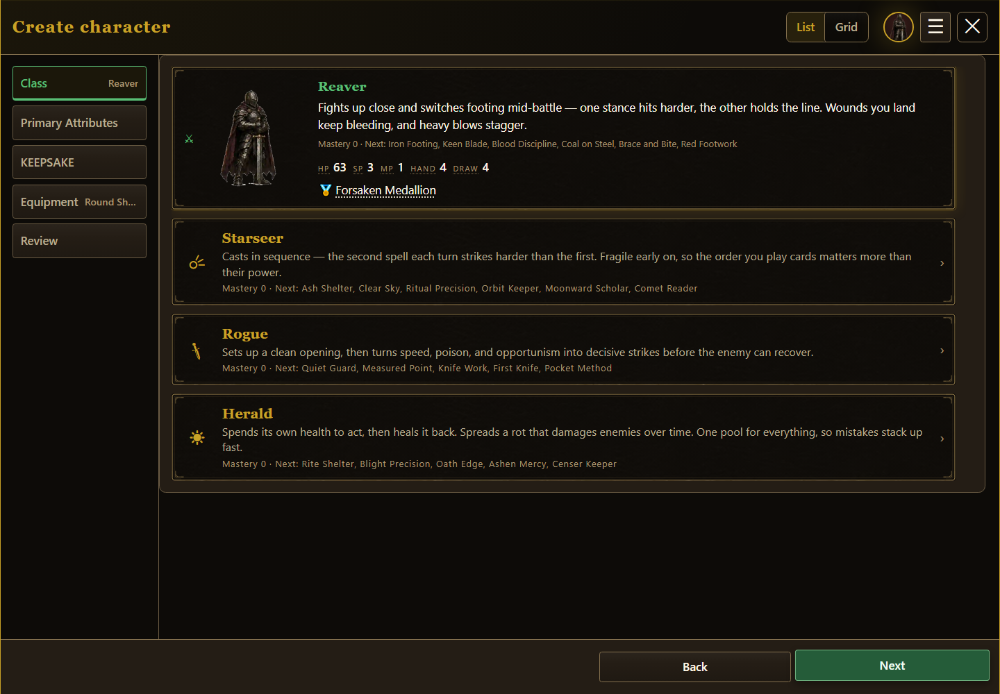
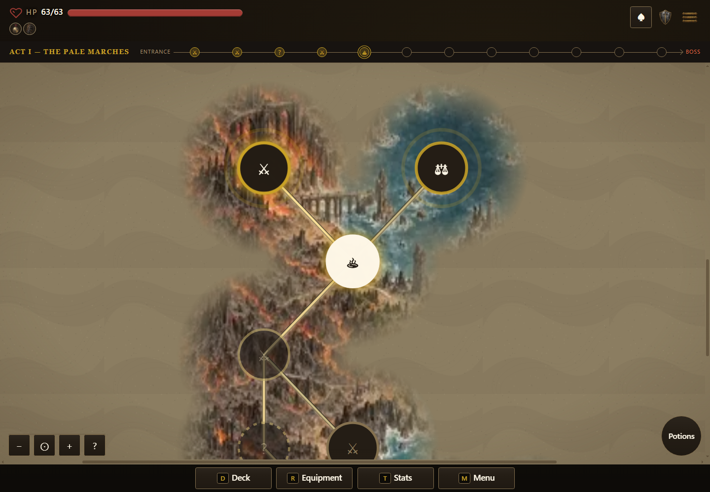
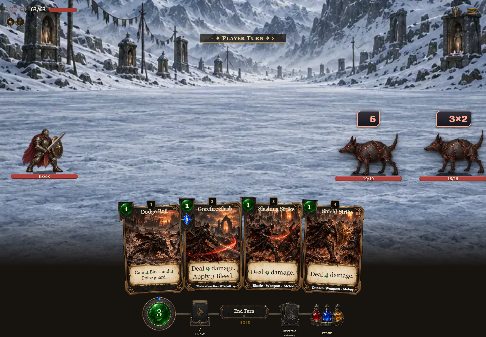
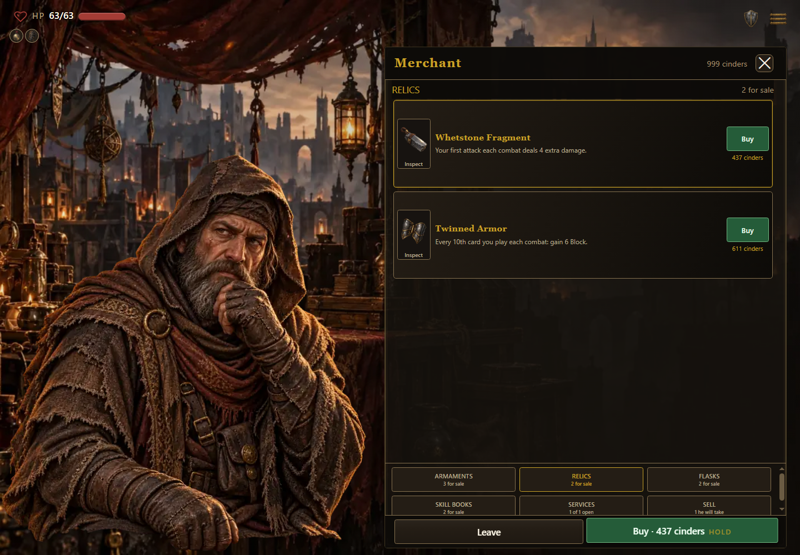
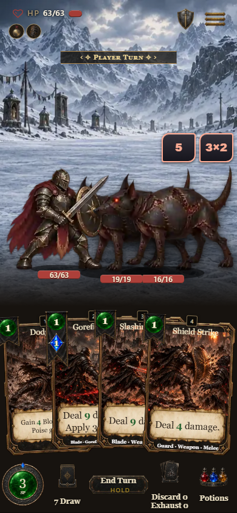

# AshenSpire

A browser roguelike: build a character, explore a seeded world, and fight with cards.

> **AI-made game.** The original game code, design, writing, artwork and music
> are created by AI under human direction. Third-party fonts and software are
> exceptions; some asset records still need confirmation. [AI acknowledgement and credits](#legal-and-credits).

[Play](#play-and-download) · [Screenshots](#screenshots) · [Features](#features) · [Guides](#guides)

## Play and download

Choose **Test** for the latest promoted game. Badges show the full **published**
build number and link to its history. Play and HTML follow that channel's latest build.

| Channel | Published build / history | Play | Download |
| --- | --- | --- | --- |
| **Test** — promoted |  | [Play Test](https://cehinds.github.io/AshenSpire/test/latest/) | [HTML](https://cehinds.github.io/AshenSpire/test/latest/download/AshenSpire.html) |
| Dev — integration |  | [Play Dev](https://cehinds.github.io/AshenSpire/dev/latest/) | [HTML](https://cehinds.github.io/AshenSpire/dev/latest/download/AshenSpire.html) |
| Release — candidate |  | [Play Release](https://cehinds.github.io/AshenSpire/release/latest/) | [HTML](https://cehinds.github.io/AshenSpire/release/latest/download/AshenSpire.html) |
| Main — earlier stable |  | [Play Main](https://cehinds.github.io/AshenSpire/main/latest/) | [HTML](https://cehinds.github.io/AshenSpire/main/latest/download/AshenSpire.html) |
| Alternative Dev |  | [Play Alternative Dev](https://cehinds.github.io/AshenSpire/alternative/dev/latest/) | [HTML](https://cehinds.github.io/AshenSpire/alternative/dev/latest/download/AshenSpire.html) |
| Alternative Test |  | [Play Alternative Test](https://cehinds.github.io/AshenSpire/alternative/test/latest/) | [HTML](https://cehinds.github.io/AshenSpire/alternative/test/latest/download/AshenSpire.html) |

**Windows:** [Test installer / build chooser](https://github.com/cehinds/AshenSpire/releases/download/installer-test/AshenSpire-Setup.exe)
· [Installer build number](https://github.com/cehinds/AshenSpire/releases/tag/installer-test)
· [Installation guide](desktop/windows/README.md).
The chooser identifies the selected game build; its installer can be newer than the hosted Test badge.

[All builds](https://cehinds.github.io/AshenSpire/) · [ZIP artifacts](https://github.com/cehinds/AshenSpire/actions/workflows/dev-preview.yml) · [Changelog](CHANGELOG.md).
Publication can lag source changes. For ZIPs, open a successful run and download its named build artifact.

## Screenshots

Latest published Release candidate **0.7.1.1060**, captured 2026-10-08 UTC.
[Play this exact build](https://cehinds.github.io/AshenSpire/release/1060/) · [Capture details](docs/preview/releases/0.7.1.1060/README.md).
Dev/Test can contain newer features. Select an image to view its full size.

| Create a character | Explore a route |
| --- | --- |
|  |  |
| **Fight with cards** | **Visit shops and improve equipment** |
|  |  |

Phone combat — 390 × 844

## Features

Checked items are implemented; build channels and older saves can differ.

- [x] Four classes: Reaver, Rogue, Starseer, Herald
- [x] Seeded exploration, encounters, shops and bosses
- [x] Card combat with enemy intentions, equipment and statuses
- [x] Deck building, skill training, attributes and rewards
- [x] Saved runs, offline play and phone layouts
- [x] Optional LAN co-op
- [x] Alternative appearance by default; optional Classic appearance with the debug flag on
- [ ] Complete 1.0 release acceptance — [remaining work](docs/FINISH.md)

## Guides

[Getting started and project links](docs/PROJECT-GUIDE.md) · [Contributing](CONTRIBUTING.md)
· [Game rules](SPEC.md) · [Development](DEVELOPER.md) · [Credits](CREDITS.md).

## Legal and credits

**“Ashen Spire was built by AI under human direction.”** Anthropic Claude and
OpenAI ChatGPT/Codex created the original game work under the owner's direction.
The [full AI acknowledgement](src/content/aiDisclosure.js) describes code,
writing, generated art and synthesized music. No AI model runs while you play.

**Not AI-made by this project:** bundled fonts are third-party work under
[SIL OFL 1.1](asset-data/fonts/OFL.txt); system emoji come from your OS/browser;
Electron and its dependencies have their own licences. The project's
[MIT code licence](LICENSE) does not replace those licences.

**Rights review remains open:** [CREDITS.md](CREDITS.md#ai-authorship-and-third-party-exceptions)
identifies unrecorded flask/landmark sources and incomplete sprite/map rights.
AI authorship is not a guarantee that every asset's provenance or licence is cleared.
No FromSoftware assets or affiliation are claimed.
