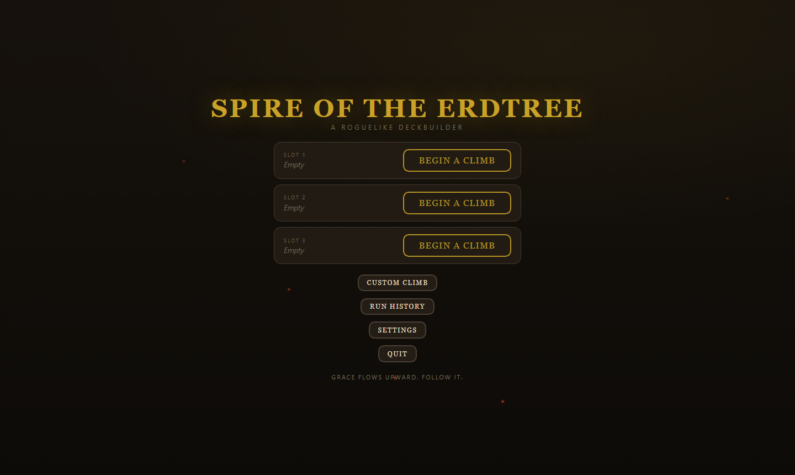
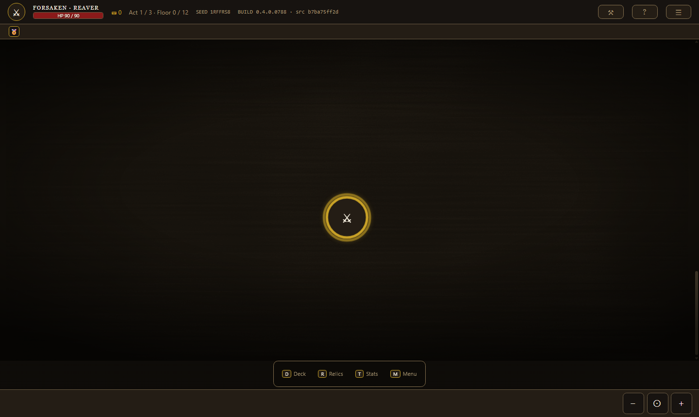
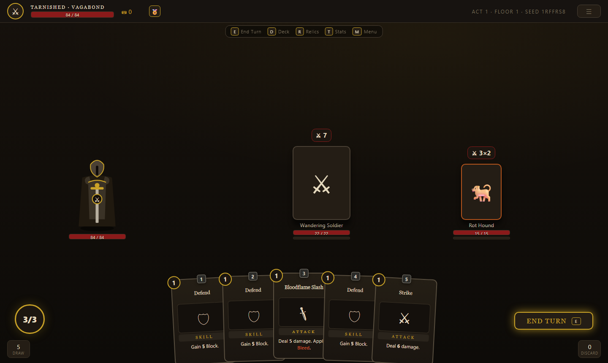

# AshenSpire — Ashen Spire

A browser roguelike that combines card combat with equipment, attributes, skill training, and exploration.

- Build a character as well as a deck: weapons shape your basic attacks, armour changes your defenses and weight class, and books can teach skills from other classes.
- Play single-player or optional LAN co-op.
- Choose from four starting classes and follow seeded regional routes in resumable runs with configurable rules.
- Written in vanilla JavaScript ES modules, HTML, and CSS, with Node tooling for builds and local LAN play.
- This README describes the current browser game's `dev`/`test` mechanics; a published `release` or `main` build can be older. The title screen and each branch's build list identify the version you are playing.

- **[Play / download builds](https://cehinds.github.io/AshenSpire/)**
- **[Windows installer](https://github.com/cehinds/AshenSpire/actions/workflows/windows-installer.yml?query=branch%3Atest)**
- **[Art repository](https://github.com/cehinds/AshenSpire-art)**
- **[Unity version: AshenedSpire](https://github.com/cehinds/AshenSpire-Unity)**
- **[Changelog](CHANGELOG.md)**

**This is a development preview**, not production approval. Release acceptance is tracked separately in [docs/FINISH.md](docs/FINISH.md).

## Play and download

### Test

Latest promoted game; full QA runs here.

- [Play test](https://cehinds.github.io/AshenSpire/test/latest/)
- [Download test HTML](https://cehinds.github.io/AshenSpire/test/latest/download/AshenSpire.html)
- [GitHub test build zip](https://github.com/cehinds/AshenSpire/actions/workflows/dev-preview.yml?query=branch%3Atest)
- [Test build history / version](https://cehinds.github.io/AshenSpire/test/)

### Release

Owner-selected release candidate.

- [Play release](https://cehinds.github.io/AshenSpire/release/latest/)
- [Download release HTML](https://cehinds.github.io/AshenSpire/release/latest/download/AshenSpire.html)
- [GitHub release build zip](https://github.com/cehinds/AshenSpire/actions/workflows/dev-preview.yml?query=branch%3Arelease)
- [Release build history / version](https://cehinds.github.io/AshenSpire/release/)

### Main

Owner-promoted stable channel.

- [Play main](https://cehinds.github.io/AshenSpire/main/latest/)
- [Download main HTML](https://cehinds.github.io/AshenSpire/main/latest/download/AshenSpire.html)
- [GitHub main build zip](https://github.com/cehinds/AshenSpire/actions/workflows/dev-preview.yml?query=branch%3Amain)
- [Main build history / version](https://cehinds.github.io/AshenSpire/main/)

### Dev

Integration source.

- [Play dev](https://cehinds.github.io/AshenSpire/dev/latest/)
- [Download dev HTML](https://cehinds.github.io/AshenSpire/dev/latest/download/AshenSpire.html)
- [GitHub dev build zip](https://github.com/cehinds/AshenSpire/actions/workflows/dev-preview.yml?query=branch%3Adev)
- [Dev build history / version](https://cehinds.github.io/AshenSpire/dev/)

**Hosted availability, checked 2026-10-03:** the test/release/main game and HTML-download paths above returned 404 during the mechanics update. Their GitHub build downloads are available. Use the build zip until those hosted paths are published; a green source/build check alone does not prove a live Pages URL.

The hosted links select the latest **published** build, which can lag the branch while publishing runs. For a **GitHub build zip**, sign in, open a successful run for the branch, and download its `<branch>-standalone-<commit>` artifact. Unzip and open `AshenSpire-<branch>-preview.html` (for example, `AshenSpire-test-preview.html`), the self-contained light-art game file. Artifacts are kept for 14 days on dev, 30 on test, and 90 on release/main. Older builds may have different download names; their build histories provide the matching links.

Versions use `<major>.<minor>.<candidate>.<build>`. The build counter restarts when the candidate changes, so compare the full stamp, not just its last number. The source record is each branch's `buildordinal.json`; the build list and title screen identify the published artifact. See [versioning](docs/versioning.md).

### Windows installer

[Download an installer from the Windows installer workflow](https://github.com/cehinds/AshenSpire/actions/workflows/windows-installer.yml?query=branch%3Atest). Sign in to GitHub, open a successful run on the branch you want, and download `windows-installer-<commit>` under **Artifacts**. Unzip and run `AshenSpire-Setup-<version>.exe`.

The installer runs for your Windows user without an administrator prompt and creates Start menu and optional desktop shortcuts. Its **High-quality art: choose branch and version** button opens the art repository's branch and published-version selectors. It shows your installed art version, the art required by this game, and the latest published art version. Choose the compatible high-resolution pack for installation, or **Download this art separately** to save a verified release zip without installing it. Other art versions remain separate downloads until a game build pins them; the standard light art works without the optional pack. The installer discloses that the artwork is completely AI-generated with OpenAI ChatGPT under human direction, with credited licenses retained for fonts and other third-party assets. See the [installer guide](desktop/windows/README.md) for install, upgrade, and uninstall behavior. Installer artifacts are separate from the browser HTML downloads.

### Art and the Unity version

- **[AshenSpire-art](https://github.com/cehinds/AshenSpire-art)** holds the high-resolution masters, fonts, recorded music, map tiles, and authoring sources. This repository carries the simplified `assets-mobile/` light tier. [Art releases](https://github.com/cehinds/AshenSpire-art/releases) provide the matching high, light, and common packs; `art-release.json` pins the compatible release.
- **[AshenedSpire — Unity adaptation](https://github.com/cehinds/AshenSpire-Unity)** is a separate mobile-first native C# project. Its [playable channels and downloads](https://cehinds.github.io/AshenSpire-Unity/) and [milestone status](https://github.com/cehinds/AshenSpire-Unity/blob/dev/docs/Unity-Milestones.md) have their own version and parity evidence; the browser build number does not describe the Unity build.

### Local and offline play

Install Node.js 22, clone this repository, and fetch the shared assets with `node tools/fetch-art.mjs --pack common`. The local light tier is already present; `node tools/fetch-art.mjs --pack light` is optional when checking the release copy. Then run `node tools/launch.mjs`, `run.bat` on Windows, or `./run.sh` on macOS/Linux. There is no root `package.json` and no root `npm install` step. The launcher builds the game, serves it at `http://localhost:8080`, and opens your browser. Options include `--no-open`, `--port <n>`, `--build-only`, and `--full-art` (fetch the high pack too for that build).

New builds provide a web game with external art packs and a self-contained light-art HTML download. The download plays by double-click with no server; local builds put it at `AshenSpire.html` and `dist/download/AshenSpire.html`. The web edition at `dist/AshenSpire.html` also opens from disk while its `packs/` and `objects/` remain beside it. Hosted builds can be cached with **Download & saves → Make available offline**, or downloaded as a folder zip. Recorded music plays over HTTP; disk builds use synthesized music. LAN co-op requires the launcher's Node server. Details: [dist/README.md](dist/README.md).

Test/dev use light art; release/main web builds default to high art with a light fallback. Settings → Display → Art quality offers Auto, Light, High, and a local high-resolution folder. Auto chooses light on a phone. There is one game page and one light-art download, rather than separate full-art and mobile HTML editions.

## How the game works now

### Character and journey

Choose **Reaver**, **Rogue**, **Starseer**, or **Herald**, then choose starting gear, attributes, keepsake, and appearance. Standard uses the class preset; Assign points starts every attribute at 1 and lets you place three points. **Quick start** begins with the recommended Reaver setup and skips character creation and the opening for that climb.

The seeded climb visits the Hollow Weald, Pale Marches, and Cinder Reach in a run-specific order. Region determines the scenery and encounter pool; the tier at which you meet it determines difficulty. Fight, explore Unknown nodes, visit services, gather cinders and equipment, and reach the final boss. World Journey also provides an authored atlas, towns, quest boards, and legacy dungeons. Event history and quest progress determine which follow-up encounters can appear. Custom Climb supports alternative rules, including Sealed and Draft starting decks and Endless play.

| Class | Starting identity |
|---|---|
| Reaver | Close combat, stance changes, Bleed, and heavy impact |
| Rogue | Fast setups, poison, and attacks that exploit openings |
| Starseer | Spell sequences, magical damage, and resource planning |
| Herald | Martial support, healing, and oath/blight synergies |

### Combat: cards and three resources

Enemy intents show what is coming. Cards spend **Stamina (SP)** and may also cost **Mana** or HP. Stamina is the turn budget: every class starts with 3 base SP, plus growth from Dexterity, Constitution, Wisdom, Intelligence and level, and it refills each turn. The emerald orb shows SP; sapphire diamonds around its rim show mana. Turn Mana ring off in Combat settings to restore the top MP bar. Mana carries between fights and is restored through effects, flasks, and suitable rest services. Recovery rules are configurable.

The solo default **retains unplayed cards** and draws the character's Draw stat each turn up to hand capacity. The opening hand, per-turn draw, capacity, and resource pools derive from attributes and configured stat rules. This is no longer a fixed “draw five, discard everything” loop. Ethereal, Exhaust, Retain, and Power rules still govern individual cards. Settings can change hand retention, draw, discard, and deck-order behavior.

Select a card to preview its legal targets. Its circular **(i)** button opens the full card details and play action; a stationary hold can play it. A targeted card then asks for its target. Keyboard and gamepad controls are supported, and unavailable actions show their reason.

### Ratings, defense, and Dodge Roll

The current solo rules use **Attack Rating (AR)**, **Defense Rating (DR)**, and **Potency Rating (PR)** alongside HP, Mana, Stamina, **Poise**, and **Ward**. Attributes, equipment, relics, and statuses contribute to them. Physical attack damage uses AR, physical defensive Block uses DR, and magical damage, Block, and healing use PR. Poise and Ward also resist physical and magical damage and configured hostile status buildup.

Hits that damage HP can build physical impact against Poise or magical impact against Ward. Breaking Poise causes **Stagger**; breaking Ward causes **Disruption**. Under these solo defaults an enemy loses its next move, while the player starts the next turn with reduced Stamina. Block that absorbs the entire hit prevents its automatic impact. Bleed, Venom, Frost, Crimson Blight, and other effects have their own buildup, duration, or trigger rules; inspect them in combat for the current values.

Equipment weight versus carrying capacity determines **Light, Medium, or Heavy** weight class. In a Standard deck, Dodge Roll is an equipment-independent card. It checks Dexterity against a d20 and grants Block on success; it does not guarantee avoidance. Light and Medium cost 1 Stamina; Heavy costs 2 Stamina. The combat result shows the check and guard gained.

### Equipment and deck construction

The Armoury owns your right/left hands, prepared sets, armour, inventory, and card sources. Basic attack slots take their face from the equipped weapon package; dual wield divides those slots between the hands without automatically growing the deck. Equipment can also lend guards, techniques, and weapon arts. Lent cards follow their item when it is equipped or removed, while cards you learn or acquire are owned independently.

You can change carried equipment on your turn in combat, paying the configured swap cost in Stamina. Card sources, ratings, maximum resources, and weight class update with the change. Equipment ownership and requirements still apply.

The **Deck editor** moves owned cards between the active deck and a sideboard outside combat. Defaults allow editing freely outside combat, require at least ten active cards, and impose no maximum size. Basic Strike/Defend slots are unlimited; other cards use owned-copy limits, with a default single active copy for the current class's spells and Powers. Cross-class book lessons are exempt from that own-class limit. Item-owned cards are managed through equipment. Deck bounds, copy limits, editing locations, and ordered draw are configurable. Excess limited copies go to the sideboard rather than disappearing.

**Sealed and Draft** preserve the dealt card pool: changing gear still changes relevant weapon bonuses but does not insert the equipment's normal lent cards, weapon arts, or Dodge Roll. These modes also refuse extraction of equipment cards at a smith; seating an owned card remains available.

### Progression, books, and rewards

Character XP earns levels and attribute points; leveling is not bought with cinders. Weapon, focus, armour-weight, dual-wield, and class tracks have their own XP. Claim a ready Level action, keep any surplus XP toward the next step, and choose the offered skill or class reward when available. Class progression unlocks talent tiers and subclass choices. Combat rewards show progression separately from ordinary card drops; card chances, choice counts, XP curves, and per-fight level limits are configurable.

Read books outside combat from the Armoury's inventory. **Manuals** give track XP and a matching card choice, including cross-class cards; **spellbooks** teach matching spells; **Universal Tomes** let you choose a track and lesson. **Class books** give class XP on every read and learn a reusable class card on the first read. They independently roll a matching combat card (default 25%) and feat (default 5%), with both chances configurable. Learned class cards can be equipped, switched, or removed outside combat; stored class progress is preserved.

Post-fight rewards are collected through a menu. A reward joins the run when taken, and collection settings control what Continue gathers automatically. Drops can include relics, flasks, equipment, crafting materials, and sigils. A legendary sigil is attuned for its own property effects rather than treated as an ordinary card.

### Markets, smiths, masters, and recovery

- **Markets** sell cards, relics, utility flasks, armaments, weapon arts, and additional rolled shelves such as armour, Smithing Stones, sigils, books, revive tokens, or companions. They also offer removal and buy back eligible items.
- **Blacksmiths** upgrade equipment and its affected cards, refine stones, work with sigil slots, and extract, install, or upgrade weapon arts. A service appears only when the visit offers it and the item meets its requirements.
- **Wise masters** train their listed skills, offer matching lessons and books, appraise progress, and respec skill XP into a training pool for redistribution. Default classic merchant nodes remain markets; Advanced → Shops can change the weights for smith/master visits.

Rest is a location service: camps, shrines, chapels, and inns have different recovery and editing options. Refillable Crimson/HP and Azure/Mana flasks share an allocation pool that can be redistributed at suitable grace services; growth items can increase it. Utility flasks are separate consumables. Drinking outside combat is an optional setting. Revive tokens and hired companions provide their authored effects when owned.

### Co-op, saves, and configurable rules

**Forsaken Together** shares a LAN map, route votes, and combat while each player keeps their own deck, relics, and flasks. A disconnected seat can return through catch-up. Modern LAN seats use the shipped retained-hand behavior and their own stat rows; legacy seats can keep older rules. Solo rating settings, configurable hand behavior, and some progression reward doors are not universally shared by the LAN path; the [spec](SPEC.md) records those boundaries.

Runs are seeded, autosaved, and resumable. The profile stores settings, unlocks, and history separately. Many game-rule settings are snapshotted into a run, so older saves can retain older mechanics or numbers; settings that apply live say so in their descriptions. Advanced settings expose the stat formulas, hand and deck rules, recovery, rewards, shops, and progression. For exact behavior, use the in-game descriptions, [SPEC.md](SPEC.md), and [developer guide](DEVELOPER.md).

The broader typed-damage, deterministic-Evade, stance, and equipment redesign in [Combat and equipment rules](docs/COMBAT-EQUIPMENT-RULES.md) is an implementation contract, not a claim that the entire future ruleset is playable in this browser build. See [scope reconciliation](docs/SPEC-RECONCILE.md) for implementation boundaries.

## Recent changes

See [CHANGELOG.md](CHANGELOG.md) for PRs and exact build receipts. Recent player-facing changes include Quick start, cross-class book lessons and reusable class cards, painted class books with configurable card/feat bonuses, the Deck editor and sideboard, the three shop systems, Poise/Ward combat ratings, phone haptics, and the Windows installer with optional high-resolution art.

## Screenshots

Captured from the exact `dev` tree by `node tools/screenshot.mjs`; the visible build stamp ties each image to the tree that drew it.

| Title | Act map | Combat |
|---|---|---|
| [](https://cehinds.github.io/AshenSpire/AshenSpire.html) | [](https://cehinds.github.io/AshenSpire/AshenSpire.html) | [](https://cehinds.github.io/AshenSpire/AshenSpire.html) |

> **Look at any image you regenerate before you commit it.** `tools/screenshot.mjs` sizes the *window*, not the viewport, so under Chromium 141 it can write a picture with a blank bottom band and still exit 0.

More captures — Armoury: [Equipment](docs/preview/armoury-simple-equipment-1440.png), [Character](docs/preview/armoury-simple-character-1440.png), [Inventory](docs/preview/armoury-simple-inventory-1440.png), [Cards](docs/preview/armoury-simple-cards-1440.png), [phone cards](docs/preview/armoury-simple-cards-390.png). Title flow: [folded wide](docs/preview/startup-folded-wide-1440x900.png), [folded phone](docs/preview/startup-folded-mobile-390x844.png), [title wide](docs/preview/title-menu-wide-1440x900.png), [Load phone](docs/preview/title-load-mobile-390x844.png). Catalog QA: [title family](docs/preview/component-catalog-title-wide-1440x900.png), [startup family](docs/preview/component-catalog-startup-mobile-390x844.png). Also the [class sprites](docs/preview/class-sprites.svg) and the [menu control audit](docs/preview/menu-control-audit.md).

## UI component library

- **[Player polish asset kit](docs/design/player-polish-asset-kit-2026-10-02/index.html)** — reusable desktop/mobile artwork, engraved SVG components, canonical art reuse, provenance and a 24-feature integration map. [Integration guide](docs/design/player-polish-asset-kit-2026-10-02/README.md).

- **[Player polish inspiration](docs/design/player-polish-2026-10-01/index.html)** — twelve illustrated concept boards showing desktop and portrait-mobile directions for the player-facing feature families. [Design notes and implementation caveats](docs/design/player-polish-2026-10-01/README.md) distinguish generated examples from the game's rules.

- **[Component catalog](https://cehinds.github.io/AshenSpire/docs/component-catalog.html)** ([source](docs/component-catalog.html)) — stable component IDs, model/renderer names, reuse surfaces and a visual miniature per component. Select a card for its detail drawer.
- **[Markdown catalog](docs/COMPONENT-CATALOG.md)** — the chat-friendly reference.
- **[Folding Tray gallery](docs/tray-gallery.html)** — every top/right/bottom/left folded and unfolded state; the [Folding Tray contract](docs/TRAY-COMPONENTS.md) defines the grammar.
- **[Component model architecture](docs/COMPONENT-MODEL-ARCHITECTURE.md)** — model, renderer, host, behavior, service and infrastructure boundaries.
- **[Armoury layout contract](docs/ARMOURY-LAYOUT-BRIEF.md)** and **[asset-component index](docs/ASSET-COMPONENTS.md)** — the exact Character, Armaments, Inventory, Cards, Stats, card-hold, comparison and resizing surfaces.
- The catalog decomposes the title flow as `startup-gate` (folded mark, deterministic ash, wordmark, subtitle, divider, input-family prompt), `title-menu` (six centered actions and their selection ornament) and `title-menu-modal` (Load/New heading, slot list, receipts and states, hold-to-delete, Back/Continue).

**Rule:** any merge or PR that changes a UI element must update both catalogs in the same origin-bound change and include `Changed catalog components: <id...>` plus the catalog link in its summary. If the surface has no stable ID, add one first.

## Contributing

- **[CONTRIBUTING.md](CONTRIBUTING.md)** — working rules: one task per branch, PRs into `dev` opened ready for review, only the owner merges to `main`.
- **[DEVELOPER.md](DEVELOPER.md)** — build and test commands; how to add a card, relic, enemy or event.
- **[Architecture map](docs/ARCHITECTURE-MAP.md)** — the stable composition/component contract. The [current-`dev` snapshot](docs/ARCHITECTURE-CURRENT-DEV.md) refreshes automatically after every push to `dev`.
- **[QA testing](docs/QA-TESTING.md)** and the **[feature delivery loop](docs/FEATURE-DELIVERY-LOOP.md)** — the design → build → responsive playtest → evidence → documentation process. Latest write-up: [Smith modal design](docs/qa/2026-08-25-smith-modal-design.md).
- **[Project #4](https://github.com/users/cehinds/projects/4)** owns workflow status; **[Status & Daily Briefs](https://github.com/cehinds/AshenSpire/issues/183)** is the readable projection.

### Branches

`feature/* → dev → test → release → main`

| Branch | Purpose |
|---|---|
| `main` | Stable, playable. Only receives merges from `release`. |
| `release` | Release staging, promoted from `test` by the owner through a pinned `rc/<version>` branch — final checks before `main`. |
| `test` | Heavy CI: each session promotes `dev` here after merging, and the long suites run on that push. Only `dev` promotions land here; balance experiments go on `experiment/*` branches. |
| `dev` | Integration. Each session merges its own feature PR here once the fast checks pass. |
| `feature/*` | One branch per unit of work, branched from `dev`, merged back via PR. |

### Repository layout

```
PROMPT.md        the build brief
SPEC.md          the full design + technical specification (source of truth)
AshenSpire.html  standalone build (root alias; built locally or by CI, not committed on dev/test)
art-release.json pins the art release (high, light, common) in cehinds/AshenSpire-art
index.html       game entry point
styles/          CSS
src/model/       schemas, registries, formula evaluator, validation
src/engine/      generic interpreters + procedural generators — no DOM access
src/content/     ALL game data: cards, statuses, enemies, relics, events, tuning
src/ui/          rendering and input
tests/           headless engine tests (open tests/index.html, expect all green)
DEVELOPER.md     how to add a card/relic/enemy/event
docs/            design, component, and development-coordination documentation
CREDITS.md       every asset's source and license
```

Design rule: adding a new card touches exactly **one** file in `src/content/`.

## Roadmap

| Milestone | Scope | Status |
|---|---|---|
| **M1** | Combat vertical slice — Reaver, 24 cards, Act 1 enemies + elite + boss, full combat UI | **shipped** |
| **M2** | The run — map generation, rewards, relics, flasks, shops, events, save/continue, seeds | **shipped** |
| **M3** | Content — four classes, regional encounters, relics, events, and balance | **core implemented**; content reachability and release acceptance remain tracked in [FINISH](docs/FINISH.md). [BALANCE](docs/BALANCE.md) records measurements; it is not a release approval. |
| **M4** | Polish — feedback, controls, accessibility, art, audio, and performance | **partly complete**: responsive play, painted art, recorded/synthesized music, gamepad/keyboard controls, tutorial, history, and phone haptics are implemented. Remaining release evidence is tracked in [FINISH](docs/FINISH.md). |

Acceptance criteria per milestone: [SPEC.md §9](SPEC.md).

## Legal

Code is MIT ([LICENSE](LICENSE)). A fan-inspired original work: **no** FromSoftware assets, music or proper nouns; not affiliated with or endorsed by FromSoftware or Bandai Namco.

The [AI disclosure](src/content/aiDisclosure.js) sums it up: "Ashen Spire was built by AI under human direction." AI assistants (Anthropic's Claude) wrote the code, design and writing, an OpenAI image-generation model (ChatGPT Codex) was used for art, and the music was composed as code: written as notes in `music/score/` and rendered by an AI-written synthesizer, with no samples and no AI music model. What each tool made, and how much, is stated in that disclosure, which is the authoritative account: Settings → About, or `node tools/ai-disclosure.mjs --full`. The bundled lore fonts are SIL OFL. [CREDITS.md](CREDITS.md) lists every asset directory with its source and rights, and marks the files whose provenance is not yet recorded.
