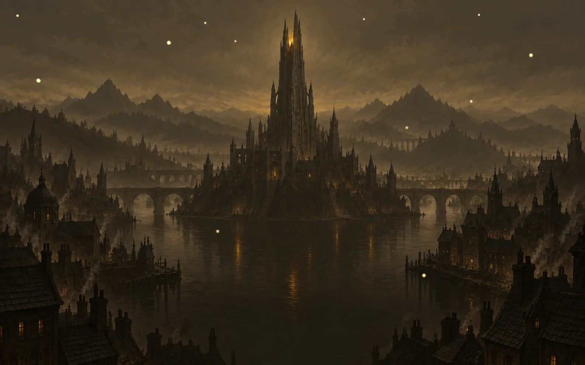
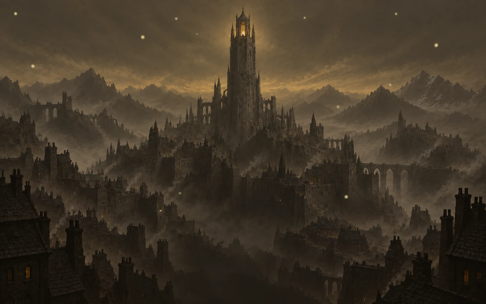
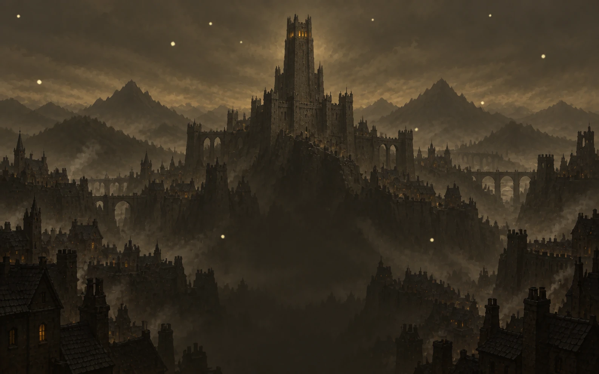

# Title background variations

The owner-approved city spire remains active on the startup gate and title menu:
[Current artwork](../../assets/bg/title-city-tower.webp).

These three alternatives are saved for later review. They are not runtime assets
and do not increase the shipped game bundle. All four images are 1586 x 992 WebP
exports at quality 90, generated with OpenAI imagegen on 2026-09-10 using the
approved city spire as the style reference. Project-owned generated artwork;
no third-party asset license is claimed.

## River Citadel

A central island spire, arched bridges, and warm reflections in a medieval river city.

## Forgotten Observatory

A weathered tower with astronomical stone details above misty city terraces.

## Ashen Bastion

A heavier stepped fortress tower over a fortified ridge city.

