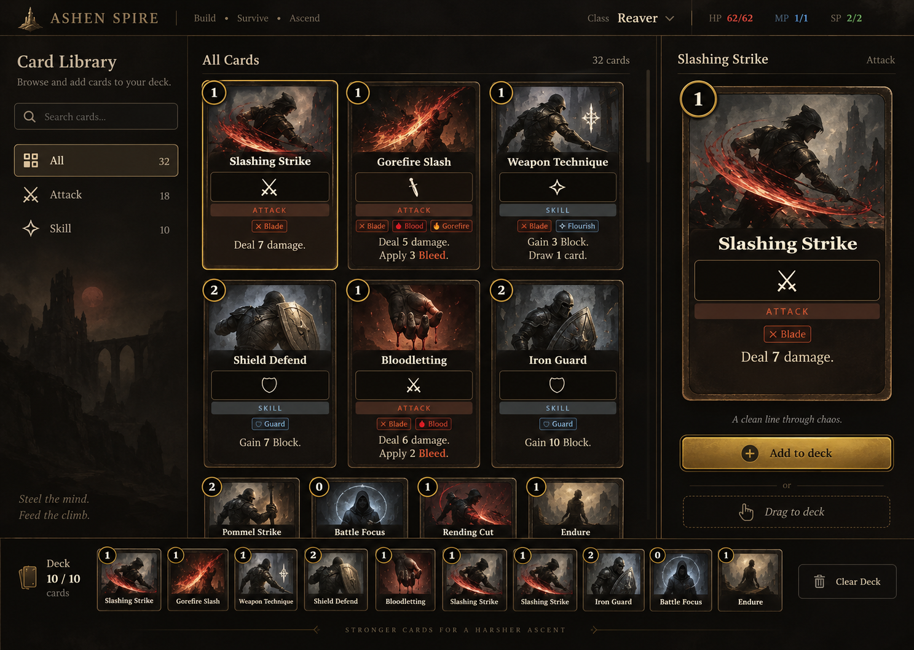
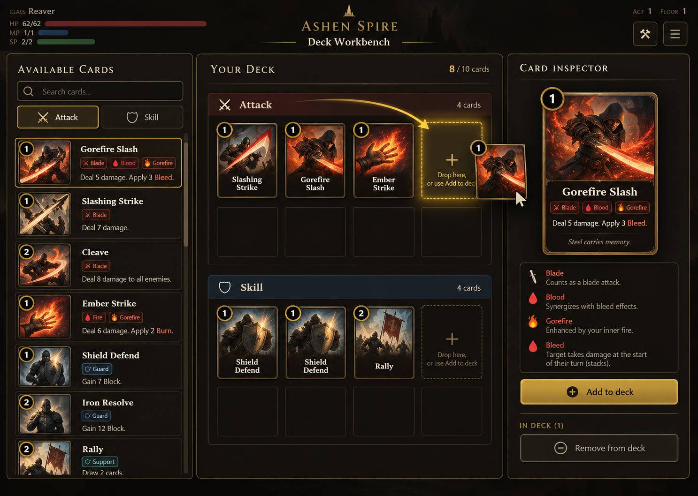
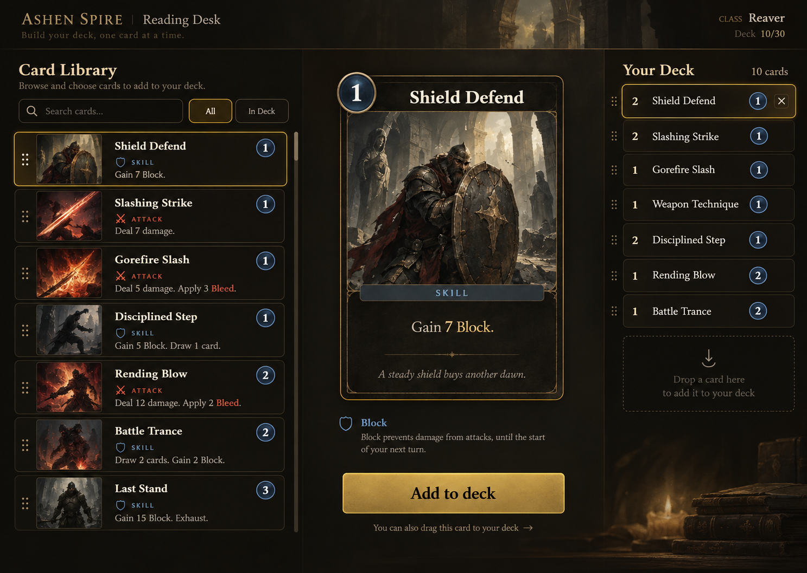
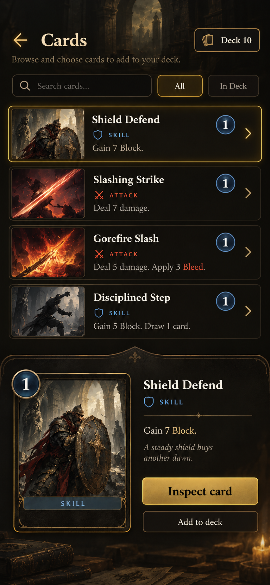
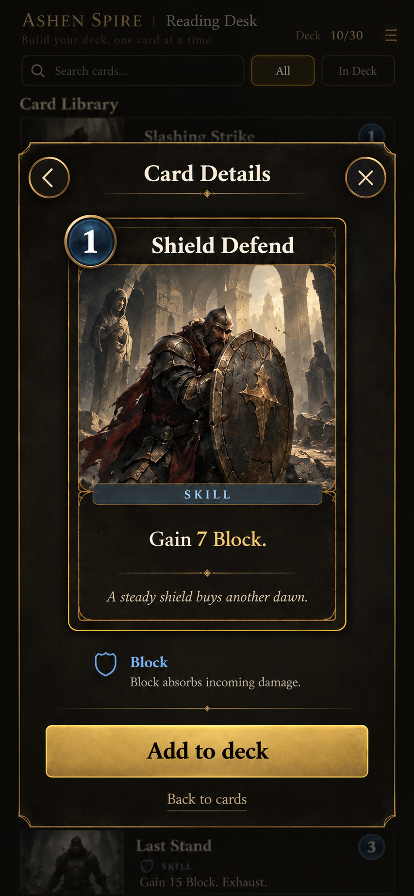
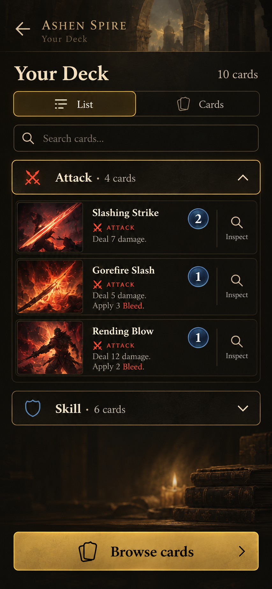

# Deck editor redesign proposals

These concepts respond to the current Cards view and the reported problems: card inspection is hard to discover, controls feel crowded, and drag and drop is unreliable. The images are visual proposals, not implemented screens. Card art, card availability, counts, and free deck editing in the images are illustrative; game rules still need to determine which cards can be added or removed.

## What the current UI does

- The Armoury Cards view renders the complete run deck as a large card grid (`src/ui/screens/equipment.js`, `cardStrip`). It has no add, remove, or reorder action on that view.
- A card can be inspected, but the information button appears only after selecting the card and waiting for its reveal delay (`src/ui/components/cardInspection.js`). The screen gives no instruction for that sequence.
- The Armoury's inventory drag code moves equipment to compatible positions. It does not drag cards into or out of a deck.
- Custom Climb's draft (`src/ui/screens/draft.js`) is a separate one-pick-per-round flow. It advances immediately after a card click.

This suggests making inspection a first-class action before introducing deck mutation. The current code also means a card editor needs an explicit rule-bound add/remove path; visual drag targets alone cannot fix it.

## Concept 1: Card Library



| Area | Role |
| --- | --- |
| Left rail | Search and simple card type filters. |
| Center | Browse illustrated cards, with one selected card visibly highlighted. |
| Right | Always-visible full card inspection and one primary action. |
| Bottom | Compact deck tray and a visible drop destination. |

This is the most familiar collection layout. It works best if browsing many available cards is the primary task. The bottom tray may become crowded on smaller screens, so it should collapse to a deck count and openable list there. The concept image's **Clear Deck** control is not recommended for the final UI.

## Concept 2: Deck Workbench



| Area | Role |
| --- | --- |
| Left | Available cards as readable rows. |
| Center | The deck itself, grouped by type with clear drop targets. |
| Right | Selected card inspection and add/remove actions. |

This makes drag and drop spatially clear and suits users who arrange a deck. It requires more room and stricter rules for where a card may be dropped. Empty deck slots in the illustration should not imply a fixed slot limit unless the game actually has one.

## Concept 3: Reading Desk — recommended starting point



| Area | Role |
| --- | --- |
| Left | Searchable card rows with enough text to identify a card. |
| Middle | One large card, complete rules, and keyword explanation. |
| Right | A compact deck list with copy counts and selected-card removal. |

This gives inspection the most space and uses the fewest persistent controls. It is the clearest fit for the complaint that cards cannot be read. It also adapts well to a phone: card list first, selected card in a full-height sheet, deck list behind a clearly labeled **Your deck** button. Drag remains optional; tap, keyboard, and gamepad use the same explicit actions.

## Interaction rules for the selected direction

1. **Select to inspect:** clicking or focusing any library or deck row immediately updates a persistent inspector. The whole card and its full rules are readable without a delayed information button.
2. **One primary action:** the selected available card shows **Add to deck**. A selected deck copy shows **Remove from deck**. Show disabled reasons in plain language when game rules disallow the action.
3. **Drag with feedback:** card drag starts only from an obvious handle or card row; valid destinations highlight; invalid destinations explain why. A successful drop updates the deck count and gives a brief confirmation. A canceled drag changes nothing.
4. **Equal non-drag path:** every drag action has a click/tap/keyboard/gamepad equivalent. Touch movement must not conflict with scrolling or card inspection.
5. **Safe changes:** support undo for the most recent add/remove when the game permits deck editing. Never mutate the saved run on mere selection or hover.
6. **Responsive layout:** keep the card list and inspector visible together on desktop. On phones, use a single column with a persistent deck count and open the selected card in a readable sheet.

## Mobile views

These portrait concepts extend Reading Desk. They illustrate the hierarchy and visual style; the shipped screen should render card faces and art from the current in-game card model rather than use artwork baked into these images.

| View | Proposal | Main interaction |
| --- | --- | --- |
| Browse |  | Search and filter compact rows. A row selects a card; **Inspect card** opens the full card view. The deck count opens the deck list. |
| Full card |  | Reuse the game's card rendering at a readable size. Put complete rules and keyword help below it, with one rule-allowed primary action and an obvious close control. |
| Folded list |  | Switch between **List** and **Cards**. Accordions group cards by type; a row opens the same full card view. |

```text
Browse                 Folded deck list         Full card
┌ Cards ── Deck 10 ┐   ┌ Your Deck ───────┐     ┌ ‹ Card Details × ┐
│ Search · filters  │   │ List | Cards     │     │                  │
│ selected row      │   │ Search           │     │  in-game card    │
│ other rows        │ → │ Attack (open)    │ →   │  full size       │
│                  │   │   card rows       │     │  rules + help    │
│ Inspect card      │   │ Skill (folded)   │     │  primary action  │
└──────────────────┘   └──────────────────┘     └──────────────────┘
```

On narrow screens, do not require drag to edit. A row is a large touch target for inspection, while add/remove is an explicit action inside the inspector and only appears when game rules allow it. Preserve the user's list/card view choice and expanded groups during the session. The fixed action area must stay reachable above mobile browser controls; the card and rules area can scroll. The visual's sample counts, actions, and card text remain illustrative until tied to real run state.

## Implemented first pass: Armoury Cards

The Armoury now opens its Cards tab in a searchable folded list. Each card row reveals a compact art and rules preview, and its **Inspect** control opens the existing full card modal. **Cards** switches to the familiar illustrated grid, where a card opens the same modal in one tap or click. Both views use the current run deck, `playingCardModel`, and `renderCard`; the display choice lasts while the Armoury is open. Seven reviewed illustrations are wired to existing equipment profiles or authored card IDs, with uncropped masters and exports documented in `art/card-illustrations-2026-10-01/`.

```text
Desktop Armoury                        Phone Armoury
┌ Categories ┬ Your deck · 11 ───────┐  ┌ Armoury ───────────────┐
│ Character  │ Search     List Cards │  │ Cards ▾               │
│ Equipment  │ ▸ 1 Guard Counter     │  │ Your deck · 11         │
│ Inventory  │ ▾ 1 Slashing Strike   │  │ Search                 │
│ Cards      │   art + rules preview │  │ Folded list | Cards    │
│            │   Inspect → full card │  │ ▸ 1 Guard Counter      │
└────────────┴───────────────────────┘  │ ▾ 1 Slashing Strike    │
                                         │   art + rules preview  │
                                         │   Inspect → full card  │
                                         └───────────────────────┘
```

The Armoury is a run deck viewer. It has no rule for freely adding, removing, or reordering cards. The illustrated **Add to deck**, **Remove**, and drag targets in the concepts remain proposals; adding them to this screen would bypass the existing reward, shop, equipment, and card removal rules. A true editor needs those permitted actions and save behavior defined first. Custom Climb Draft is a separate one-pick-per-round flow and should use **Choose card** rather than a free-edit control.
