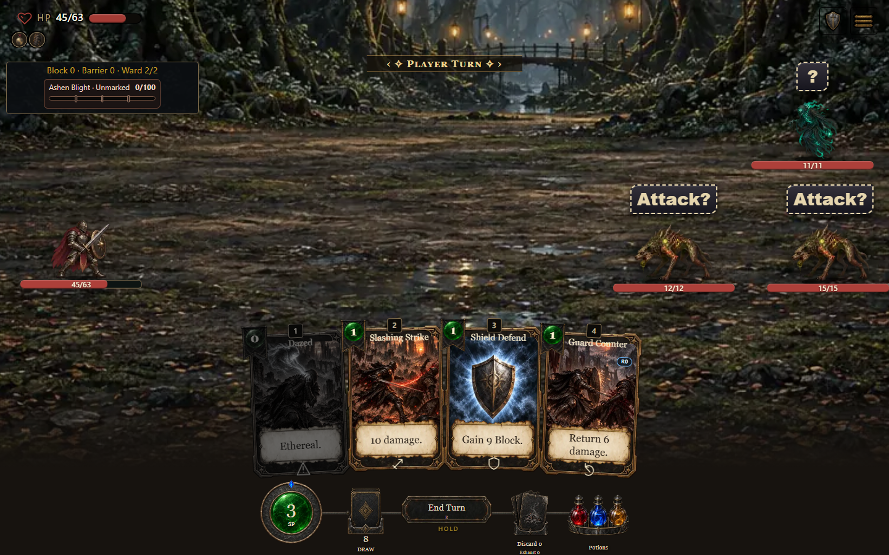
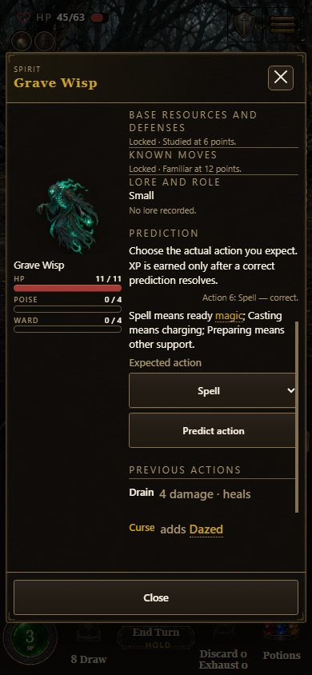
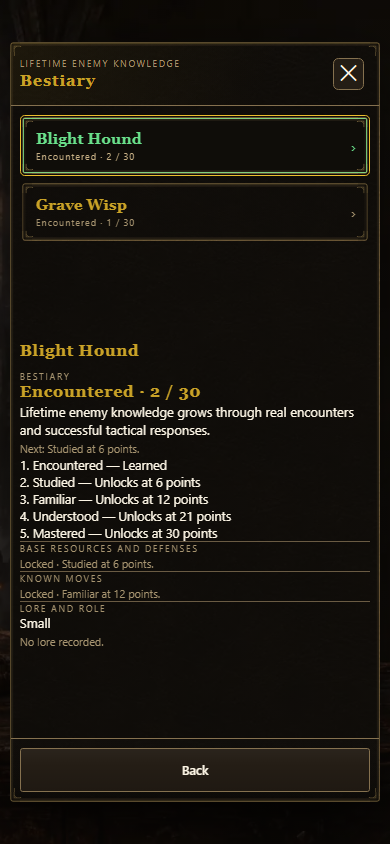

# Enemy knowledge playtest

The runtime implements [enemy-knowledge-contract.md](enemy-knowledge-contract.md) and SPEC section 4.9, independently merged in #1726.

## Compiled gameplay evidence, 2026-10-08

The final regular standalone artifact is `0.7.1.1132`, digest `8a6108c4f4`. All four launcher aliases refreshed successfully. Build identity, shipped-file, receipt and changelog-order gates passed. Browser probes read the embedded ordinal and digest from the actual compiled document and required the same identity after reload.

Microsoft Edge exercised actual game controls at 1440 × 900 and 390 × 844 with reduced motion. The phone browser enabled native touch (`navigator.maxTouchPoints = 1`). These captures were visually inspected.

- Desktop combat displayed two `Attack?` clues and one wholly unknown `?`, with the existing character, enemy and backdrop art.
- Native phone input selected the Grave Wisp and opened its normal Inspect control. The select and Predict action button were at least 44 pixels high, with no horizontal panel overflow and nine plain native options.
- A committed Spell prediction on the initially wholly unknown action serial 9 executed correctly. Perception advanced from level 0 / XP 2 to level 1 / XP 0, with pendingDrafts 0. Reload and Continue preserved the entire serialized combat, RNG seed and every stream counter, prediction feedback, Perception and learning projection.
- The native-touch Bestiary showed five stages: Encountered, Studied, Familiar, Understood and Mastered. Blight Hound progress was 2/30 after a tactical bonus; Grave Wisp was 1/30. The next threshold was 6, with resources and moves still locked and absent from the learned disclosure model. The page had no horizontal overflow. Escape restored the Bestiary opener; Inspector Escape restored its Inspect opener.
- Three additional compiled Load probes preserved exact snapshots and RNG: knowledge-disabled expanded combat returned from live turn 3 to its turn-1 encounter entry; an explicitly saved turn-3 checkpoint restored exactly after a later unsaved turn; default knowledge-enabled combat restored its latest accepted turn-3 action. The debug fixture used the existing `shotSettings` seam to disable optional haptics before a user gesture, without changing combat or save rules.

## Normal run and storage evidence

Earlier normal source-game interactions entered Quick Start, chose a class and entered the first map encounter through normal controls. Two Blight Hounds and one Grave Wisp created one lifetime receipt per definition. Correct Attack, Spell and Spell predictions advanced Perception automatically; a committed Dodge Roll then succeeded against an unknown action, producing a fourth earned XP and one Hound tactical bonus. Actual card plays won the encounter. Reload preserved the victory handoff, reward offer, level XP, RNG and fight totals. Native taps claimed Riposte and the ordinary Backstep draft, confirmed Continue and returned to the map without recounting the encounter. Perception remained level 1 / XP 1, pendingDrafts 0.

The actual browser-save facade was exercised in two browser realms with real localStorage and navigator.locks. Concurrent disjoint receipts and stale settings writes retained their union under the same profile lock. A physical partial-write/throw fault retained the complete old ledger, bonus and stamped target, plus the new pending receipt. Retry repaired the ledger and acknowledged only captured learning. This used an isolated QA storage namespace.

Headless checks cover solo/co-op continuation, private host-seeded reads, owned-seat wire projection, acknowledgment before adoption, delayed/multi-hit/cancelled actions, inert previews and rejections, bounded monotonic profile receipts, staged disclosure and asynchronous run ownership. The actual main combat wrapper and browser-save manager regression also verifies that legacy expanded runs retain their encounter-entry checkpoint while opted-in runs save accepted learning exactly.

The frozen reconciled source completed all 373 discovered files and 3,245 tests with zero failures. Its hosted exhaustive run completed both tool self-test groups and the bundler parse gate; all 149 core checks passed, while the ordering step correctly rejected the then-unfinished build receipt. The final build resolves that mismatch. Complete local tool-suite execution and exact final-head promotion checks are tracked separately. Independent regular and alternative reviews found no actionable source issues.

Optional `/assets/sfx/` samples used the existing procedural fallback after 404 responses. Pre-gesture AudioContext policy warnings were recorded. The final compiled probes reported no runtime exception, required-resource failure or unexpected console error.

## Alternative and delivery

The reconciled alternative source also passed actual desktop and native-touch phone gameplay, prediction, exact reload and Bestiary checks. Protected-path auditing retained all variant art and the parent's pricing, checkpoint and sigil controls. Its final generated artifact and compiled captures are recorded separately before promotion.

Regular and alternative dev/test promotions remain tracked delivery work. No release/main promotion is included. Phone evidence uses a browser viewport with native touch; physical handset and owner acceptance remain separate.
