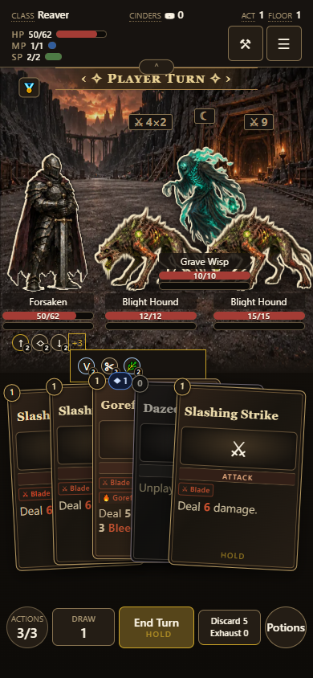
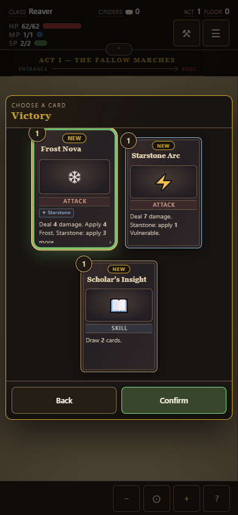
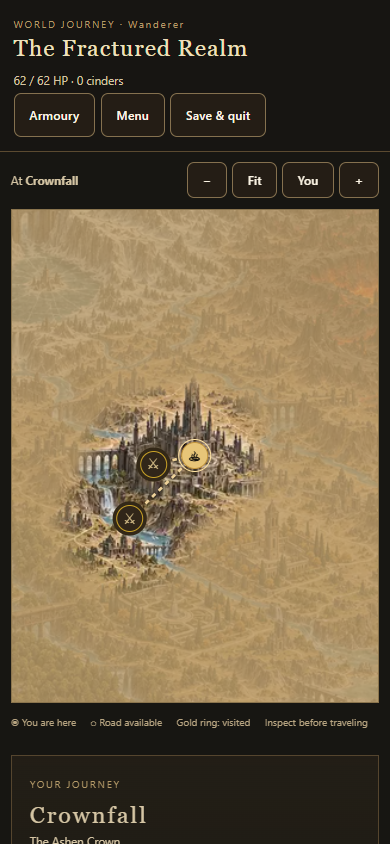
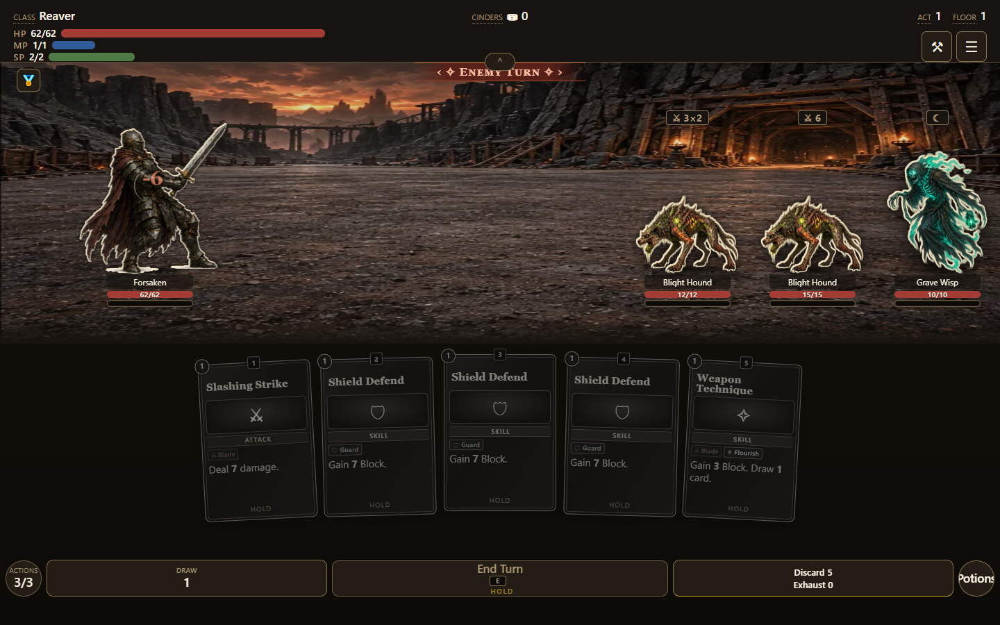

# Mobile maps and combat vitality

PR #874 fixes replacement combatant frames painting at their intrinsic width during turn handoffs. The stage now fits replacement frames synchronously; resize events still coalesce into one animation frame. A 24px status row is reserved below vitality. Extra icons live in a keyboard-accessible +N popup and retain their existing inspection listeners. The player name, vitality and statuses use the same order as enemies and co-op allies.

Ten map textures are regenerated from the preserved PNG paintings with a maximum 768px edge, aspect ratio retained, WebP quality 65. The encoding settings live in `tools/environment-art-build.mjs`; rerun it with Sharp available, then rebuild the game. Combat paintings and landmark cutouts retain their existing encoding. The map no longer runs procedural turbulence or Gaussian blur filters. Fog masks and discovery data are unchanged.

World Journey and Long Expedition project their node types onto the traditional run symbols through `nodeIcon`. Completed nodes retain their symbol and show a visited ring; available connected roads remain traversable in both directions. Inspecting a node still opens its location map and services. No encounter, reward, journey-generation or persistence rules changed.

Reward card selection now uses a green outline. PR #836 already supplied touch selection and save rollback/retry; this branch retains that fix and adds a browser assertion for the visible green selection state.

## Validation

- Baseline phone repro: meters expanded from 114px to 390px in eight sampled frames during a real turn handoff.
- Four-times CPU-throttled browser checks: every sampled phone/desktop meter retained its fitted width through both phase transitions.
- Formation checks cover 1440x900, 794x893, 390x844 and 844x390, with duel, multiple enemies, multiple allies, player/enemy turns, fixed feet/nameplates, inert hands and 5:7 card faces.
- Reward checks use desktop and touch emulation, actual selection presses, green outlines, Back/reopen persistence, a deliberately failed save, rollback and a successful retry without duplicate rewards.
- Atlas tests cover 300 seeds, graph constraints, connected backtracking, save roundtrips, SQL constraints and data import/export. Browser screenshots cover both journey profiles and their location dialogs.
- Ten map files total 5,777,768 bytes before and 1,325,732 after (77.1% less). Their combined decoded pixel count drops from 15,727,944 to 4,325,376 (72.5% less).

These are browser checks on Windows Edge, including mobile touch emulation and CPU throttling. Physical phone stability and loading time are not measured. Lower resolution deliberately trades some fine map detail at high zoom for lower decode/render cost.

## Screenshots

See the component catalog's battlefield stage and status-effect tray entries for the updated component contract and miniature.
