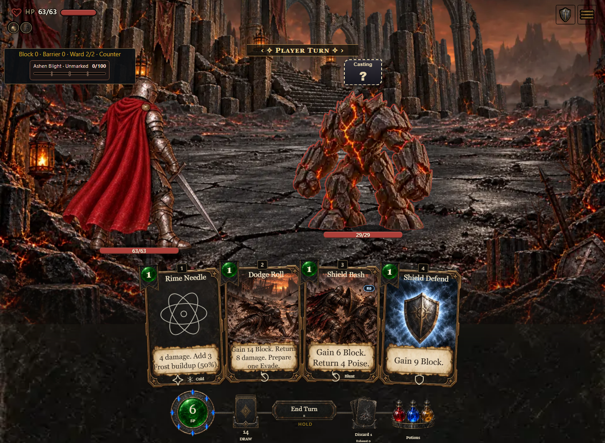
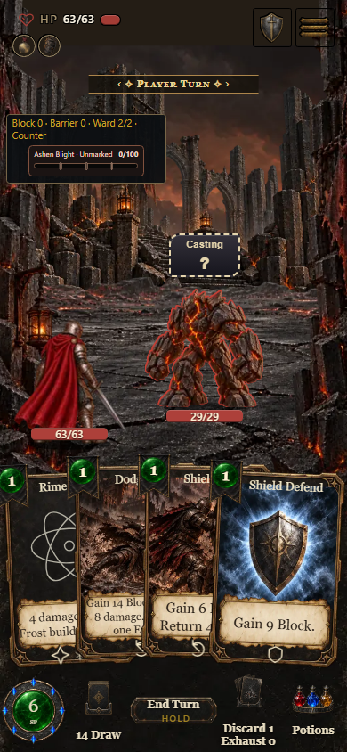

# Alternative combat expansion: preliminary compiled proof

These are development captures, not a release or completed campaign. Captured
2026-10-08 from the official light standalone `build/download/AshenSpire.html`,
build **0.7.1.1135**, source identity **4f2b113cd1**, in the reviewed alternative
lineage. The later workflow-only merge has identical game inputs. The final PR
receipt, combined regular ancestry and final artifact are still pending.

The production screenshot fixture was `?shot=combat&shotExpansion=cards` with
`shotSeed=EXPANSIONMOTION`, Reaver, actual Settings **Normal** animation pace,
and Reduced motion disabled. No enemy/card definitions or combat state were
changed for these captures. Desktop is 1365x1000; phone is 390x844.

A real card selection and friendly-target click pays 1 SP and prepares Shield
Bash. Real End Turn confirmation and hand retention advance the natural enemy
action. A fully guarded connected melee Smash produces exactly one Counter
reply: **6 Poise, 0 Health damage**. The authored Reaver stage advances through
its contact/return poses; artwork loads, browser errors and horizontal overflow
are absent on both viewports. The first random seed did not produce a reply;
its failed probe remains separate evidence. Phone Auto pace was also kept
separate from this explicit Normal test.

Additional preliminary compiled checks pass on both viewports: Counter and
hostile-card Escape cancellation preserve all state; changing to an authored
Tier 5 retargets before payment, shows 3 SP and 3 Mana, rejects a 2 SP play
atomically, and pays exactly 3/3 when funded. The generic tier card is an
explicit memory-only diagnostic fixture. The co-op client uses a canned
transport with real production-engine previews: Tier 2 Shield Bash shows
3 SP/2 Mana and sends the correct seat/tier. It does not prove live LAN host
persistence; headless session/durability regressions cover that separately.

The component catalog is [here](../../component-catalog.html). These images
were inspected for loaded artwork, legible primary rules and reachable controls.
Final exact-head artifact and hosted checks remain required before merge.
