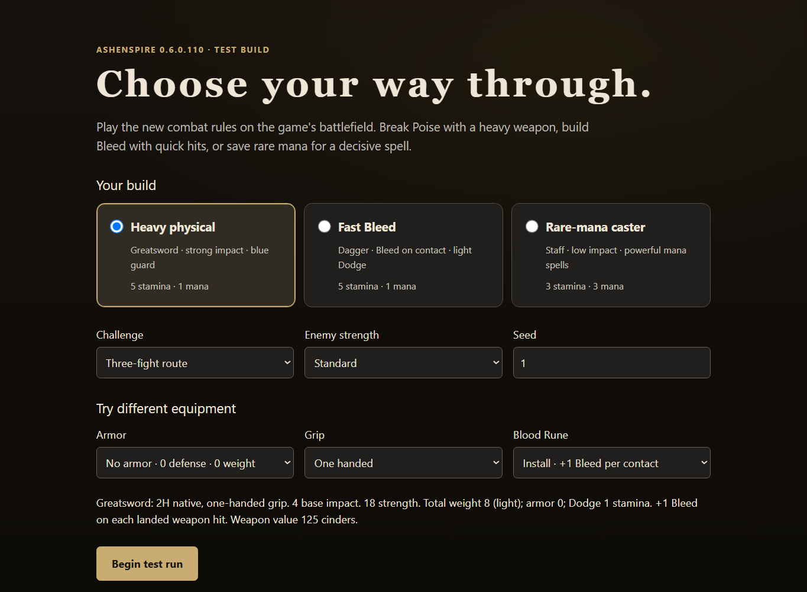
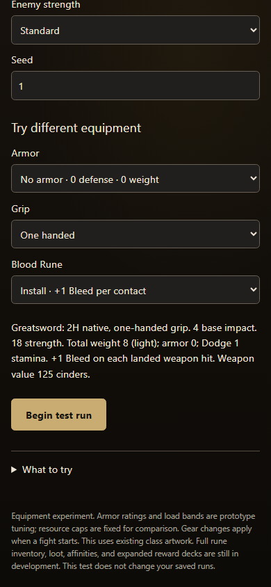

# Equipment experiment preview

PR #936, build 0.6.0.110. Open `AshenSpire.html?shot=combat-test`.

Both screenshots show the greatsword with no armor, one-handed grip, and a Blood
Rune. The receipt derives 18 required Strength, 8 total weight, light load, zero
armor, one-stamina Dodge, four base impact, one contact Bleed, and 125 cinders of
weapon value. The rune contributes 25 of that value. The standard Plate setup
instead weighs 20, provides 30 armor, and pays three stamina for Dodge.

The browser check starts this configuration and confirms its actual profile and
Dodge payment. It also checks incompatible grips/runes, rune removal in preview,
source ownership for the three builds, and unchanged durable saves. Form values
are set through DOM change events; battlefield actions use real pointer/touch
input. Screenshots use Chromium at 1365×1000 and 390×844; physical iOS Safari was
not tested.

This is an opt-in experiment. Resource caps remain fixed. Armor items use the
existing class art. Inventory transactions, loot, affinities, reinforcement,
mid-route equipment changes, and ordinary-run migration are not part of this PR.
