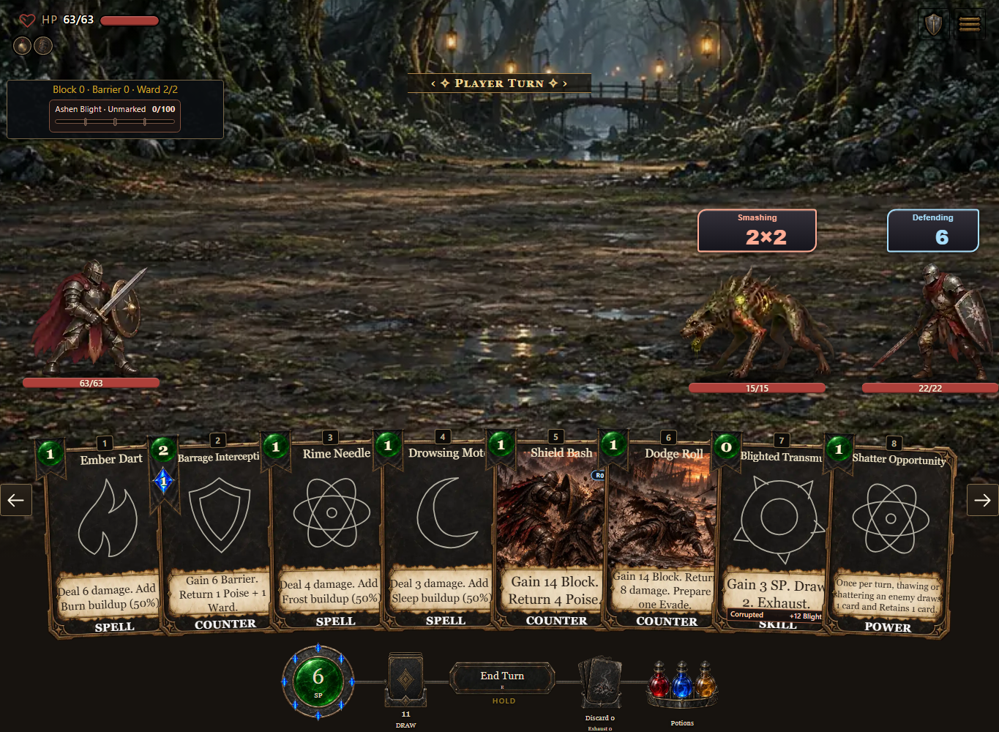
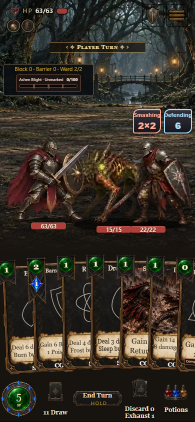

# Combat expansion built-game checks

- Build: **0.7.1.1106**, gameplay source **de8fe9ed0e**.
- Captured: October 8, 2026 UTC (October 7 local time).
- These captures use the actual compiled game and a posed combat hand to cover eight representative cards. They show a test scenario rather than a completed run.
- Desktop: 1365 x 1000. Phone: 390 x 844.
- The hand shows Spell, Counter, Skill and Power identities at the bottom. Secondary combat tags remain in inspection.
- Real Shatter Opportunity play spends 1 SP, Exhausts that instance, and leaves its combat hook installed.
- Sleep recovery spends 2 SP for each removed stack; ordinary cards unlock after recovery. The hand is retained.
- Temporary rank 1 costs one additional SP and one Mana. Inline and modal controls commit correctly on desktop and phone. Modal Cancel preserves resources, hand, selection, Blight and RNG state.
- All 292 cards fit their complete effect text at desktop and phone test widths, with no effect overflow. The phone document has no horizontal overflow.
- A fresh created run and Continue pass 21 checks. Custom settings remain in the saved snapshot and the live registry.
- The probes report no console, script or network errors in these compiled-game checks. Source-server startup and click latency are checked separately.

The component definitions and reuse surfaces are in [the component catalog](../../component-catalog.html).
