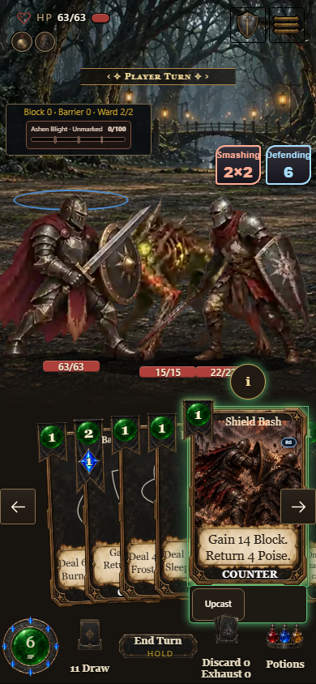
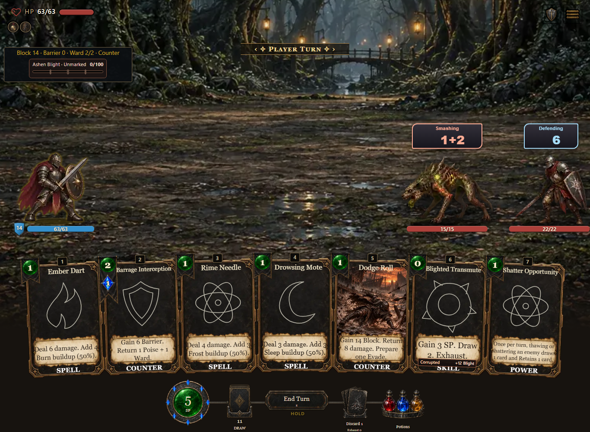
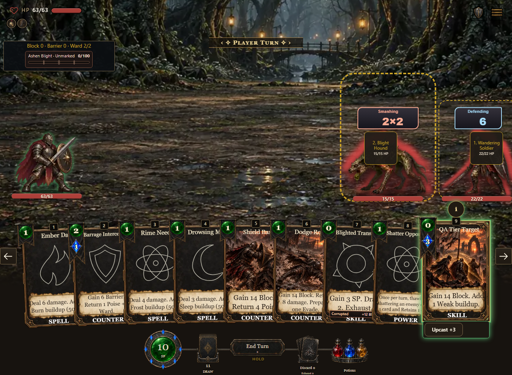

# Historical baseline: build 1113

These captures are from the actual downloadable HTML at **0.7.1.1113 / ffdc226b80**. They are labeled separately from the final build.

- Desktop and phone: selecting Shield Bash arms the player. Escape cancels that selection or an enemy-targeted selection without changing resources, hand, Block, Counter or RNG.
- Playing Shield Bash prepares 14 Block and one Counter charge. A later unarmed Escape preserves the paid state and charge.
- Authored test card: base tier 2 to tier 5 changes friendly targeting to enemy targeting. The modal re-arms a legal enemy without payment; the final choice spends exactly 3 SP and 3 Mana and grants the displayed 14 Block.
- No console/network errors or horizontal overflow in these scoped checks. The tier-changing card is an explicit QA fixture, not a shipped card.

