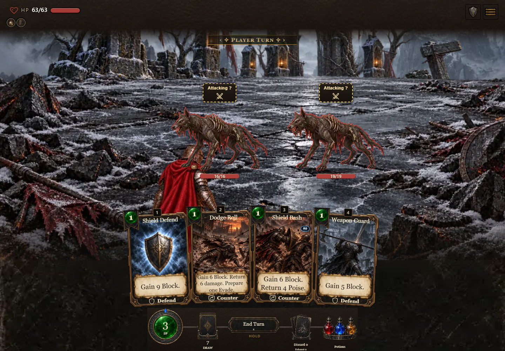
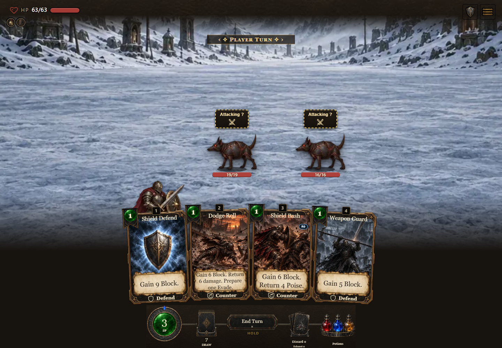
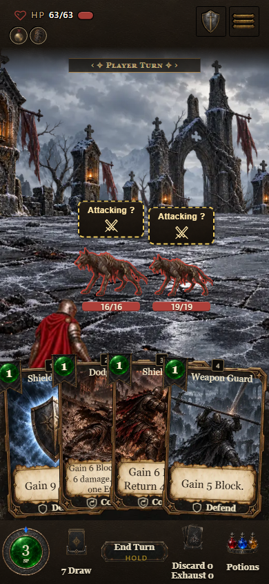
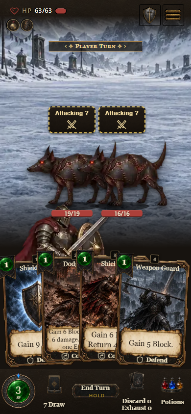

# Appearance comparison - development build 0.7.1.1163

This is local development evidence for PR #1757. The README release gallery remains Release 0.7.1.1060. [Capture identity and image hashes](manifest.json) - [Browser results](report.json).

| Alternative (default) | Classic appearance |
| --- | --- |
|  |  |
|  |  |

**Settings:** [desktop](desktop-setting.png) - [phone](phone-setting.png). The saved **Classic appearance** choice appears in Advanced settings only when the debug flag is on.

**Co-op:** [desktop alternative](desktop-coop-alternative.png) - [desktop classic](desktop-coop-classic.png) - [phone alternative](phone-coop-alternative.png) - [phone classic](phone-coop-classic.png).

The pointer checks switch both ways without changing the combat or run, play a card in each appearance at each viewport, and verify that debug-off search hides the choice. Co-op snapshots match between appearances. Desktop and phone resize checks restore the same resting player position; card actions keep that position steady. Captures wait for painted class canvases and decoded artwork. Console and required resource checks passed. Optional recorded-sound probes returned 404 and used the documented immediate synth recipes; the probes remain recorded in report.json.

Viewports are 1440 x 1000 and 390 x 844 in Edge. These are staged combat states, with real card input; co-op uses the existing canned screenshot transport. Live LAN and owner/device acceptance were not tested by this capture.

The captured source commit is recorded in manifest.json. To run the same checks on a freshly built checkout from the repository root: build with `node tools/launch.mjs --build-only`, run `node tools/verify-shipped.mjs`, then run `node docs/preview/display-appearance-0.7.1.1163/capture.mjs`. Set `CHROME` to a supported Chromium browser when needed; outputs use `QA_OUT` or `.codex/display-browser`. The committed [capture recipe](capture.mjs) preserves the pointer, state, art-ready and resize checks.
