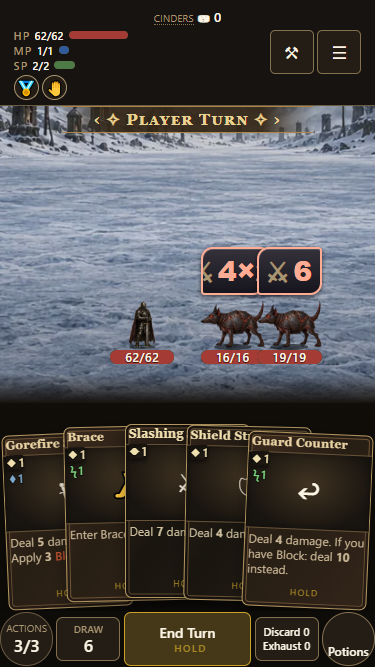
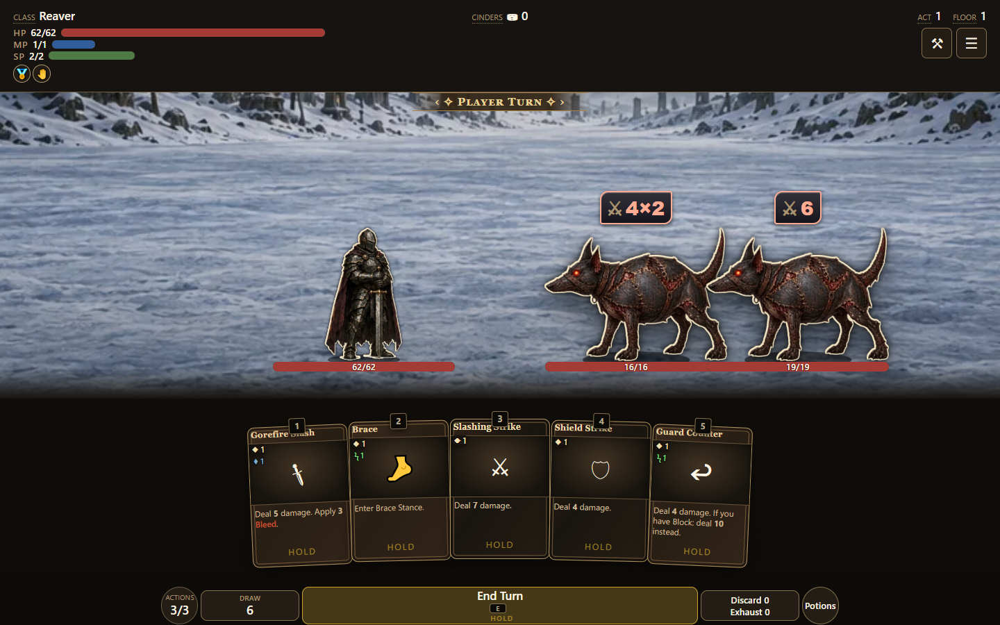
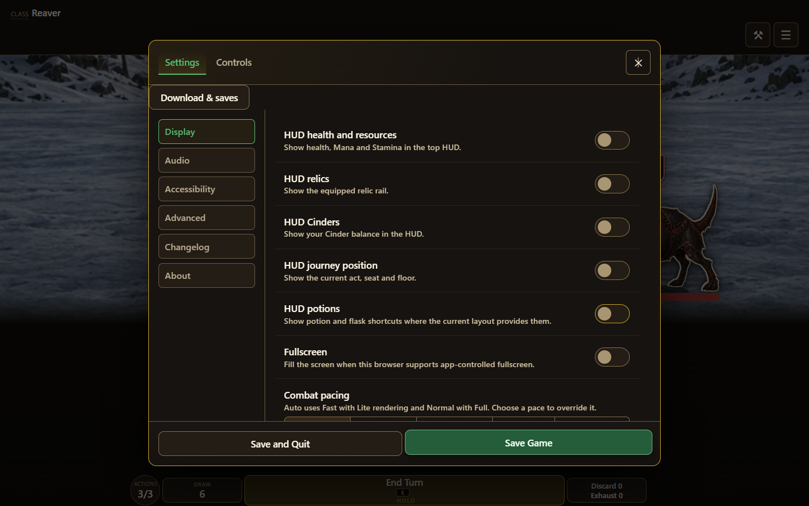

# HUD containment and visibility

The HUD background grows to contain the health/resources stack, relic rail and menu controls. Relics share the resource column instead of hanging below the panel. Short landscape keeps the meters inline to preserve the battlefield.

Display settings offer five saved visibility switches: health/resources, relics, Cinders, journey position and potion shortcuts. Armoury and Menu remain reachable. Defaults preserve visible components.

Combat and map potion minis start collapsed. A fine hover pointer reveals them after the configured delay; keyboard focus also reveals them. Touch opens the full potion list from the large button. Reduced-motion preferences suppress travel.

The earlier hover change (#1143) applied only to map potions; this change covers the separate combat tray too.

[Wireframe](wireframe.svg) · [Component catalog](../../component-catalog.html)

Browser verification uses Edge at 375×667, 1440×900 and 844×390. Source previews cover combat, map and dialogue containment, hidden HUD combinations, and opening Menu with optional components hidden. Actual Settings interaction covers all five switches, reopening the panel and restoring them. Potion checks cover rest, hover, keyboard, touch and reduced motion.

Packaged build: **0.7.1.229**, source digest **ba7c5d716a**. All 12 packaged containment/visibility cases pass; 83/83 HUD action checks, 118/118 engine tests and 397/397 focused tests pass.

