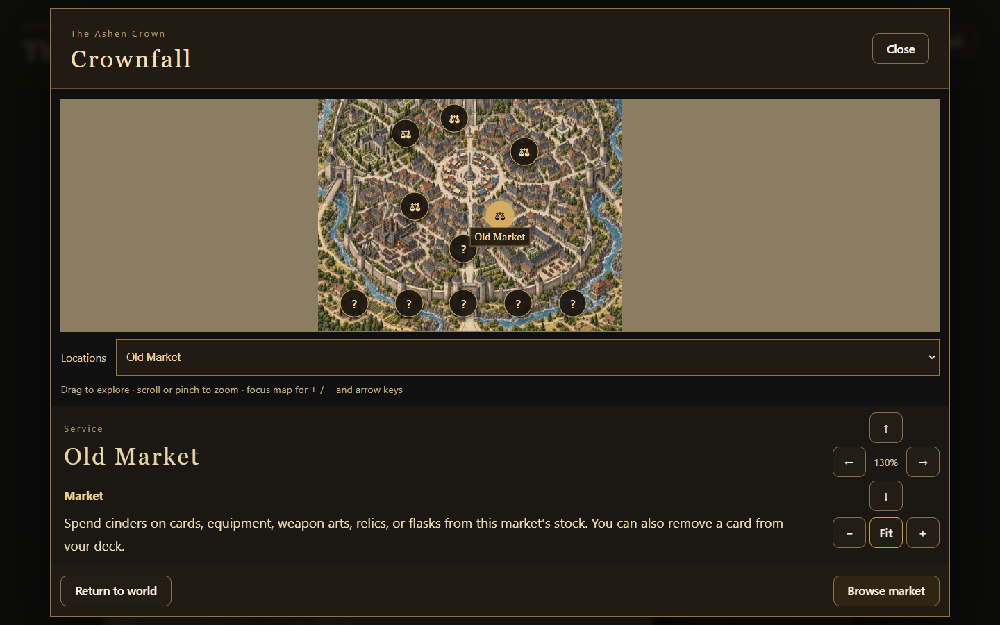
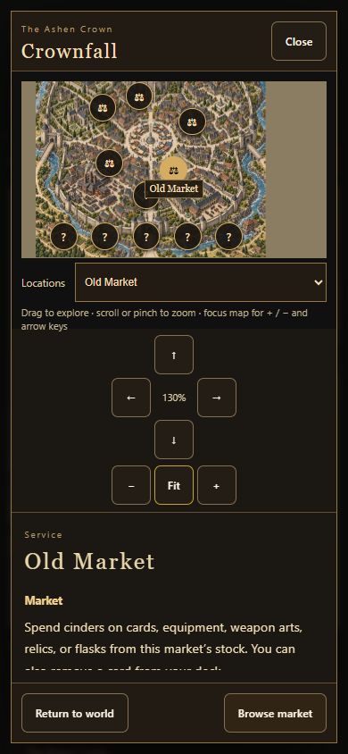
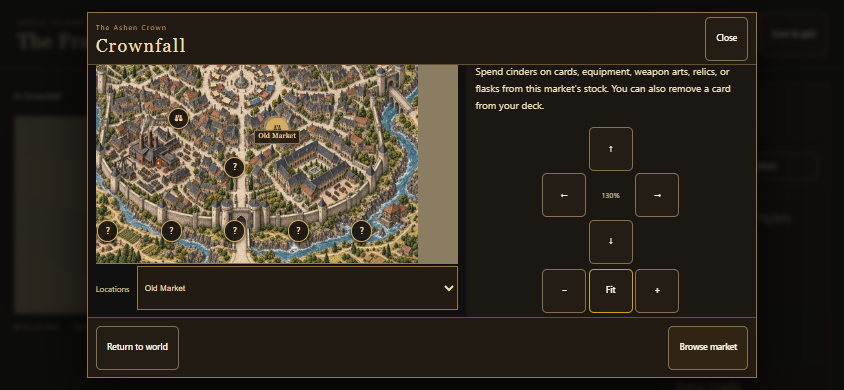
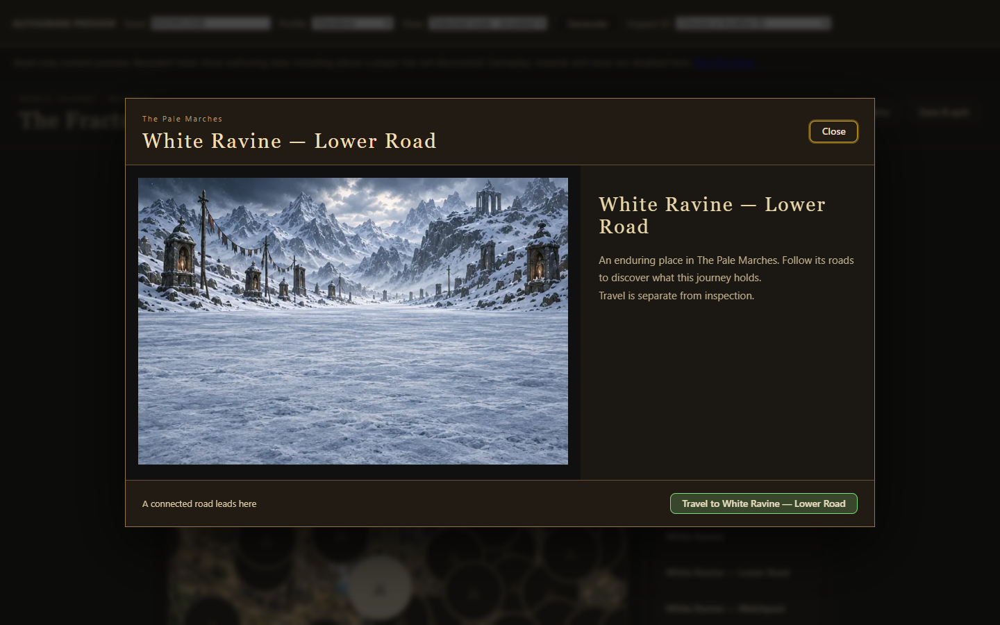
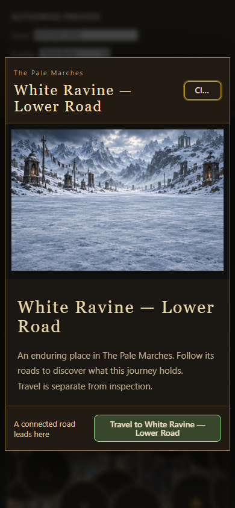

# Local map control pad

Follow-up to #921; closes #925.

Pan arrows form a spatial Up / Left-Right / Down pad, with minus / Fit / plus below. The current zoom sits in the empty center. This shared renderer covers every city and dungeon local map and retains WebP artwork. Short landscape places the two control groups side by side to preserve room.

Verified four responsive map flows, directional geometry and actual pan/Fit actions at three sizes, 11 focused map tests, build-version and shipped-artifact checks. The parent modal change passed all 138 Node checks before merging. Physical iOS Safari has not been tested.

## Location illustrations and travel action

Ordinary world locations now resolve authored node IDs to full WebP environment scenes, rather than enlarging a tiny world-map crop. White Ravine — Lower Road uses the Frozen Pilgrim Road scene. Reuses the existing 20 biome scene paintings; it does not claim a unique painting for every node. Enabled travel is green and anchored to the right; disabled routes remain disabled.

Coverage tests verify every non-local world node has a scene. Desktop and phone browser checks verify the road illustration, button position and actual travel callback.

