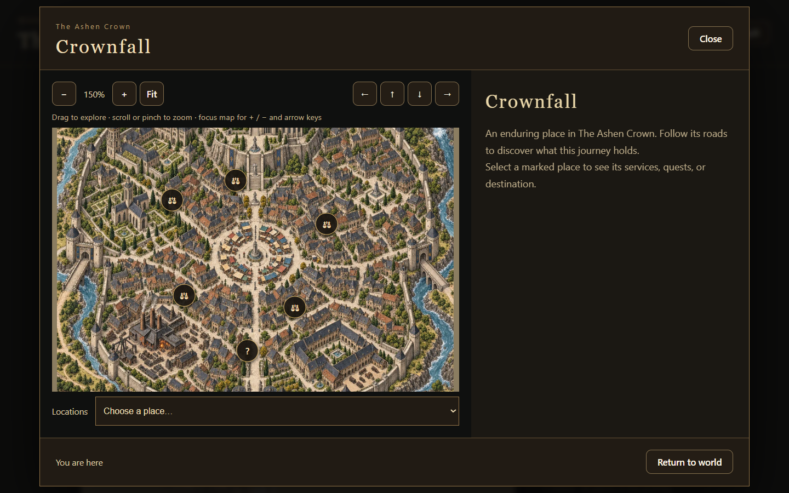
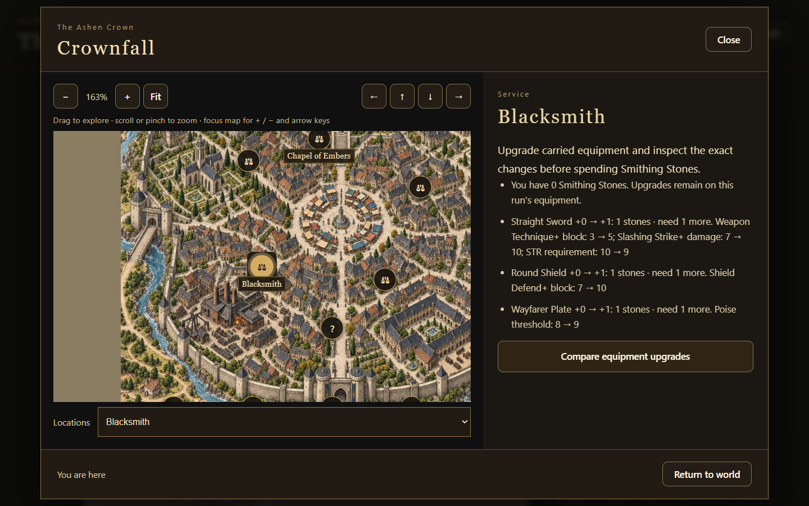
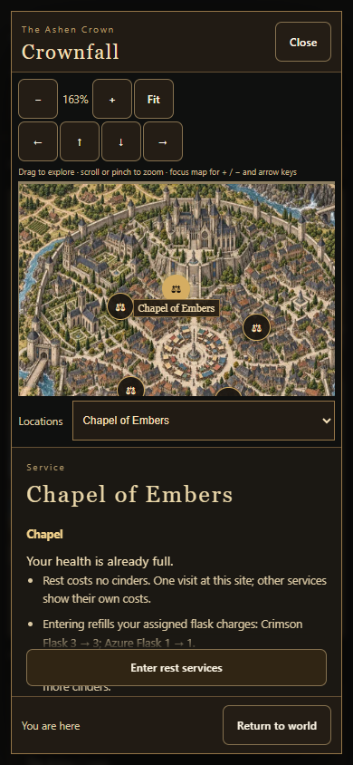
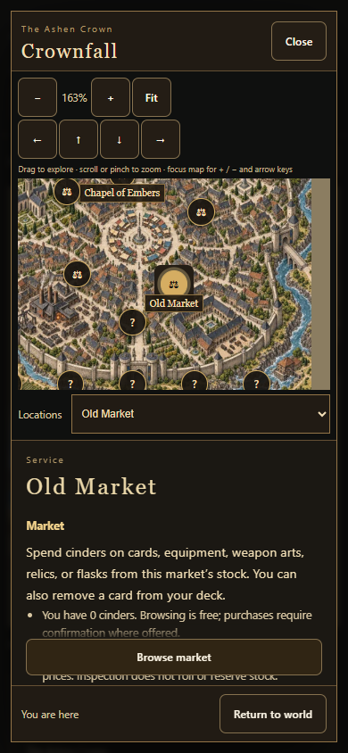
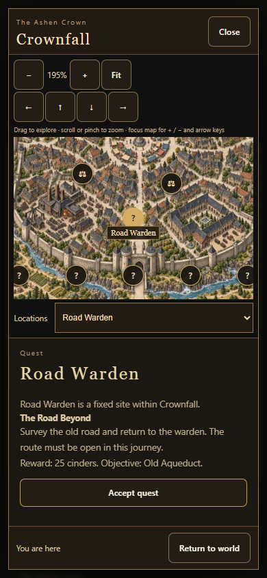
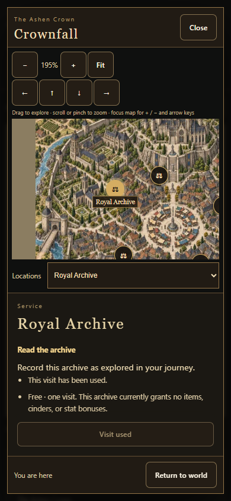
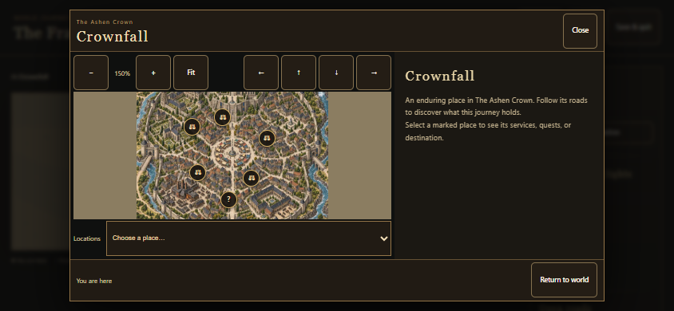
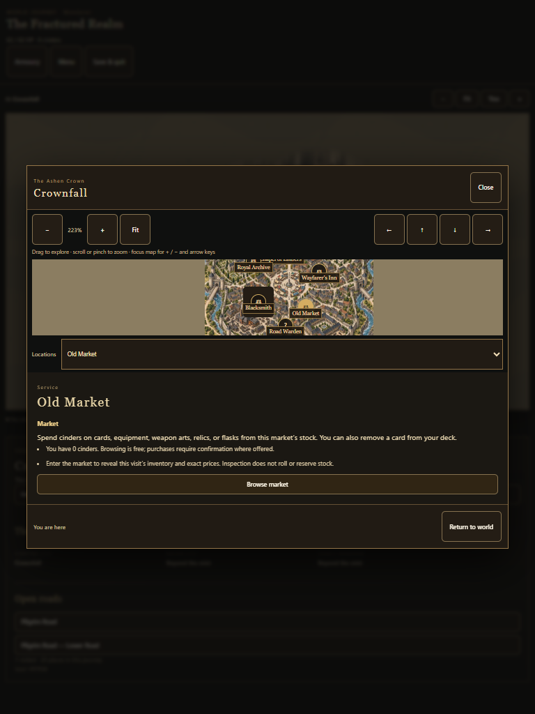

# Local maps: navigate, inspect, then act

Build **0.6.0.74** adds the same local-map controls to World Journey and Long Expedition.

- Open at 150% of Fit; pan by mouse or one-finger drag, arrows, or directional buttons.
- Wheel zoom follows the cursor. Pinch zoom follows the midpoint. Main keyboard `+`, `=`, `-` and numpad Add/Subtract work when the map has focus. Browser Ctrl/Command shortcuts and form controls retain their normal behavior.
- Select a site to center it and add 30% inspection zoom once. Switching sites keeps the inspection scale; manual zoom can go closer, up to 500% of Fit. Reopen a location to restore its map-specific camera and selection.
- Read current healing, flask refills, level-up prices, equipment upgrade deltas and stone costs, market stock availability, or quest rewards before activating a separate action.
- Viewport-sized native detail tiles share the existing map loader and limits. A single HTML opened directly uses the bundled fallback; serve the complete folder to load sharper detail.

## Configuration and ownership

`src/content/localMapPresentation.js` defines default zoom, limits, keyboard step, inspection multiplier, drag threshold, pan step, wheel sensitivity and motion duration. Optional overrides are keyed by map ID. `LocalMapCameraModel` derives the camera; saved views live under `journey.view.localMaps[mapId]`.

Node, map, service and quest relationships continue to come from the normalized worldAtlas tables. `LocalServiceModel` projects existing gameplay plans without spending resources, rolling inventory or marking locations complete. Inn and chapel use the existing rest handler. Archives currently record exploration without granting loot or stats; the panel states this explicitly.

The local map uses a native location selector and pan buttons as alternatives to dragging. Markers retain touch-sized hit areas. Information scrolls separately from the map; selecting a node never activates its service. Reduced-motion mode applies focus changes immediately.

## Validation and limits

Playwright with Microsoft Edge; Browser plugin unavailable. Packaged-game interactions checked at 1440×900, 390×844, 844×390 and 768×1024. Checks cover viewport containment, main/numpad shortcuts, cursor anchoring, drag versus selection, touch pan/pinch, 30% focus without compounding, saved views and resize. Additional checks cover actual archive/market activation, quest benefits, reduced motion, authored local-map inspection and the single-file fallback.

Native paintings still cap detail at their existing 1254–1536px source resolution. This update does not invent additional painted pixels. Touch was emulated; physical iOS/Safari and low-memory phone performance were not measured.

## Screenshots

