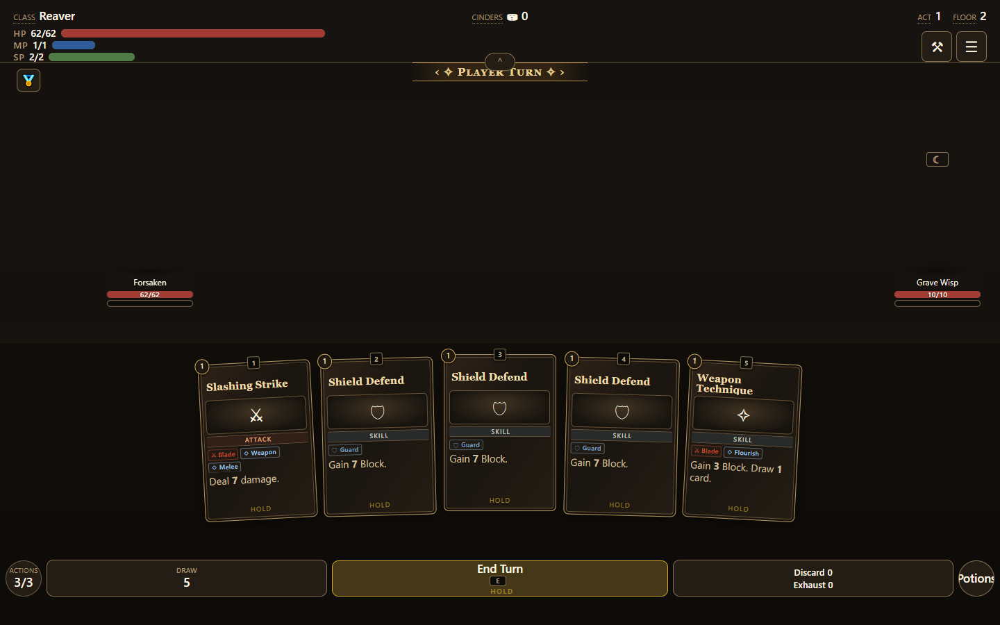
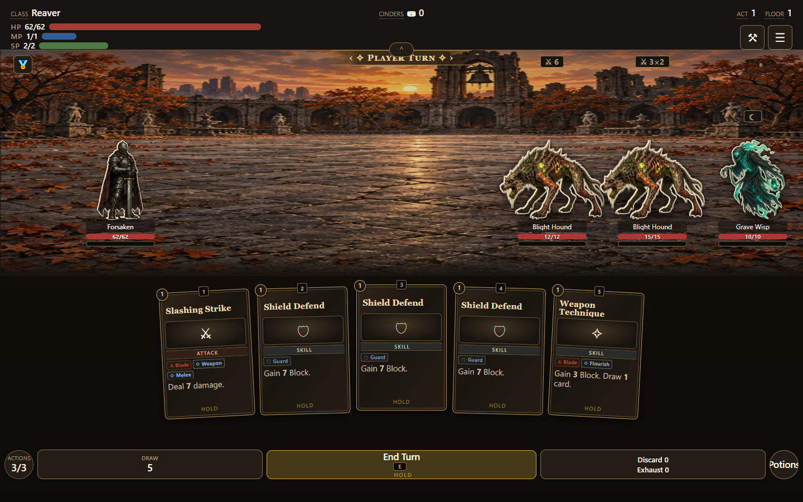
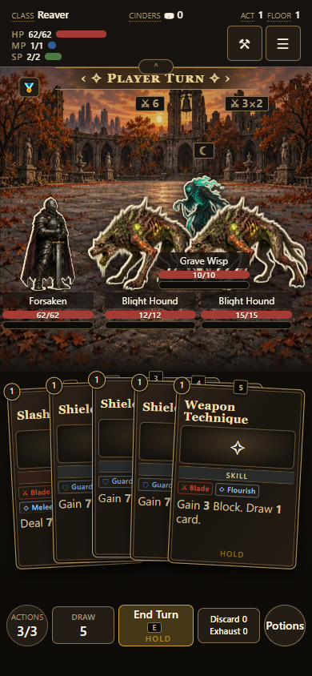
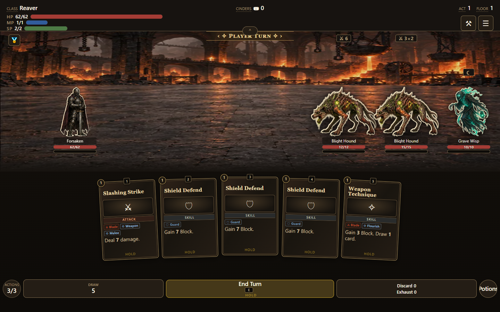
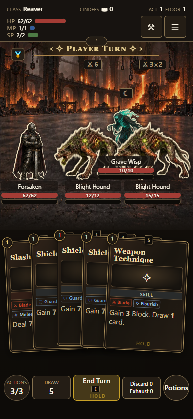
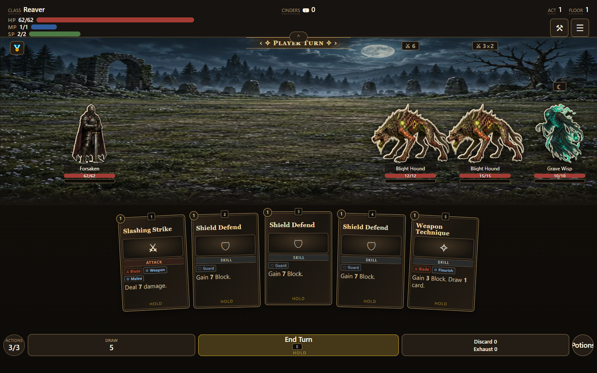
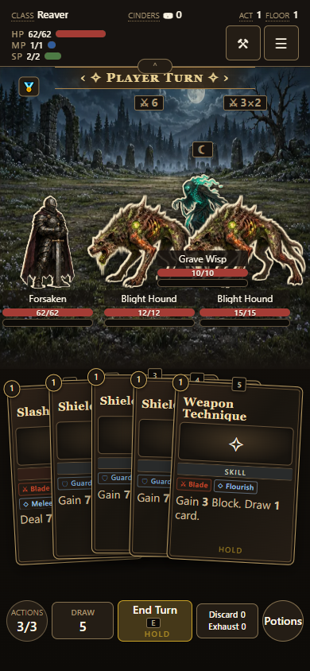
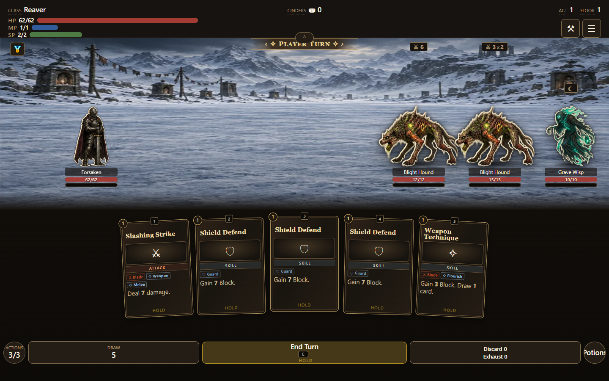
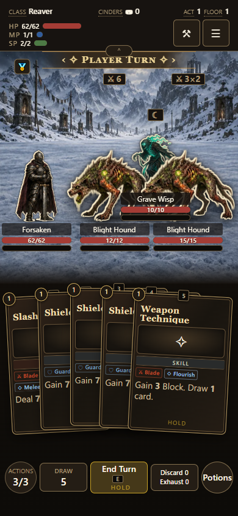

# Location-driven inspection and combat

Node IDs resolve to normalized setting/biome profiles and weighted scene pools. Inspection and combat share the same deterministic selection, with a saved choice on world entry. Time/weather preferences relax only within the compatible setting/biome pool; missing night art is explicitly reported. Gameplay RNG and travel rules are unchanged.

The current 20 WebP scenes supply roads, city grounds, forest clearings, dungeon interiors, mines and shores. This update reuses existing art; it does not supply day/night paintings for every profile. Music compatibility tables are prepared but contain no tracks and do not start playback.

[Authoring and normalization](../../location-presentation/README.md) · [Day/night coverage](../../location-presentation/coverage.md)

Verified: 11 focused tests, all authored node mappings, deterministic/saved selection, invalid-data rejection, actual inspect → Travel → combat matching, and eight desktop/phone scene renders. Physical iOS Safari remains untested.

## actual-node-to-combat

## city-1440

## city-390

## dungeon-1440

## dungeon-390

## forest-night-1440

## forest-night-390

## road-1440

## road-390

