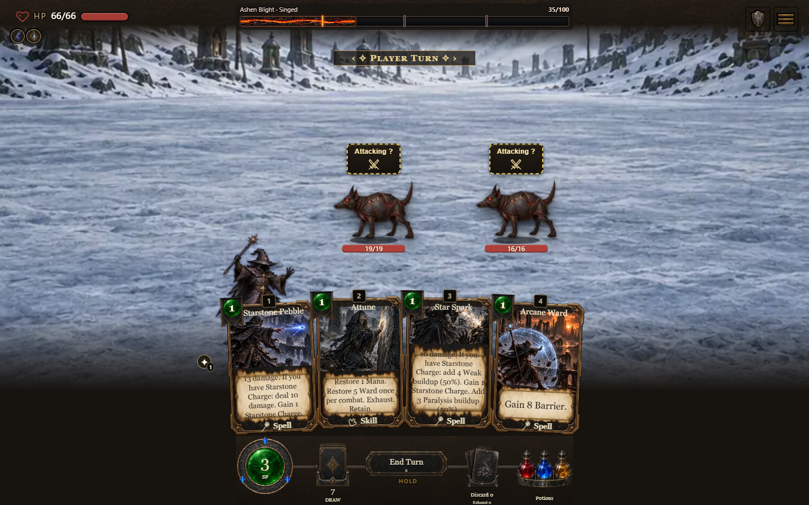
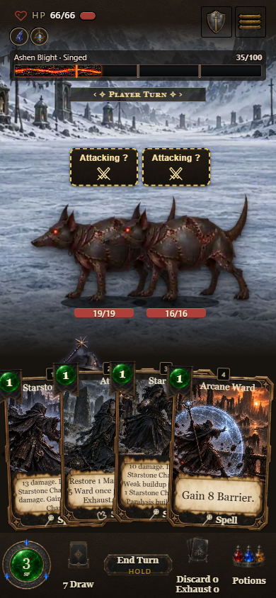
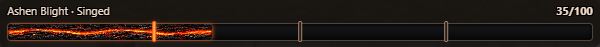

# Molten River Blight HUD evidence

Channel: dev. Build 0.7.1.1152, source digest 778e20dbe2. Captured from the packaged light-art game on 2026-10-08 at 1440×900 and 390×844. The existing combat screenshot fixture sets Ashen Blight to 35/100; these are posed HUD captures, not a completed playthrough.

Checks cover values 0, 1, 35, and 0; centered geometry; phone ribbon clearance; no horizontal overflow; recovery availability; and real pending-feat button opening. The texture uses the published hd-assets-v15 art release.

