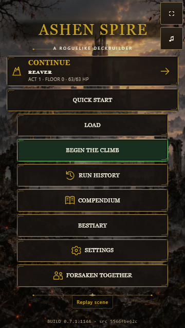
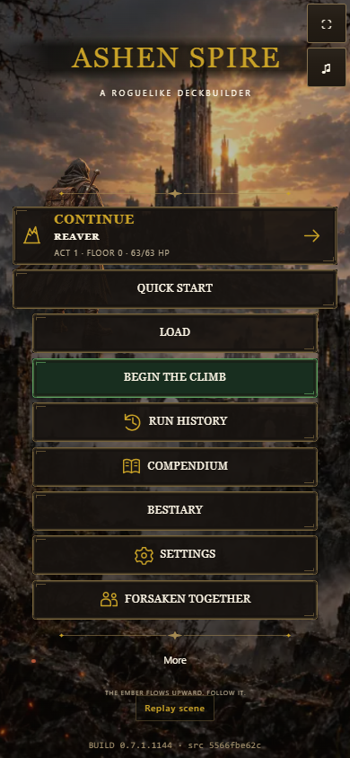
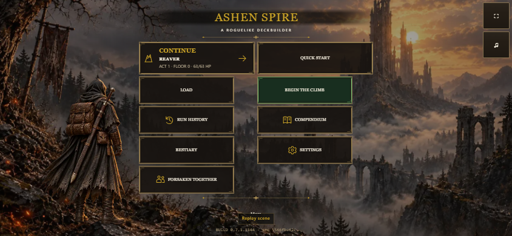

# Promotion-check follow-up evidence

Captured from the official light standalone build `0.7.1.1144`, source digest `5566fbe62c`, through `build/download/AshenSpire.html?shot=title` in real headless Microsoft Edge. The screenshot fixture uses memory storage and a Continue entry. It is a posed runtime screen, not a complete playthrough.

All nine enabled title controls were scrolled into view and hit-tested at their centers at 360×640, 390×844 and 844×390. Continue remains below the wordmark, no page overflows horizontally, and no JavaScript exceptions occurred. The traveler and title backdrop were loaded before capture. The menu scrolls when the available height requires it; see [checks.json](checks.json).

The checkpoint regression uses the actual save manager in `tests/main-run-ownership.test.mjs`. It verifies successful void-returning checkpoints, clearing only the owned finished run, deduplicating repeated completion, and preserving a rejected checkpoint without banking learning, recording a result, or clearing the slot.
