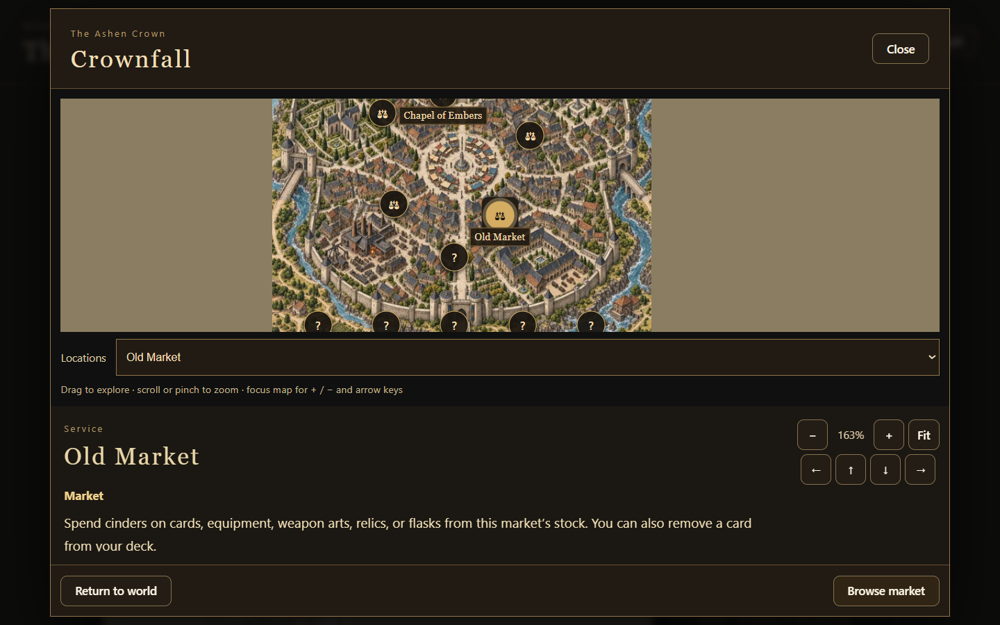
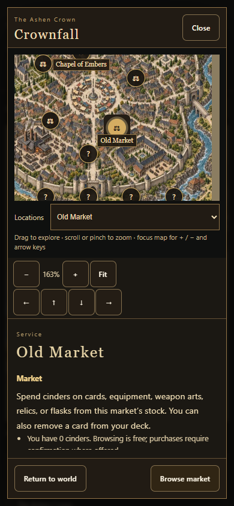
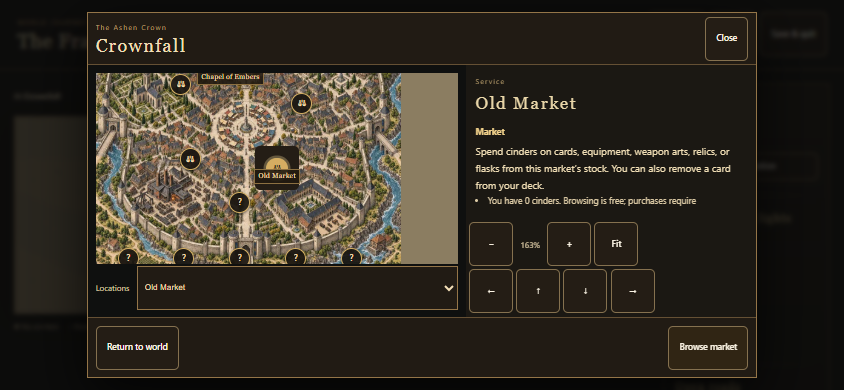
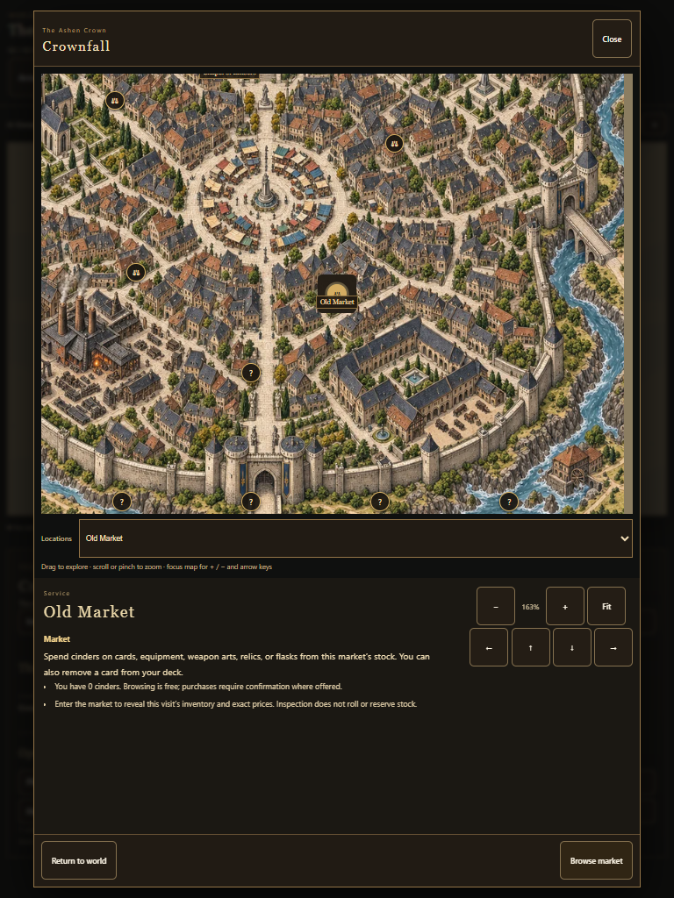
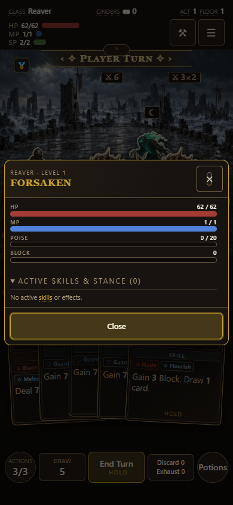
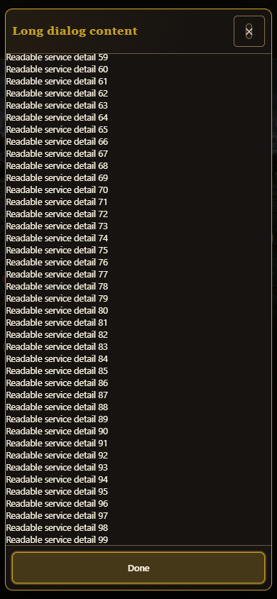

# Tall modals and local maps

Issue #920. Preview build 0.6.0.104.

All 11 city/dungeon local maps share a tall viewport-bounded layout. The map retains a minimum height, service information scrolls, and Return plus the selected action remain in the footer. Short landscape uses side-by-side map and details. Mouse wheel, keyboard, touch pan/pinch, saved framing, centered selection, and existing service behavior are preserved. All local map base assets and detail tiles remain WebP.

Shared modal widths remain sm/md/lg/xl. Overflow promotes shared dialogs to long height for the remainder of the opening; headers and footers stay fixed, with scrolling bodies and uncompressed pane content.

## Verification

- Node suite: 138 passed, 0 failed; reward selection 72 checks, card touch/removal 25 checks, starting equipment 112 cases.
- Build, build-version (8), shipped-artifact (6), receipts (1), About/changelog (274) checks passed.
- Packaged browser flows at 1440x900, 768x1024, 390x844 and 844x390: zoom, mouse/touch gestures, selection, service previews, framing persistence, no page errors.
- All 11 authored local maps opened and inspected. Expedition service activation, used state, quests, maximum zoom and offline fallback passed.
- Shared overflow and combat inspector checks at 1440x900, 390x844, 844x390 and 320x640: scrolling, stable header/footer, close interaction.
- Physical iOS Safari was not tested; mobile checks use Edge device emulation and CDP touch events.

## Screenshots

### 1440-market

### 390-market

### 844-market

### 768-market

### 390-combat-inspector

### 390-long-modal

