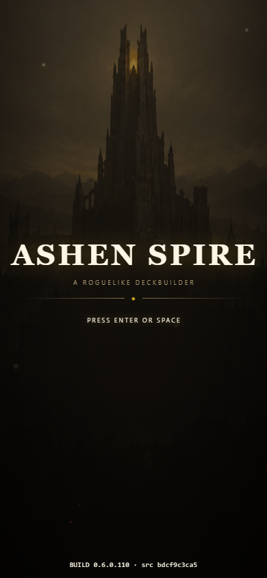
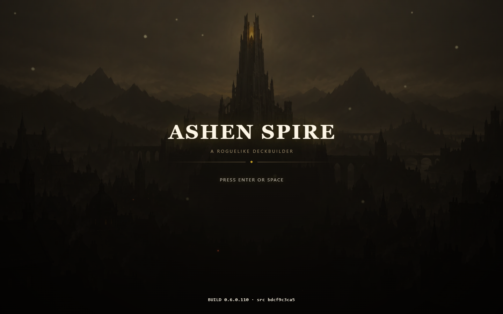
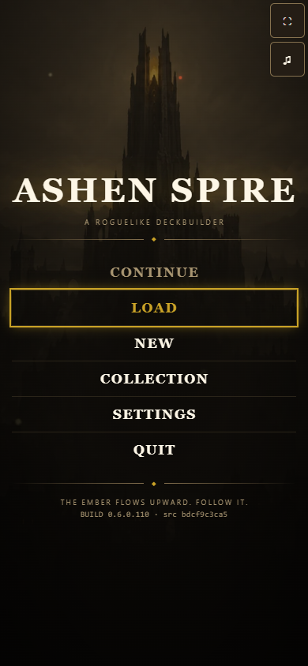

# City spire title background

Build 0.6.0.110 uses the owner-approved city spire on the startup gate and title menu.
The native 1586 x 992 WebP is 72,522 bytes. The centering and activation behavior
are unchanged. This delivery does not implement the proposed city-light transition.

Checked in local Edge with Playwright at 320x568, 390x844, 844x390 and 1440x900.
The title, subtitle, ornament and prompt stay centered and contained. Enter opens
the menu; the menu screenshot waits for its transition to settle. No application
errors occurred; the pre-existing missing favicon was the only console error.
Physical iOS Safari was not tested.

[Three alternatives for later review](../../../art/title-background-variations/README.md).

