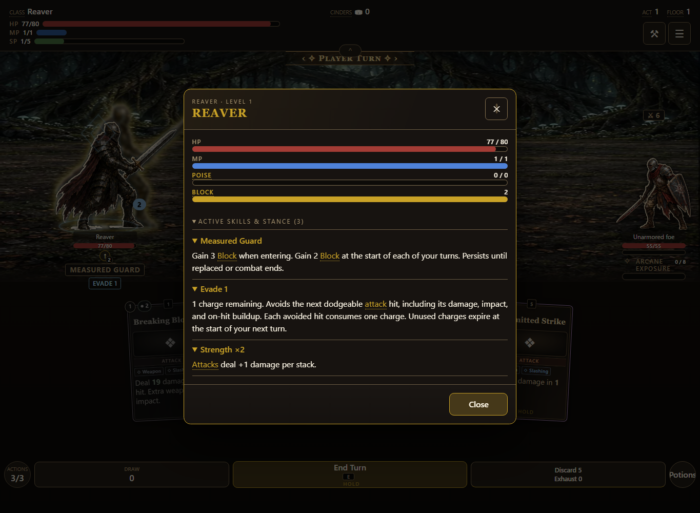
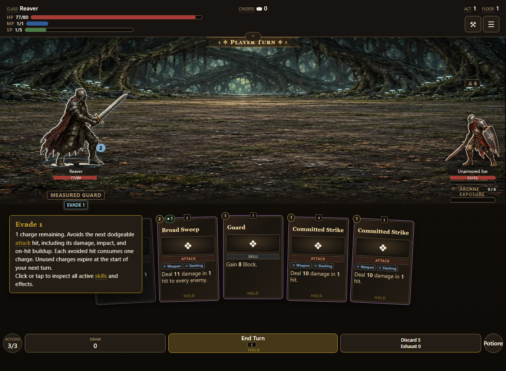
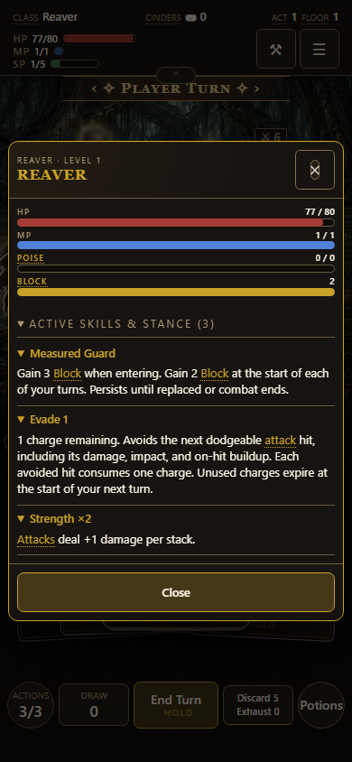

# Active combat ability inspection

Issue [#887](https://github.com/cehinds/AshenSpire/issues/887), PR [#888](https://github.com/cehinds/AshenSpire/pull/888). Built from `dev` at `c6207b94` after #876 landed in dev and #886 promoted that tree to test. Preview build: **0.6.0.69**.

## Behavior

Stance and Evade badges accept hover, click, touch, and keyboard inspection. The shared tooltip opens after half a second. Both badges open the complete current stance, Evade charge, and active status list. Its heading and individual explanations expand and collapse. Stance numbers come from authored effects, and Evade explains hit protection, charge consumption, and expiry at the next player turn. Consumed effects disappear when the inspector is reopened.

Inspection stops the event before an armed self-targeting card can use the player target. The generic class description no longer appears as an active skill. The existing combatant component catalog description and miniature show the updated interaction.

## Validation

- 31 focused tests pass: `node --test tests/combat-abilities.test.mjs tests/combat-foundations.test.mjs tests/attack-sources.test.mjs`.
- 81 actual-game browser checks pass: `node tools/combat-test-browser.mjs`, at 1365 × 1000 and 390 × 844. These include measured hover delay, real mouse and touch input, keyboard Enter, all ability disclosures, live effect removal, and an armed self-card remaining unplayed during inspection.
- Build version, shipped artifact, receipt, About changelog, and whitespace checks pass.
- Screenshots below were refreshed against build 0.6.0.69 and visually inspected.

The browser run uses the game's isolated `?shot=combat-test` mode and leaves durable storage unchanged. A Strength fixture exercises a second concurrent effect; route continuation uses explicit low enemy HP. This validates UI behavior, not full-run balance. Browser motion is reduced for deterministic input checks.

## Preview and screenshots

Run `node tools/serve.mjs --port 8877 --no-open --no-lan --root dist`, then open [the local preview](http://localhost:8877/AshenSpire.html?shot=combat-test). Start a build, play its stance and Dodge, then hover or press either badge beneath the player.

