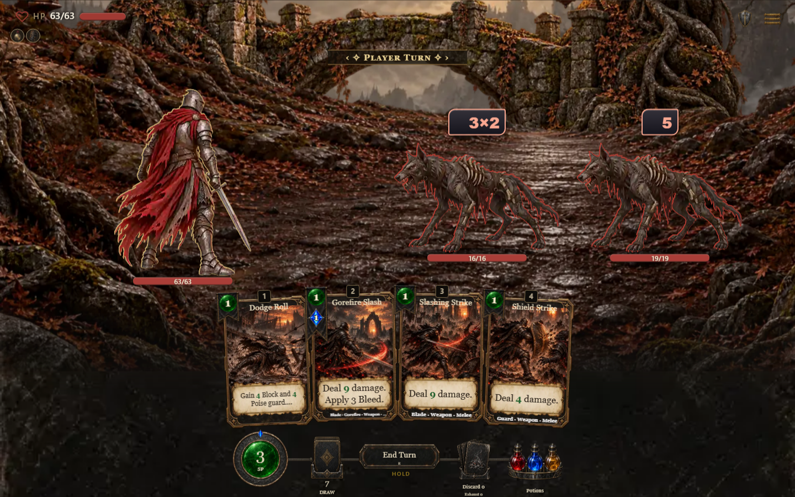
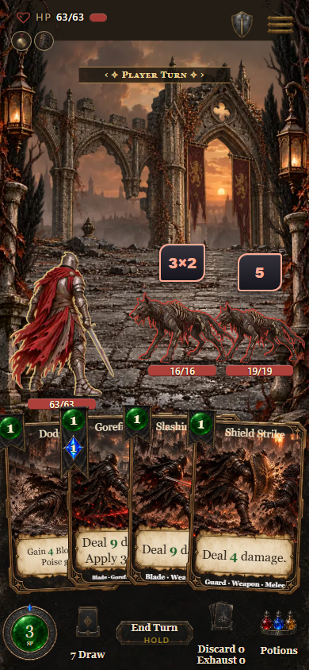
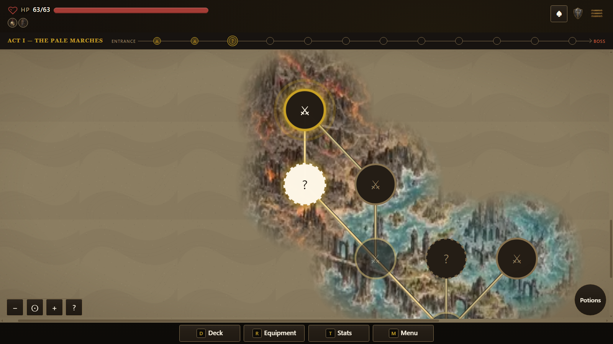
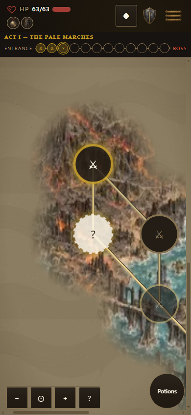
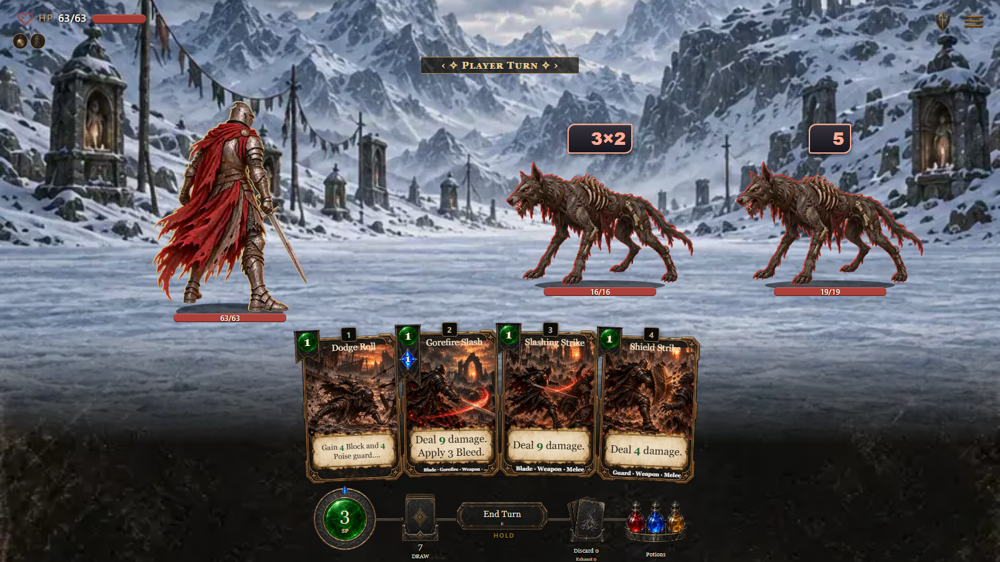
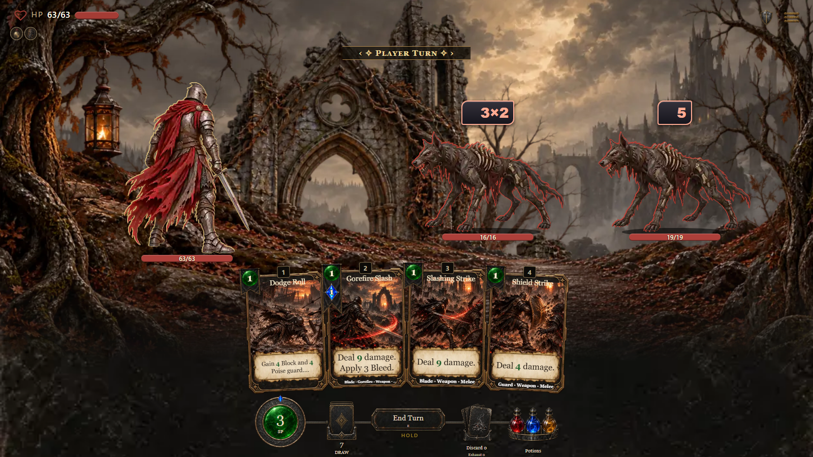
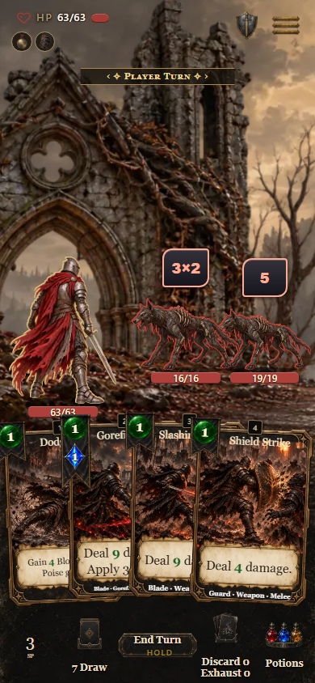
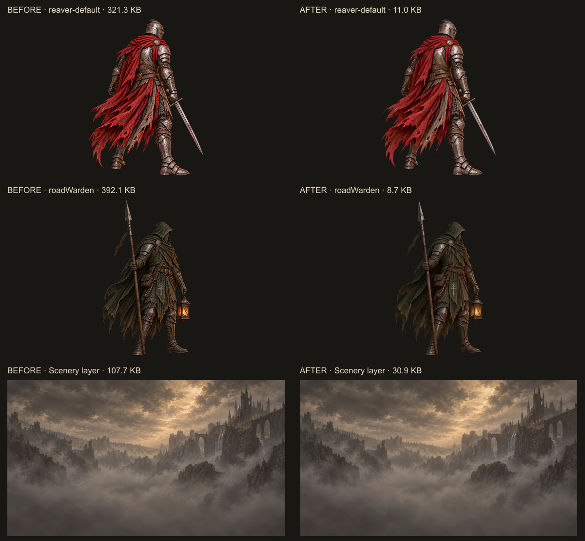

# Alternative art export verification

The final export also incorporates the subsequently merged PR #1684 collection: 59 idle actors, five legacy layers, and 69 scene layers supporting all 32 settings. Both device paths follow the shared 480px figure / 1280×720 scenery policy, with independently authored device compositions preserved. The 266 paths total 16,261,108 bytes. Portable builds alias identical device bytes instead of embedding them twice.

Build `0.7.1.1058` (`1b48adbf8b`) passes 12 focused policy, mapping, byte identity, crop registration and portable alias checks, including corrupt-byte rejection. Its complete pack and portable builds pass nine identity checks, twelve shipped-file checks and its receipt check. The portable file is **108,359,639 bytes**: 8.36 MB above the existing 100 MB target after the expanded collection landed. The served build loads content-addressed images separately. This size boundary is recorded rather than reducing the requested scenery quality further.

The expanded browser sweep passes all **64 scene/device combinations**, all four independent layers in each scene, co-op at both sizes and both resize directions. The 192 solo figure placements have a maximum ground baseline error of 0.157px; the co-op/resize checks stay within 0.188px. There are no page exceptions or HTTP errors. See [the measured report](expanded/browser-report.json).

The evidence below predates #1684 and records the smaller library and route-bar checks. Its earlier 99.2 MB size does not describe the expanded build above.

The current alternative library contains 59 custom sprites and five scenery layers. Exporting the approved masters through the shared policy reduces those runtime files from 24,886,184 to 1,044,432 bytes. Sprites fit within 480px; scenery fits within 1280×720. Original masters and their validation coordinates are preserved. Runtime crop bounds are scaled with each raster, keeping the normalized crop and display geometry identical.

- Nine focused tests pass, including every catalog hash, actual WebP dimensions, no enlargement, normalized crop registration and the shared policy bridge.
- The initial complete pack and portable builds pass nine build-identity checks and twelve shipped-file checks. The portable build measures 99,186,248 bytes before adding this change's receipt.
- All 6,215 shared light files match the published `hd-assets-v14` manifest.
- `results.json` records the route bar at desktop, phone and narrow-phone sizes, plus combat at desktop/phone sizes. Destination inspection leaves route history intact.
- The final combat captures wait for the SVG or layered scenery to decode. Hollow Weald captures exercise all four alternative scene layers; Pale Marches captures exercise the shared atlas. Successful runs have no page exceptions or failed HTTP responses.
- The independent `external-play` network gate passes all 82 checks across seven cold-boot/title/combat/map views: zero broken images, zero failed requests, decoded CSS backdrops, fonts, map tiles and score tracks. See `network-check.log`.
- A separate cold direct-combat fixture run fell back to unresolved asset URLs while concurrent builds were active. Repeating the isolated run and the full map-to-combat sweep passed. These captures establish the tested rendered states, not a general performance or cold-network guarantee.

The earlier screenshots show build `0.7.1.1056` (`ce6742e0b4`), before receipt-only changes. The alternative's authored layout and character designs are preserved. Physical-device/controller acceptance remains outside this evidence.

[Component catalog](../../component-catalog.html) · [Export policy](../../ART-EXPORT-POLICY.md)

The common-branch reconciliation retains all 726 protected presentation paths except the additive, unused combatTargetAnchors model helper needed by the shared tests. Existing model code is byte-equivalent; all renderer/style files remain the alternative versions. The final source receipt is 0.7.1.1059 (dd66d2c8d7). Twenty-five policy, mapping, registration and shared model tests pass; full rebuild verification follows the source reconciliation.

