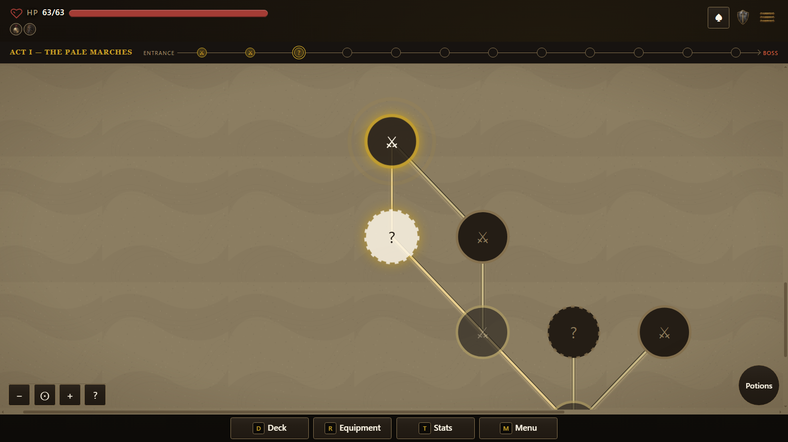
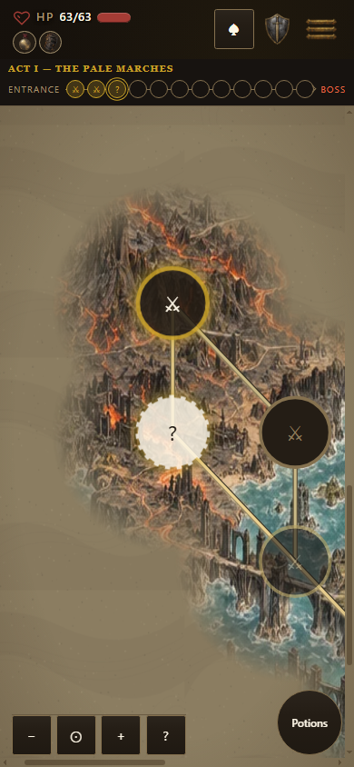
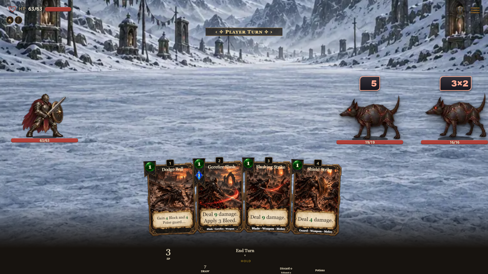
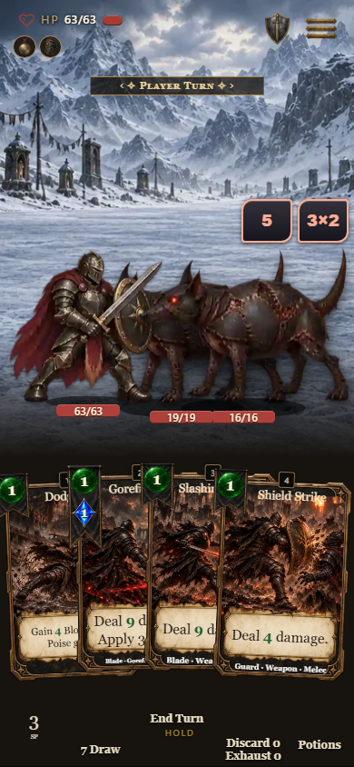
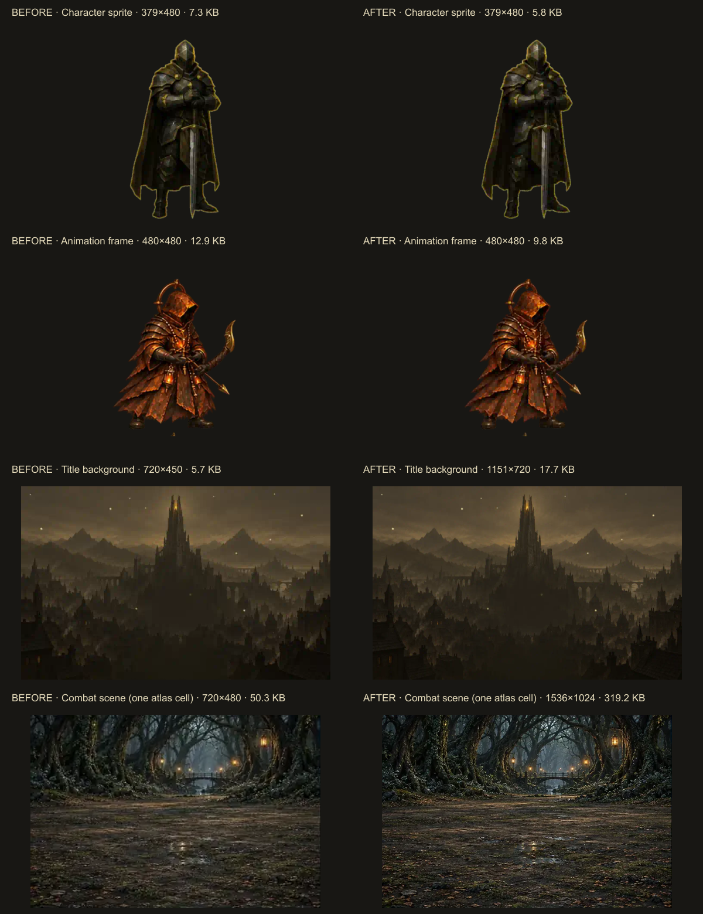

# Art export verification

Published source: [AshenSpire-art PR 16](https://github.com/cehinds/AshenSpire-art/pull/16), release `hd-assets-v14`. All three published archive hashes and the published manifest match the locally reproduced packs.

- 6,215 light assets match the manifest byte for byte. Embedded art is 81,390,056 bytes against the tightened 81,500,000-byte allowance.
- The regular portable build with its PR 1693 receipt is 97,765,370 bytes, below 100 MB.
- Seven policy/deduplication tests and eleven environment/map tests pass. The art repository passes 20 tests, 17 known-bad checks, provenance verification and reproducible packing.
- The initial complete build passed nine identity checks and twelve shipped-file checks. The receipt changes only changelog text; the final build repeats the same pack and portable compilation.
- `results.json` records real Chromium runs at 1600×900, 390×844 and 320×640. Empty slots, three entered encounters, current-position ring, equal spacing, containment and a real destination-inspection click pass. Inspection does not record travel.
- The independent seven-screen network gate passes all 82 checks with zero broken images or failed requests, including decoded map tiles, backdrops, fonts and score tracks. See `network-check.log`.
- Combat images and SVG scenery were decoded before the final captures. The successful full run has no browser exceptions or failed HTTP responses. An early fixed-delay capture was too early for the artwork; the probe now waits for image readiness instead of treating a delay as evidence.

The screenshots show build `0.7.1.1055` (`94f7e094d9`); build `0.7.1.1056` (`f741a4e193`) adds only the player-facing receipt. The final reconciled build is `0.7.1.1057` (`e99ef0bbf0`) and also includes the separately merged landscape-target fix. This art update does not change scene layout, sprite display size, gameplay or the original paintings. Physical-device and controller acceptance remain separate.

[Component catalog](../../component-catalog.html) · [Export policy](../../ART-EXPORT-POLICY.md)
