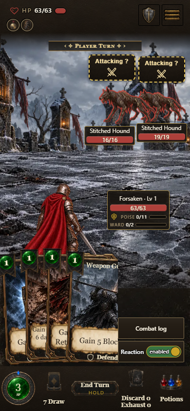
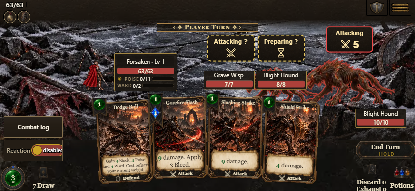

# Attached combat details — PR 1773

Approved visual: compact enemy targets over visible bodies, name/HP plates below,
and the player's live mini HUD to the right, clear of cards. The side panel shows
name/level, health, labeled resources, stance and statuses using existing data.
Enemy secondary resources remain in inspection; the battlefield plate stays
compact. Secondary co-op panels use nearby clear space when the preferred right
slot is occupied. Actor size/resting anchors and melee return behavior remain
independent of these controls.

Selection cells use 48–64 physical pixels, preserve enemy order and keep full
accessible names/HP. Native button focus updates the shared keyboard cursor.
Landscape tools use the left footer rail without subtracting the hand width twice.
Clipped card overflow is not a visible collision.

## Review and verification

The separate sprite-stability agent reviewed PR 1773 and the final source. Review
found and fixed landscape tool occlusion, co-op panel collisions, missing resource
labels and plate reservation height. Final review found no actionable blocker.

- Core lane passed.
- 48 focused placement/overhead/reaction checks and 58 sprite/reaction checks
  passed (the groups overlap; these are not additive unique-test totals).
- Source browser checks cover one/two/three enemies at 650×766, 390×844,
  844×390 and 1440×900, real legal keyboard/pointer targeting, and co-op layouts.
- Three real phone card plays plus empty-hand resize/draw preserve actor geometry.
- The crowd fixture gives each cloned enemy a unique knowledge-action serial;
  duplicate serials are correctly rejected by the engine, not bypassed.

Initial package **0.7.1.1182**, source digest **e56f8d6209**, passed all 12
responsive layouts and legal keyboard card plays. The packaged phone run also
passed three sequential card plays and empty-hand resize/draw stability. Reports
and representative screenshots are stored beside this record. External art
verification passed 314 checks, shipped-alias verification 12, build identity 9,
and the PR receipt 2. Hosted checks and promotion are reported separately in the PR.

The hosted 800x465 tutorial subsequently exposed a five-card hand collapse:
subtracting the landscape dock's complete right offset left capacity for only
one card, so all cards shared an x coordinate. The final correction places tools
in the left footer rail and reserves no additional hand width. The unchanged
Counter/Escape browser interaction then passed. Independent review verified
five distinct cards, reachable controls, and an onscreen working log drawer at
844x390 and 800x465. This initial revision still allowed cards to obscure some
enemy name/HP plates in very short landscape; PR 1775 addresses that collision
with the bounded placement described below.
The posed crowd uses 200 HP solely to survive interaction checks. Screenshots
are test fixtures, not completed runs. Build, receipt, hosted checks, dev merge,
architecture sync, test promotion and alternative sync are separate gates.

Reproduce with `node tools/combat-attached-details-qa.mjs`, setting
`COMBAT_QA_URL=http://localhost:8338/build/AshenSpire.html` for the package and
`COMBAT_QA_OUT` for output. `QA_WIDTH` optionally selects one viewport.
Existing `tools/combat-card-stability-qa.mjs --phone` covers sequential plays.

## Compact layout follow-up — PR 1775

The final source for build **0.7.1.1189**, digest **b098ee2d88**, reserves the
player details first and packs enemy name/HP bands around the actual hand,
transformed cards, intents and player panel. Ten-pixel panel clearance matches
the final HUD placement pass. Only crowded controls move; sprite anchors and
size remain unchanged. The opt-in model preserves existing alternative callers.
The component catalog documents this behavior.

The exact screenreach probe, driven through Playwright against the source
server, passed all 11 cases: normal and XL at 1200x730, 390x844, 390x650,
360x640 and 844x390, plus the controlled intent-overlap fixture at 390x650.
Enemy-tap, player-tap and intent-layer planted regressions still fail as intended.
The 21 focused placement checks passed. An independent reviewer found no
actionable blocker and checked phone, landscape and co-op targets.

The default knowledge-enabled combat also passed a real-input saved-state check:
End Turn, two defensive-reaction Back clicks, two advanced turns, then Quick
Menu > Load > slot 1 > confirmation restored an identical combat/RNG snapshot.
There were no page errors or failed requests. This covers the changed reaction
path; it does not replace all legacy/refused-slot cases in the full door tool.

Local raw-CDP probes timed out during source boot, before measuring their
assertions, and the motion self-test copy could not run without the verified
high-resolution art pack. These are unavailable results, not passes. Hosted
verification, build completion and promotion are recorded separately in PR 1775.

These source captures use the ordinary combat fixture and the XL crowd fixture,
respectively. They demonstrate layout, not a completed playthrough.
