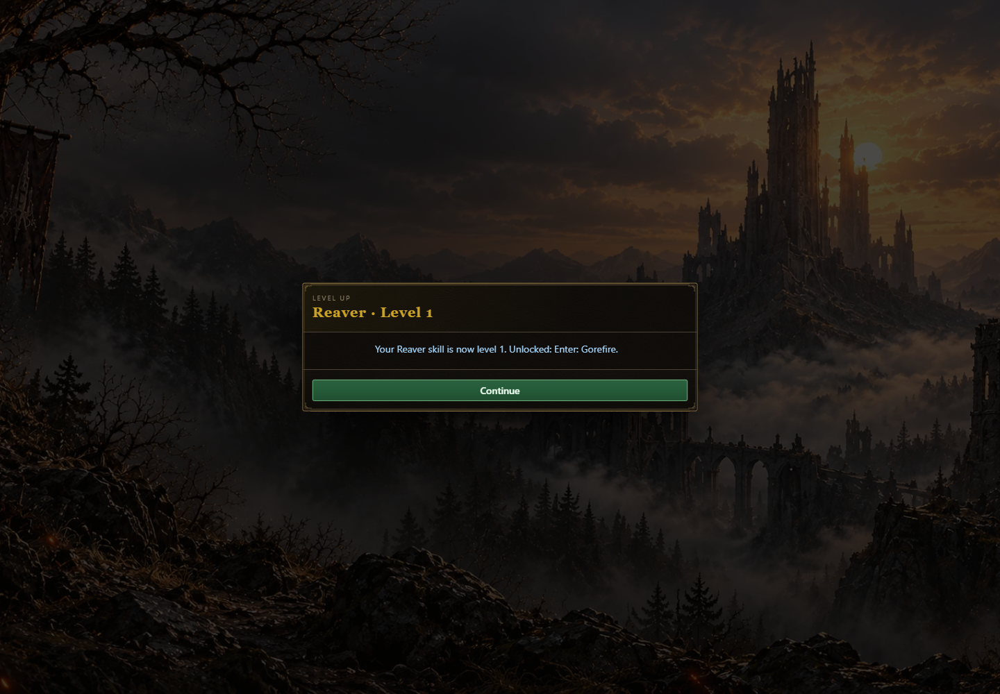
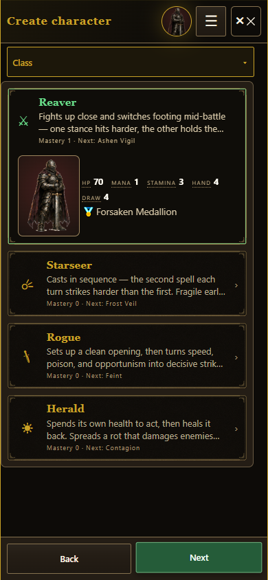
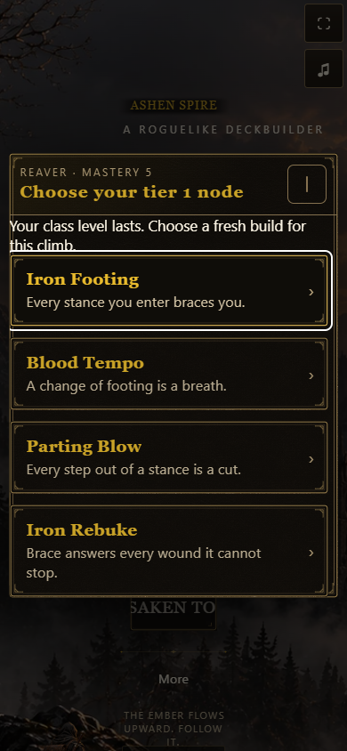
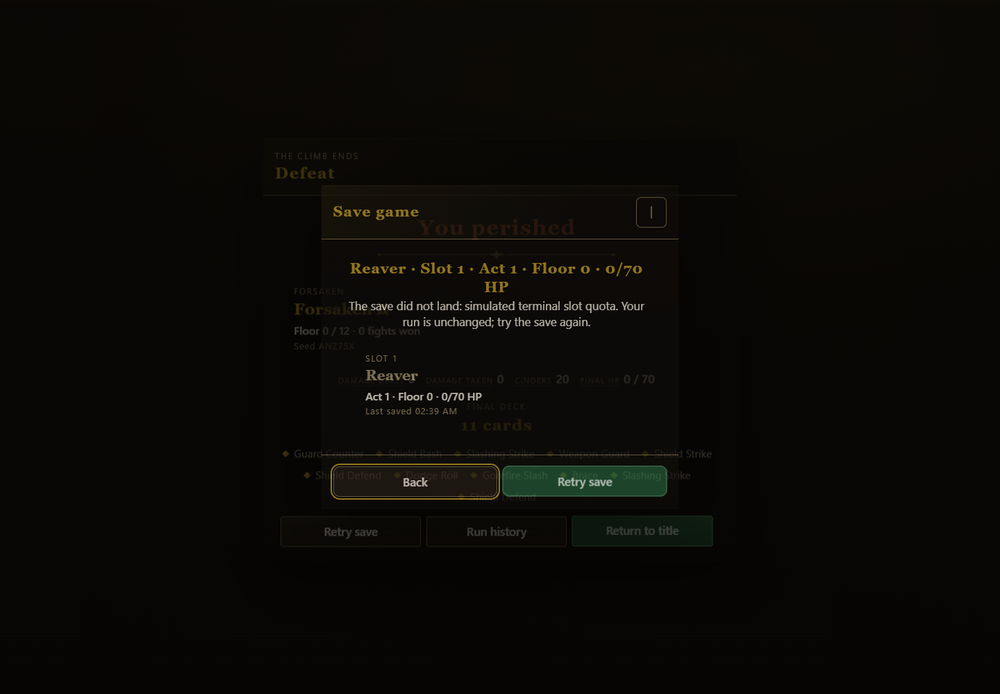

# Class mastery evidence — PR #1658

New-run activation completes the content foundation (#1654) and durable profile banking (#1655). Browser evidence uses actual source screens at desktop 1440×1000 and phone 390×844, in isolated browser contexts. It does not claim a full human-played run or physical-device acceptance.

- `main-result.json`: two cold boots, required initial tree choice, first fight preview and actual first card play, six inputs each. Actual creation shows the profile mastery and next unlock.
- `tree-result.json`: mastery 5 takes one real choice in each of tiers 1–3; the next new run starts without the previous choices and takes all three again.
- `terminal-result.json`: injected slot and profile quota failures through the actual resume/finish controller. Each retains its terminal slot, presents Retry and records exactly one result before clearing on success.
- `result.json`: deterministic reward fixture using real models, the reward renderer and memory-backed save manager. The rendered Level up button claims level 1, immediately saves XP 50 and its unlock, and displays the unlock. This is bounded reward UI evidence, not the main combat-to-reward controller.

## Reproduce browser checks

Serve the checkout using `node tools/serve.mjs --port 8328`. The scripts use external Playwright; set `PLAYWRIGHT_MODULE` to its installed module path and `CHROME` to the browser executable when needed. Set `MASTERY_QA_URL` for a different server URL and `MASTERY_QA_OUT` for a temporary evidence folder. From the repository root, run `reward-browser.mjs`, `main-browser.mjs`, `terminal-browser.mjs`, then `tree-browser.mjs` under this directory. The main check reads the reward check's profile receipt.

## Mastery XP over 100 fixed seeds per birth class

The runner is `node tools/runsim.mjs 100 --class-mastery`. For the final replay, the unchanged runner was split into four processes by filtering only its `REG.classes.all()` iteration to one birth class in each temporary copy. All imports and decisions used the final mastery/reward model. These copies were removed afterwards. Individual console receipts are `simulation-<class>.txt`; `mastery-xp.json` records the aggregate.

| Birth class | Mean XP | Median | P90 | Min | Max | Wins / 100 |
|---|---:|---:|---:|---:|---:|---:|
| Reaver | 304.3 | 330 | 415 | 165 | 455 | 39 |
| Starseer | 228.9 | 215 | 265 | 155 | 455 | 6 |
| Rogue | 266.9 | 230 | 405 | 90 | 445 | 21 |
| Herald | 348.1 | 385 | 435 | 170 | 470 | 65 |

400 completed runs, 131 wins, zero crashes, zero soft locks. XP totals include all classes paid after swaps, grouped here by the run's birth class. This fleet checks integration and XP receipts, with no win-rate gate. The greedy bot's existing character-level pace remains below its separately reported 10–20-level acceptance band; this mastery change does not settle that character-XP balance gate.

The profile durability probe's mastery migration and retry cases pass. Its pre-existing archive-salvage UI reachability gap remains reported separately; engine archive preservation does not prove that UI can be reached.

