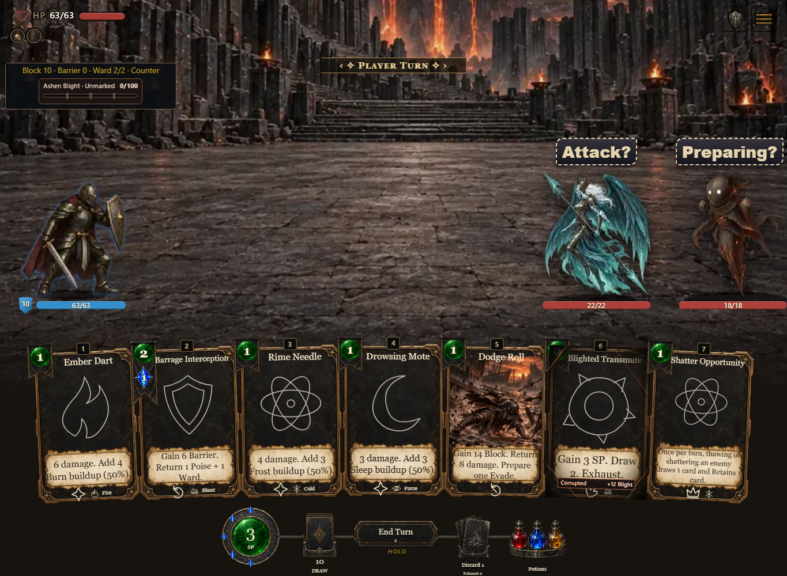
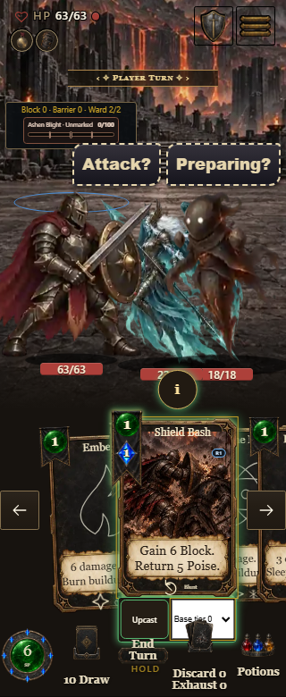
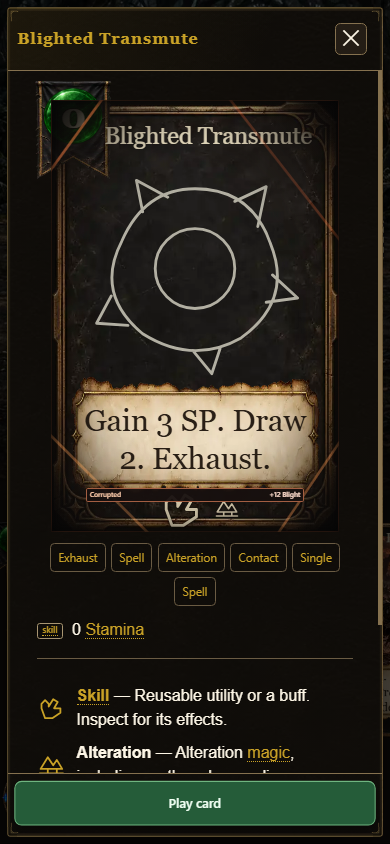

# Compiled Counter QA — 0.7.1.1134 / a573db6da0

The full driver completed with **exit 0** against the unmodified standalone artifact. Its rendered identity was checked in every solo and co-op scene. Artifact SHA-256 and production-fixture source head are in `invocation.json`; concise results are in `summary.json`.

- Desktop 1365×1000, phone 390×844, compact phone 320×780 and reduced-motion phone 390×844 passed: four mounted Shield Bash cases, four Spell Counter cases and eight co-op owner controls.
- The actual mounted Round Shield card retained permanent ability rank 1. Native Upcast Tier 2 selection displayed and paid **3 SP / 3 Mana**, armed one Counter charge and dealt no immediate enemy HP damage. Native paging and tier selection preserved resources, piles and RNG until commit. The compact phone used the actual hand pager and touch hit testing.
- Normal preparation recorded the effective guard or casting group and never entered an attack group/class or attack/shield-bash frame. Guard settled to `shieldGuard3`. Reduced motion was explicitly active and retained the same payment/mechanical checks; it settled the Spell Counter to the equipped `reaverSwordShield` ready frame `STANCE-READY` with idle rest, as the production pose resolver specifies.
- Spell Counter paid **2 SP / 1 Mana** with its immutable Tier-0 instance receipt, armed one Spell charge and added 6 Barrier. Persistent Ward and enemy HP remained unchanged.
- Co-op p2's paid tier/instance and corruption state controlled p2's guard, while p1 had different attributes and the opposite corruption state. No p1 guard/attack was attributed to p2's action. These snapshots came from production engine paths through the compiled shot transport; this is **canned transport evidence, not LAN or a second-browser host test**.
- JavaScript errors, warnings and failed requests were empty. Browser shutdown logged a profile EBUSY warning. Only identity-verified owned Chrome processes were targeted; the driver then completed normally. Final inventory showed no owned driver/browser process and the profile was absent. The original warning and cleanup inventory remain in the full output folder.

All seven representative captures were visually reviewed. The full 28 captures, event/pose traces, generated wire, log and preserved cleanup inventory remain in `D:/repos/.codex/outputs/combat-card-stances/built-counter-visual-qa-1134-a573`.

Earlier 1133 preliminary normal-case passes and both reduced driver-expectation failures remain separately preserved. They are not relabeled as final acceptance. No runtime source or artifact was injected or edited for this run.

The separate trim and inspection pass verified the same artifact: 32 motif, rarity and illustration combinations plus 32 forced-color cases on each of desktop and phone, 128 checks total. Native Information/Escape preserved the exact player, piles, RNG seed and counters. No browser or network errors occurred, and its owned browser cleanup was verified. `trim-artifact-identity.json` records that artifact boundary.

Representative authored-fixture captures:

