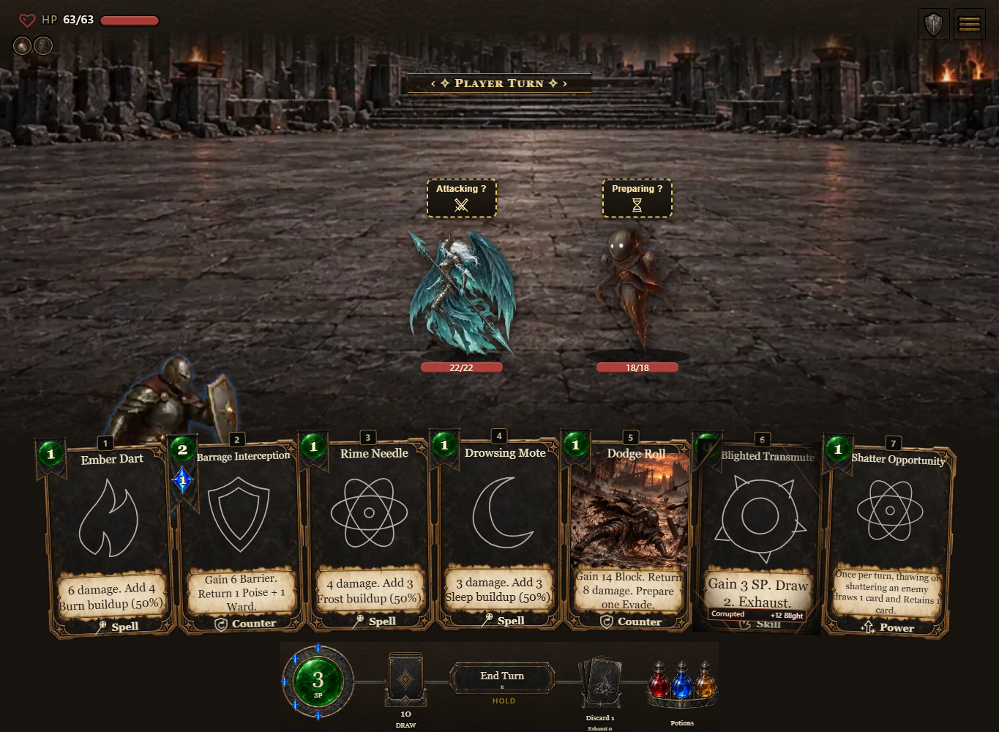
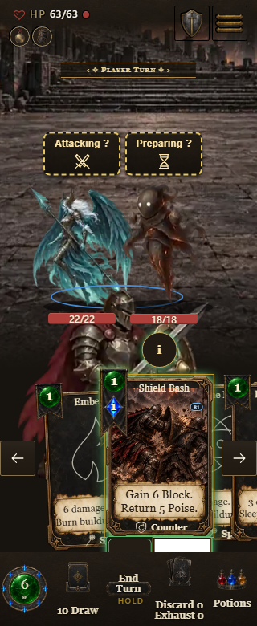
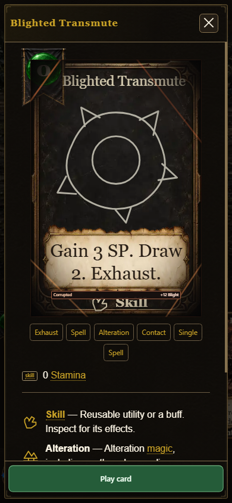

# Compiled Counter QA — 0.7.1.1148 / 6e54b35eb3

Both full drivers completed with exit 0 against the unmodified standalone artifact. Its SHA-256 and fixture source HEAD are in invocation.json; the source-generated wire pins six production modules including the actual session and LAN projection.

- Desktop 1365×1000, phone 390×844, compact phone 320×780 and reduced-motion phone 390×844: four mounted Shield Bash cases, four Spell Counter cases and eight co-op owner controls.
- A mounted Round Shield retains permanent rank 1. Native Upcast Tier 2 displays and pays 3 SP / 3 Mana, prepares one Counter charge and causes no immediate enemy HP damage. Pager, selection and rank choice preserve resources, piles and RNG until accepted play.
- Normal preparation uses the guard or casting group and never an attack group/class. Guard settles to shieldGuard3. Reduced motion uses the actual settled pose with unchanged payment and mechanical assertions.
- Spell Counter pays 2 SP / 1 Mana, adds 6 Barrier and prepares one Spell charge; persistent Ward and enemy HP remain unchanged.
- Actual createSession → host.snapshot → projectLanSnapshot supplies the canned co-op transport. Distinct p1/p2 stats and opposite conversion states prove p2's accepted instance/tier controls p2's price and animation. This does not claim a live socket or second-browser LAN test.
- All 128 corrupted trim/theme/rarity/forced-color cases passed. Native Information/Escape retained the exact player, piles and RNG state.
- Browser errors, warnings and failed requests were empty. Source tests, compiled artifact checks, browser interaction evidence and live publication remain separate checks.

All eight representative images were visually reviewed before this gallery was committed. Original complete traces, 28 Counter captures, trim captures and driver logs remain in the D: output folders; earlier source or server failures are retained separately.

**Raw files removed from the tree (2026-10-10, #1812).** `summary.json` was removed under the QA-evidence rule (CONTRIBUTING.md, *QA evidence goes to CI artifacts, not the tree*). Statements or manifests here that name it describe the original run; the bytes live in history: `git log --diff-filter=D -- <path>` finds the removing commit and `git show <commit>^:<path>` restores them.
