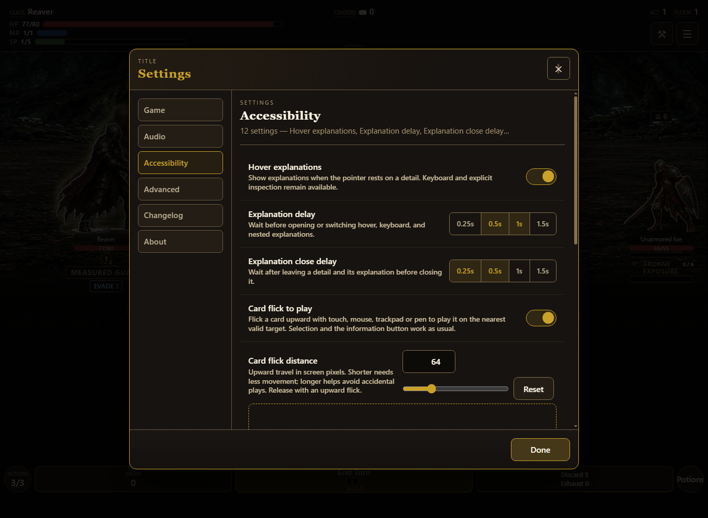
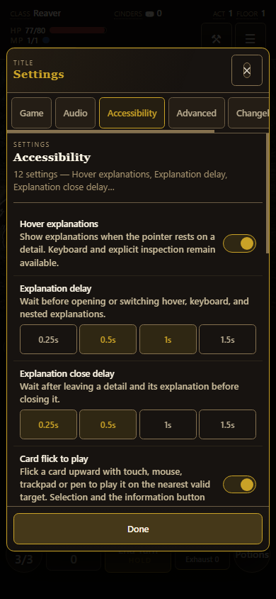
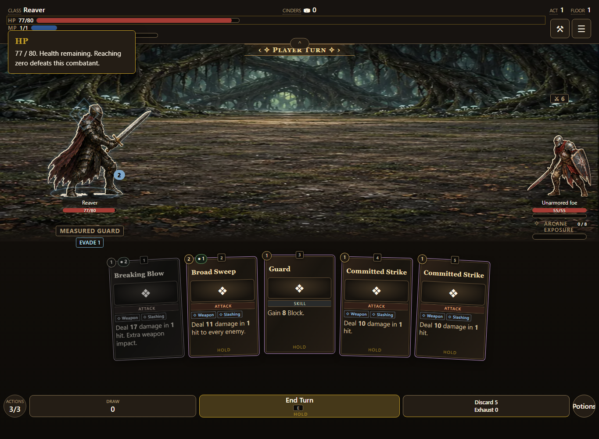
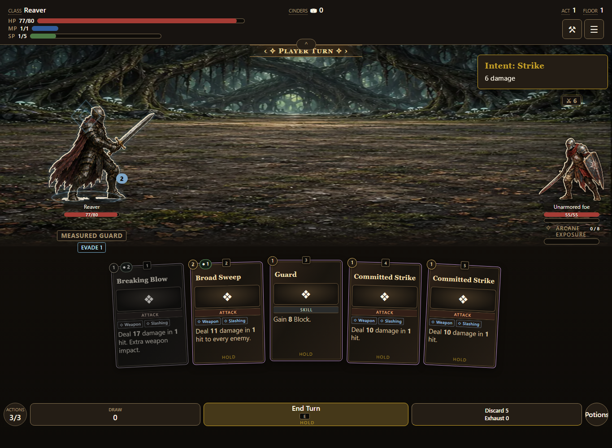
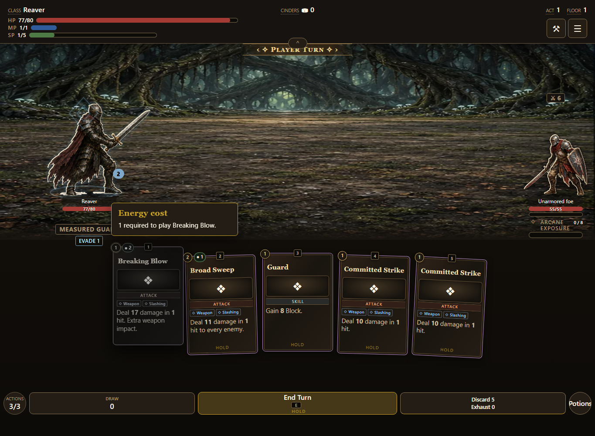
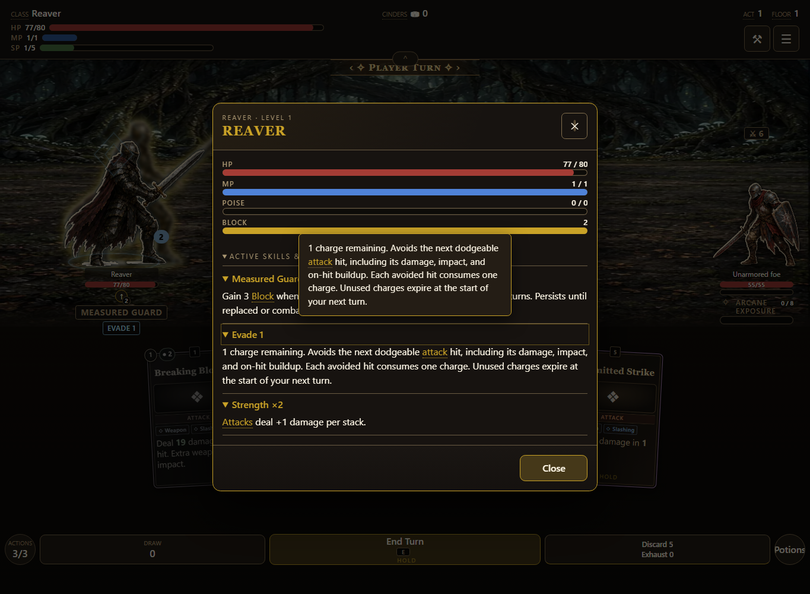
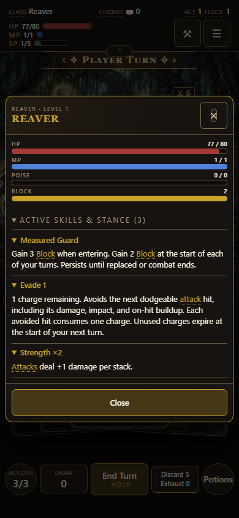

# Combat hover help

Issue [#890](https://github.com/cehinds/AshenSpire/issues/890), PR [#891](https://github.com/cehinds/AshenSpire/pull/891). Preview build **0.6.0.82**, integrating `dev` at `3ba30805` including title centering PR #903, boss/elite scale PR #900, armament specification PR #897, map PR #878, starting-equipment PR #885 and inspector footer fix #893. Inspection PR #888 and test promotion #889 were completed before this implementation began.

## Coverage

| Surface | Explanations checked |
| --- | --- |
| HUD | Class, Cinders, Act, Floor, HP, MP, SP, Armoury, Menu, HUD grip |
| Battlefield | Turn banner, player/enemy HP, enemy Poise, Block, stance, Evade, enemy intent/name, Arcane Exposure |
| Hand and actions | Action/stamina cost badges, tags, containing card, Actions, Draw, Discard/Exhaust, Potions, End Turn |
| Inspector | Resource values, Block behavior, complete ability disclosure, individual Evade disclosure, Close |

All hover targets share one service, including handover between a cost badge and its card. The default is 0.5 seconds. Accessibility settings expose hover on/off plus independent opening and closing delays (0.25s, 0.5s, 1s, 1.5s). Changes apply to existing targets immediately; hover-off keeps keyboard and explicit inspection available. Preferences persist through the normal profile settings path.

`src/content/tooltipHelp.js` owns the timing options/defaults, Settings labels, help templates, HUD target descriptors, gesture timing, fade duration, and text-size thresholds. `src/model/tooltipSettings.js` resolves stored values and generates the Settings rows from that data. Templates receive live game values; stance/status effects continue to come from their definitions. Existing card bodies and combatants remain the broad explanations for their artwork and text. Decorative scenery and spacing do not create redundant hover targets.

## Validation

`node tools/combat-test-browser.mjs`: **169 checks passed** on the generated build at 1365 × 1000 and 390 × 844. The audit covers 33 hover targets, card/cost handover, and real Settings controls. It checks delayed opening, viewport containment, immediate changes on existing targets, independent close delay, disabled hover, retained keyboard/explicit inspection, phone settings, restored defaults, and the inspector footer Close button after tooltip interaction. Existing stance, Evade, card targeting, route, and storage checks remain included. `node --test tests/tooltip-settings.test.mjs tests/combat-abilities.test.mjs` passes eight focused tests, including sparse/invalid preferences, authored option/default changes, template substitution, and profile save/reload.

Build version, shipped artifact, receipt, About changelog, and whitespace checks accompany the generated preview. The browser test uses isolated test mode, reduced motion, a concurrent Strength fixture, and explicit low enemy HP for route continuation. It is not a full-run balance test.

## Preview

Run `node tools/serve.mjs --port 8878 --no-open --no-lan --root dist`, then open [the combat preview](http://localhost:8878/AshenSpire.html?shot=combat-test). Start a build and hover any HUD or combat detail. In this isolated preview, open Armoury → Settings → Accessibility to configure explanations. Play the stance and Dodge to expose both active badges.

