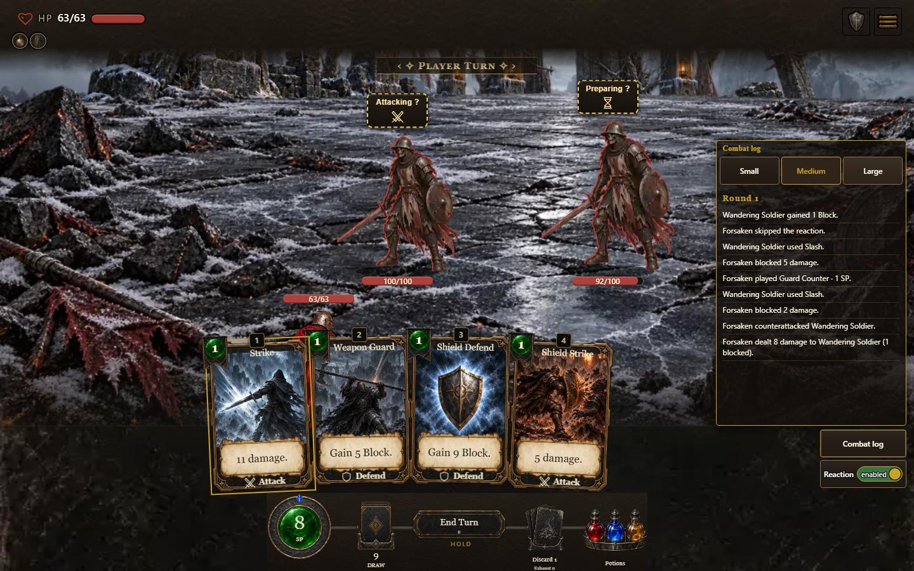
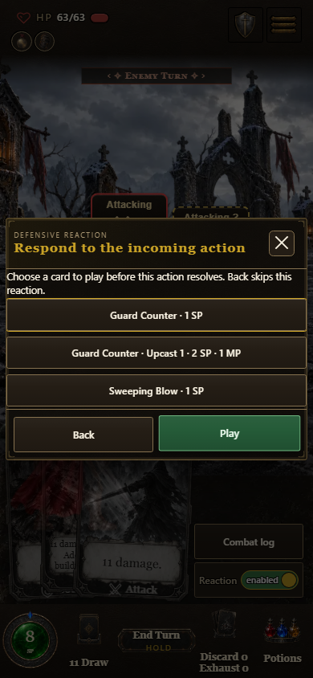
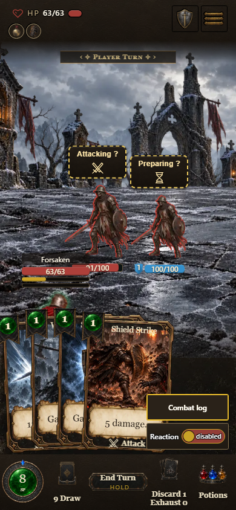
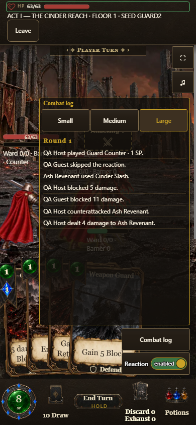
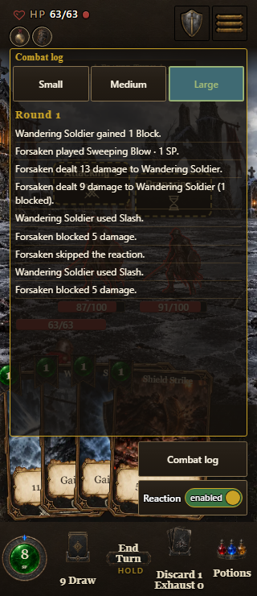
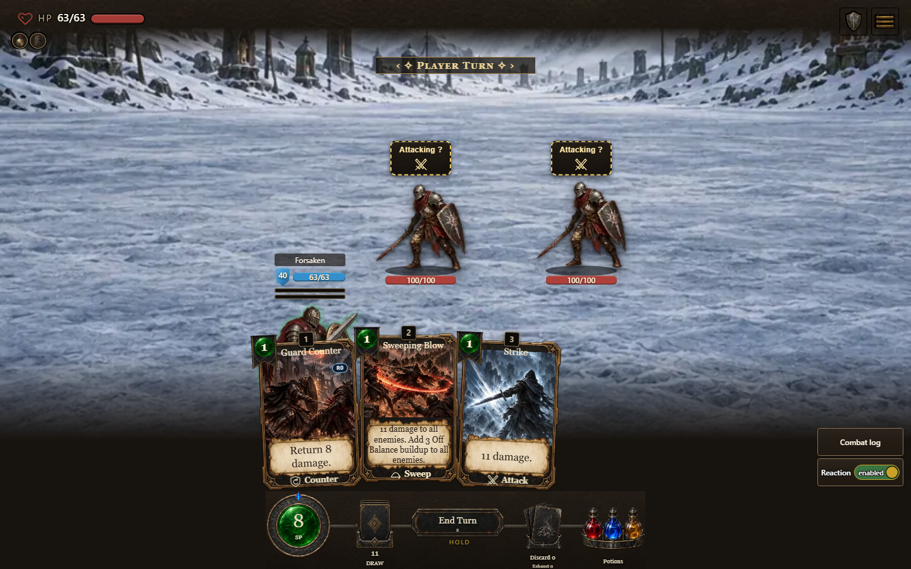

# Packaged reaction and combat controls evidence

Build `0.7.1.1168`, source digest `e8982e69ab`; source checkpoint `1974b9b386440949a383522fd4cdea592df5104a`. All four official launcher aliases match. `evidence.json` contains the build receipt, raw timeline samples, geometry and browser health.

- [x] Desktop keyboard selection stays inside the paused modal; selection spends nothing. Back skips the current offer and resumes the attack.
- [x] Paid Counter preparation, enemy attack, full block and defender return finish in order. Desktop, touch, Classic and both real LAN clients report three opened/three finished timelines and zero watchdog completions.
- [x] Only the owning LAN screen receives the reaction modal. The host plays Counter; the guest skips with Back; both render the same public round log.
- [x] Reduced-motion defensive Sweep actually spends its card and damages both enemies before the remaining actor resumes. Log unfolding animation resolves to `none`.
- [x] Small is half the physical card height, Medium half the visible viewport, and Large stops below the measured menu controls. Every log/toggle/size control is at least 44 physical pixels high.
- [x] Actual image alpha and canvas body pixels put the mini HUD about 10.00–10.02 physical pixels above art in measured desktop, 390 px and 320 px scenes. Touch selection reveals the extra bars upward. Both appearances preserve the gap.
- [ ] Physical-device and owner acceptance. Touch here uses the browser's actual touch input API with mobile/touch emulation; it is not a phone-device sign-off.

The authored combat fixture uses ordinary run/class creation and normal restore, UI and LAN command paths. It puts Counter, defensive Sweep and Strike in hand with enough resources and Block to observe the sequence. These are controlled saved-combat and production showcase checks, not a complete run playthrough. Canonical restoration may rederive enemy maxima. Browser page errors were zero. The recorded network health includes optional audio 404s and requests aborted during reload; this is not a claim that every request succeeded. No required character-art placeholder appeared in the captured scenes.

## Viewed captures

## Reproduction

Use a disposable checkout under `D:/repos/.codex/worktrees`, complete `node tools/launch.mjs --build-only`, then run `node docs/qa/combat-reactions-2026-10-08/capture-driver.mjs D:/repos/.codex/outputs/reaction-review`. Playwright must be resolvable, or set `PLAYWRIGHT_MODULE_PATH` to an installed Playwright module. `BROWSER_BIN` can select an installed Chromium browser. The driver refuses to overwrite an existing `dist/.coop-session.json`; preserve that file before another run. It authors only this isolated QA room.

The driver exposes `page` (1440×900), `nativePage` (390×844 mobile touch), `hostPage`, `guestPage`, `url`, `shot` and a command prompt. Load the measurement helpers with `globalThis.qa=await import(helpersUrl)`. Commands are one-line JavaScript. Read-only measurements use `qa.measures(page)`; timeline sampling uses `qa.startTrace(page)` and `qa.stopTrace(page)`; `qa.report(name,data)` preserves JSON.

For solo, tap/click the player's HP to reveal bars; open Combat log and compare Small/Medium/Large. Close it, focus the End Turn control and hold E on desktop, or tap End Turn and confirm END TURN on touch. Select a reaction and wait at least 350 ms; compare `qa.freeze` before/after, tab through the modal, then use Back or Play. Sample each Counter timeline through its final player turn. Set reduced motion with the browser API, reload the showcase, and play Sweeping Blow before skipping the next offer. Resize to 320×740 and repeat the log maximum and selected HUD measurement.

For Classic, reload the showcase URL with `shotSettings` JSON `{"classicAppearance":true}`. This is the production ephemeral settings path, not a CSS override. Repeat the paid Counter and selected HUD checks.

For LAN, open Forsaken Together on host/guest, host as QA Host, and join the guest through the discovered **This fire** entry. Ready the guest, wait until the host roster includes QA Guest, then Resume the saved run. End both turns through their normal confirmation dialogs. Verify that only the host sees its offer, select Guard Counter and Play; Back skips the subsequent guest offer. Wait for both player-turn renders and for `__fx.open === __fx.finished`, then compare timeline counters and public round log. Selecting a different discovered fire would invalidate room identity.

`CLOSE` ends the browser and the driver's own LAN host. Preserve the authored room in the QA output directory before a subsequent capture. Inspect captures only after modal/selection transitions settle; an early screenshot can catch the opening fade.
