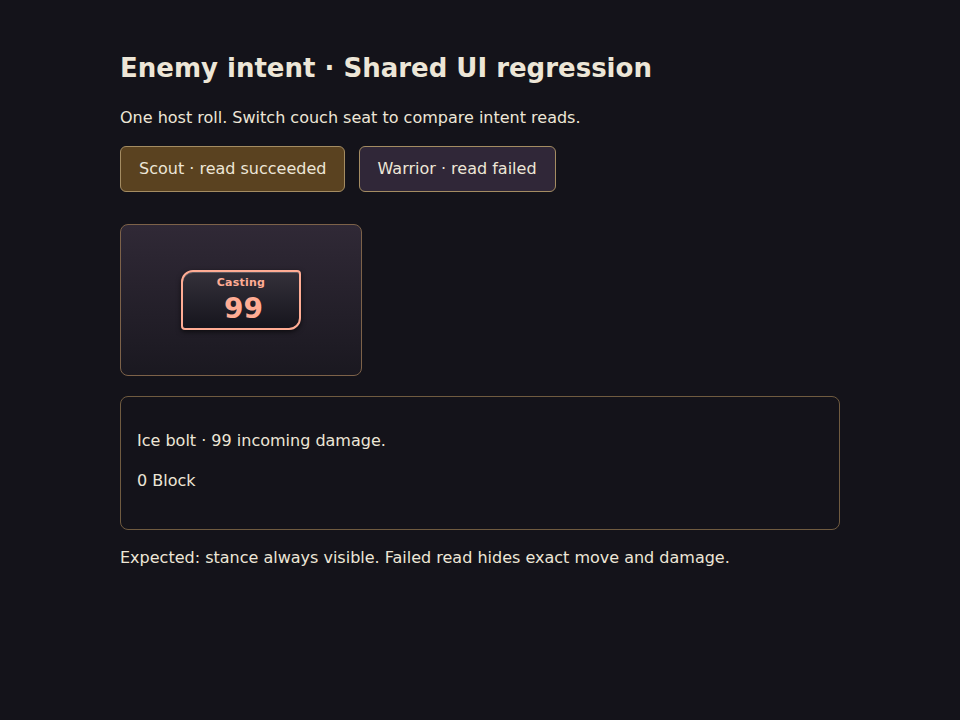
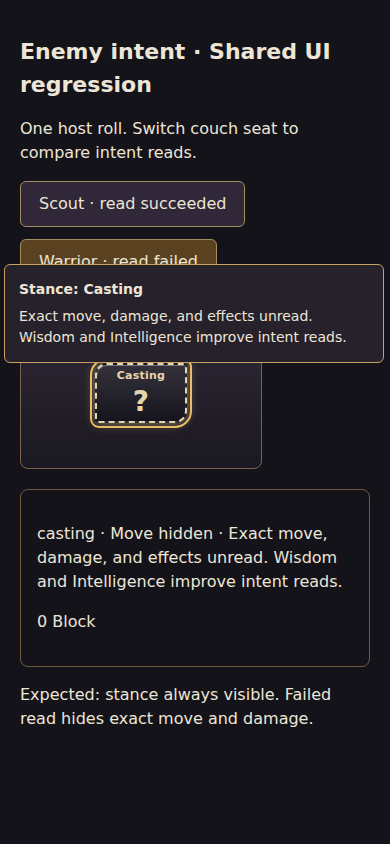
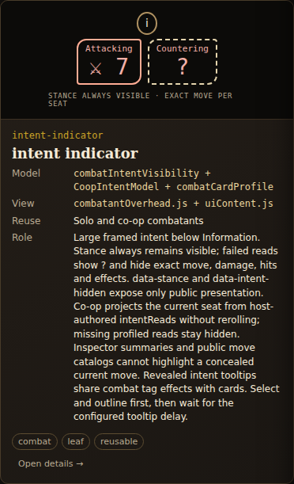
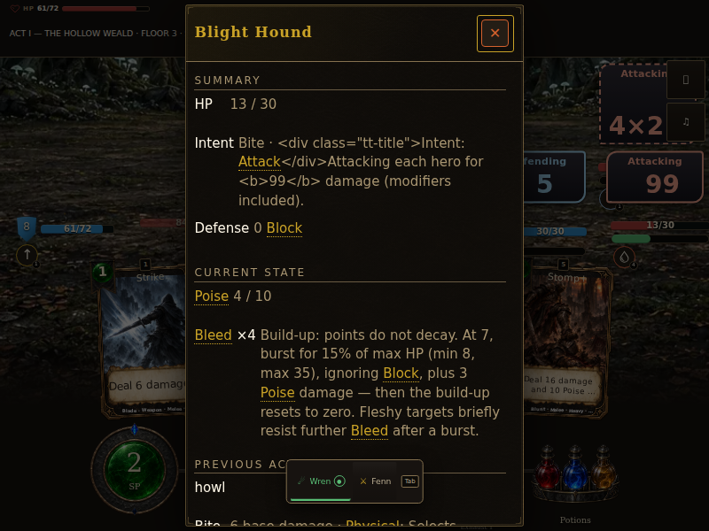
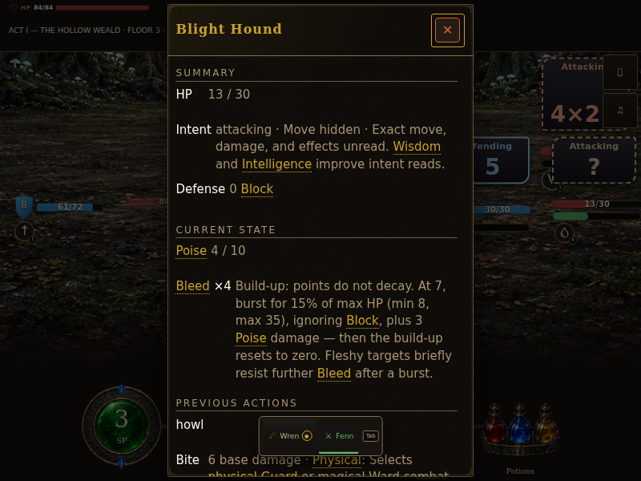
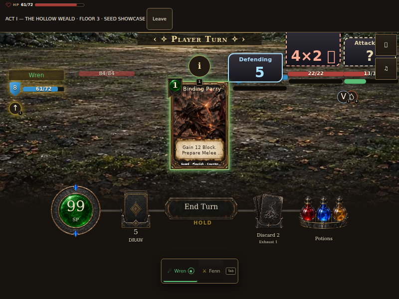

# Combat tag and intent evidence

Shared production intent renderer and co-op projection checked at 960×720 and 390×844. Switching between successful and failed character reads shows exact damage or the casting stance with a question mark. Hidden tooltip and inspector omit the move name and damage; switching back restores the successful read without rolling again.

Component catalog filter/detail interaction checked. No console errors or missing resources in the isolated checks. Full live network gameplay was not exercised by this fixture.

The real co-op screen also passed `node tools/coop-hud-top.mjs --intent-privacy-only`: open the successful-read inspector, switch couch seats with Tab, verify it closes, reopen with the failed read and verify exact damage stays hidden, then Leave and verify inspector cleanup. The same check runs in the ordinary CI probe. Host snapshot fixture, not a live network session.

That probe also checks Guard Counter's untargeted preparation and Binding Parry's explicit source confirmation. No enemy is requested for deferred reply damage. The click-to-impact probe samples five immediate damaging cards (370 ms median); deferred Counters have dedicated preparation coverage. Tutorial checks passed 200/200 across eight viewports; resize and first-run remain CI cases. Motion checks passed 32/32. An End Turn height assertion failed equally on the original runtime and this candidate at 1200×730 with a medium seven-card hand; its configured height is below the shared tap floor. No assertion was removed or relaxed.

