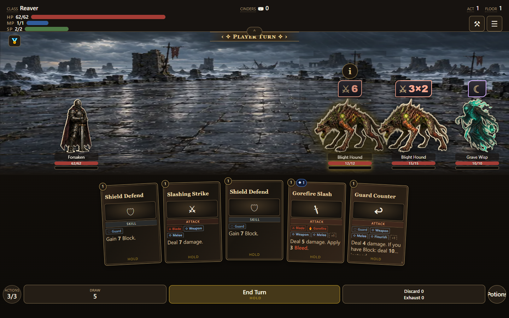
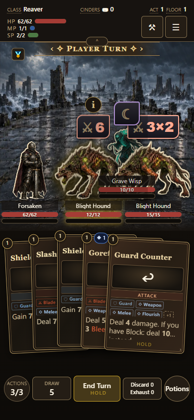
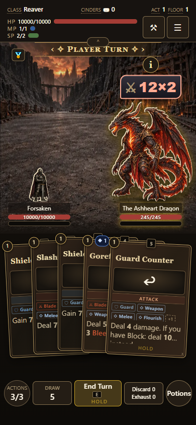

# Combatant overhead controls

Information and intent share a vertical stack above the visible idle artwork. Information uses the card's gold-ring button and appears only on the selected combatant. Selecting another combatant moves it; selecting a card or dismissing the reading selection hides it. The hidden slot collapses, while intent stays visible directly above the sprite. Information opens the existing detailed combatant body; the sprite itself no longer opens its summary tooltip. Intent is a larger framed badge, with an action glyph and live value.

Hover or keyboard/controller focus outlines the control immediately and uses the configured explanation delay. The first touch tap selects and starts the same delay; the second Information tap opens the inspector. Changing selection, leaving before the delay, Escape, scene replacement, and blank-space presses cancel the explanation. Overhead input does not bubble to an armed combat target.

The formation reserves space for the complete overhead stack and the turn banner even when Information is collapsed, so selecting a combatant never resizes sprites or moves health bars. Short viewports allocate more space to the battlefield. Visible artwork height owns fitting, so transparent padding does not reduce the combatants twice. Names, meters, and ground positions still align within each row. Only the selected overhead stack is raised; its sprite cannot cover a rear enemy's intent.

Validation: `tools/combatant-overhead-qa.mjs` exercises mouse, touch, keyboard/controller focus, armed-card inspection, unobstructed control centers, grounded geometry, and co-op at 1440x900, 390x844, 320x640, and 844x390. Additional browser checks cover 1.75x elite, 2x boss, 3x boss, reduced motion, and the rebuilt standalone. Fixtures exercise real combat rendering; they are not a complete game run.

The selection follow-up also compares the shared card/combatant Information styling, checks that only the selected combatant exposes Information, and measures unchanged sprite height and ground after selection and rerender. Touch probes use an exposed point on the visible sprite; transparent padding can overlap an intent badge.

