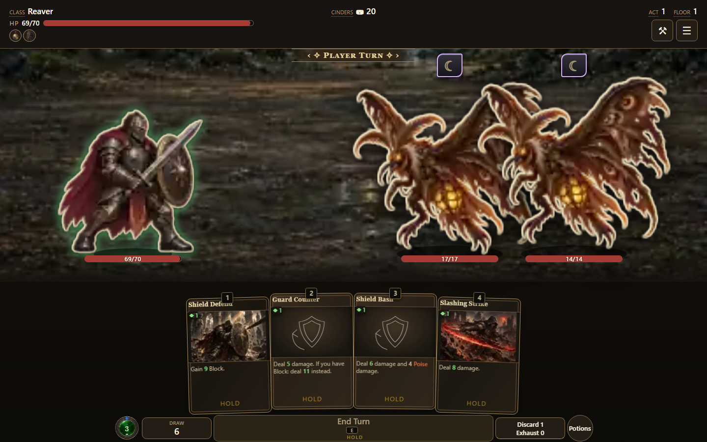

# Hand refresh browser evidence

PR #1536, 2026-10-03. Standalone build **0.7.1.846**, source digest
`f5a071fe71`, served from the normal root alias with the verified v7 art cache.

After integrating PR #1530, all 95 hand/Stamina compatibility checks passed.
The nine browser checks passed again after integrating PRs #1533 and #1538.
The final build is 0.7.1.851. Since this browser pass, the receipt was updated
and PR #1542 supplies the keepsake fallback through the shared art retry helper;
hand behavior is unchanged. Both affected art suites pass all 37 tests under
the CI cache environment.

A fresh Chromium profile at 1440 × 900 used Quick start with seed 8, entered
the first fight, played a self-targeted skill, and held End Turn for the
control's configured 600 ms. The tutorial overlay was dismissed for the image.
All actions used real CDP mouse or keyboard input; combat state was only read.

The probe passed **9 checks**. The opening hand contained four cards; Quick
start reached the first play in six inputs. The next player turn held and
rendered four cards: Guard Counter, Shield Bash, Defend and Strike. Its saved
rules read `retain: false`, `shuffleHand: true`, `drawMode: fixed`, opening/draw
base 4, and hand capacity base/max 15. There were no runtime exceptions or
unexpected HTTP failures. Optional sound-file probes fall back to the authored
synth recipes (`src/content/sfx.js`); LAN discovery returns unavailable on a
standalone server (`src/net/lan.js`). Their expected 404 responses are not asset
failures.

The headless regression suite additionally covers Retain accumulation, the
15-card cap, depleted piles, ordered draw, spell upgrades, played-card
destinations, solo/co-op overflow and deterministic save/resume. This browser
pass does not establish physical touch or controller behavior, other browser
engines, or interactive co-op acceptance.

The co-op layout/interaction probe also passed at 390 × 844, 844 × 390 and
1280 × 800 using its canned host snapshot. It verifies seat switching, flask
controls, live snapshot replacement, vow selection, and the active seat's
Stamina/Mana accessible label, painted number and mana gems. The updated
geometry judge passes all 49 self-test cases and three unit tests, including
missing/extra HP rows and the retained multi-row overlap corpus.
