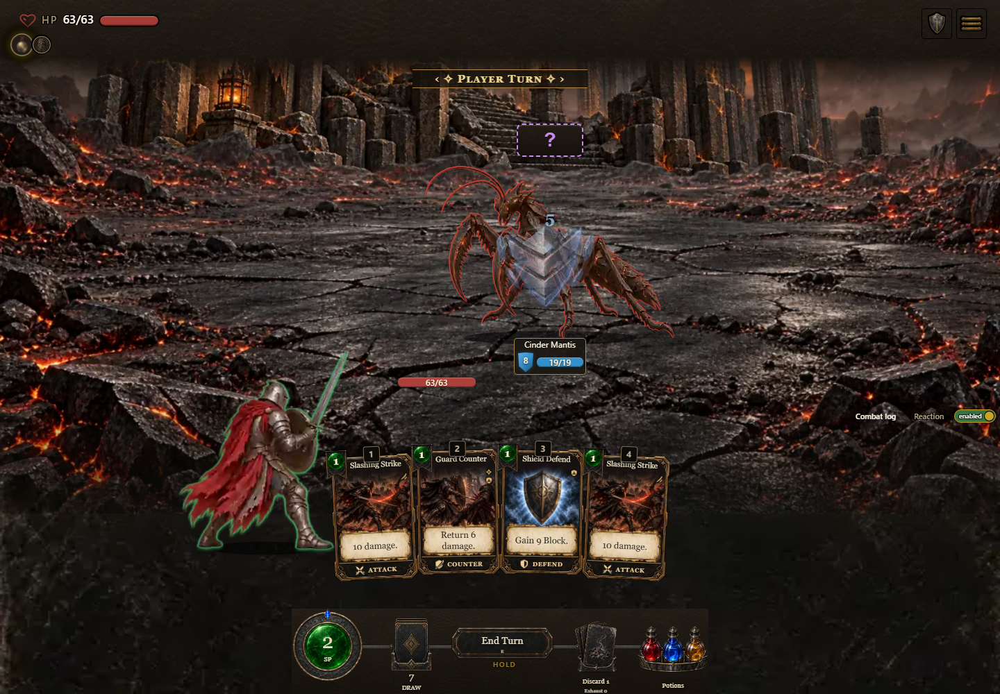
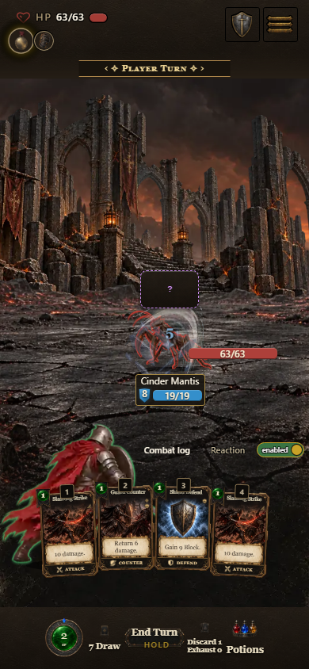

# Reviewed player attack integration

Thirty-two sequences add four painted phases for eight weapon families across
Reaver, Starseer, Herald and Rogue. All four spear candidates remain excluded.
The default combat stage retains its class identity, shared 512px canvas and
floor at 464px. The new attacks add no engine state or combat effects.

Ordinary attacks select an explicitly supported equipped shape. Unknown or
unsupported combinations retain the existing class action; shield-source bashes
do not borrow sword strikes. Physical ranged cards borrow bow art only when a
bow is equipped and the action source matches. Spell attacks use the energy
blade, other casting uses the casting sequence. Smash, sweep, counter, defend,
stances and hurt reactions retain their existing sequences. Technique IDs retain
the original card action so painting selection cannot change its aura behavior.

Asset authoring and release live in AshenSpire-art. The game adopts its immutable
release and mirrors its generated light twins for the existing local-light source
workflow. No full-resolution art is added to this repository. Source PNGs, exact
prompts, registration and visual review are archived in the art repository. The archived README is the original authoring-package description; its preview, sheets and editable projects remain in the authoring output and are not part of the runtime archive.

Validation on 2026-10-09:

- 149 engine/tool core checks passed; 17 focused animation, stage and preview
  tests passed, including variable strike timing, source mismatch fallbacks,
  reduced motion, interruption, pause/resume and casting aura preservation.
- Art repository: 20 tests, all 17 negative provenance fixtures, manifest and
  twin checks passed. All three packs reproduced byte-for-byte and verified.
- Source and packaged game at `?shot=combat&shotSeed=21`: real Slashing Strike card
  selection and target-button input played anticipation, strike, follow-through,
  recovery and returned to the offensive stance at 1440x1000 and 390x844.
  No character placeholders or missing sprite requests occurred.
- Browser requests exposed missing SFX files (`cardPlay`, `block`, `relic`,
  `holdTick`). The current layout substantially occludes the player behind the
  hand. The captures demonstrate playback, not full visual or phone-device
  acceptance. Those issues are not fixed by this sprite change.
- Refreshed complete inline candidate: 116,028,404 bytes. The new light sprites
  contribute 1,378,368 base64 bytes. Art allocation is 83,000,000 bytes; measured
  art including fonts is 82,809,576 bytes. The complete download exceeds the
  newer 100 MB owner target. Older build tooling treats that target as
  informational; passing its checks does not establish size compliance.

Independent Codex review identified co-op's midpoint impact assumption and loss
of casting aura identity; both were corrected before final review.

Component reference: [combat sprite renewal](../component-catalog.html#alternative-sprite-renewal).
