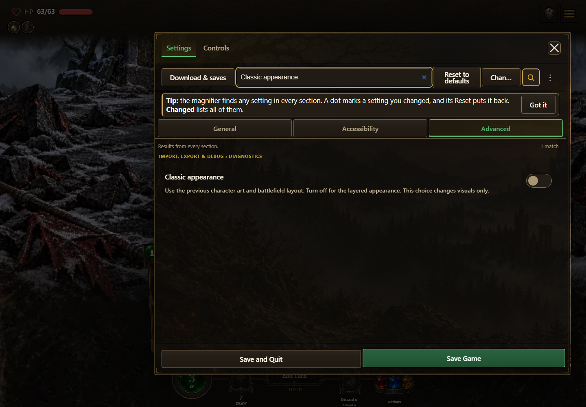
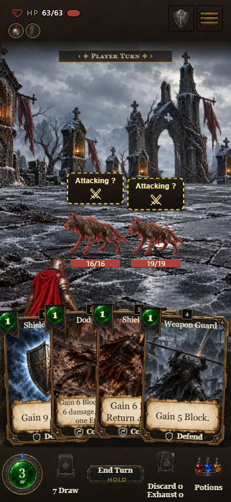

# Published appearance verification — 0.7.1.1167

The browser checked the [pinned Test build](https://cehinds.github.io/AshenSpire/test/1167/) after [publication 37890907828](https://github.com/cehinds/AshenSpire/actions/runs/37890907828) passed. All four development-channel badges were verified as **0.7.1.1167**. The same flow also passed on the latest alias before this pinned rerun; the curated report and images here use the pinned URL.

Source promotion: `4000288bef3bb0c6284ef30c66b9a7bfd2d03e4c`; canonical box **1167 / fe4bd6f5b5**. The report's `built` field is the checked-out reference box, rather than a value extracted from the browser. Publication assembly independently proves the served build identity. The capture time and image hashes are in `manifest.json`.

The existing appearance capture flow exited 0 and passed desktop 1440×1000 and phone 390×844, two card plays each, Classic switching with unchanged run/combat state, resize/restoration, hiding the control with debug off and both canned co-op appearances. There were no JavaScript exceptions or required-resource errors. The eight optional sound 404 probes listed in the report use the existing synthesis fallback. Canned co-op and desktop pointer input do not establish live LAN or physical-phone acceptance.





Run from a D: checkout of this branch:

```powershell
pwsh -File docs/qa/published-display-1167/capture.ps1
```

The wrapper adapts the existing [capture recipe](../../preview/display-appearance-0.7.1.1163/capture.mjs) to the pinned public URL, leaving its state/action/layout assertions intact. It only accommodates the public site's prefix for the same four optional sound names. Node and Edge/Chromium are required; set `CHROME` if needed. Outputs go under `.codex/published-display-qa` on D:. An alternative BaseUrl can be supplied explicitly; latest aliases can advance after capture. The historical 1163 gallery remains unchanged.

## Platform artifact comparison

`ci-digests/primary/` and `ci-digests/alternative/` preserve the three uploaded `build-digest-*` artifacts from [primary CI37887222210](https://github.com/cehinds/AshenSpire/actions/runs/37887222210) and [alternative CI37887468974](https://github.com/cehinds/AshenSpire/actions/runs/37887468974). Each snapshot has three nonempty files with nine identical rows; their union contains exactly nine unique rows, matching the workflow's comparison rule. The two snapshots also happen to produce the same bytes. This local comparison does not replace the workflow's final recorded result; see the [delivery status](../../ai/session-continuations/2026-10-08/pr-integration-delivery.md) for the formal outcome.
