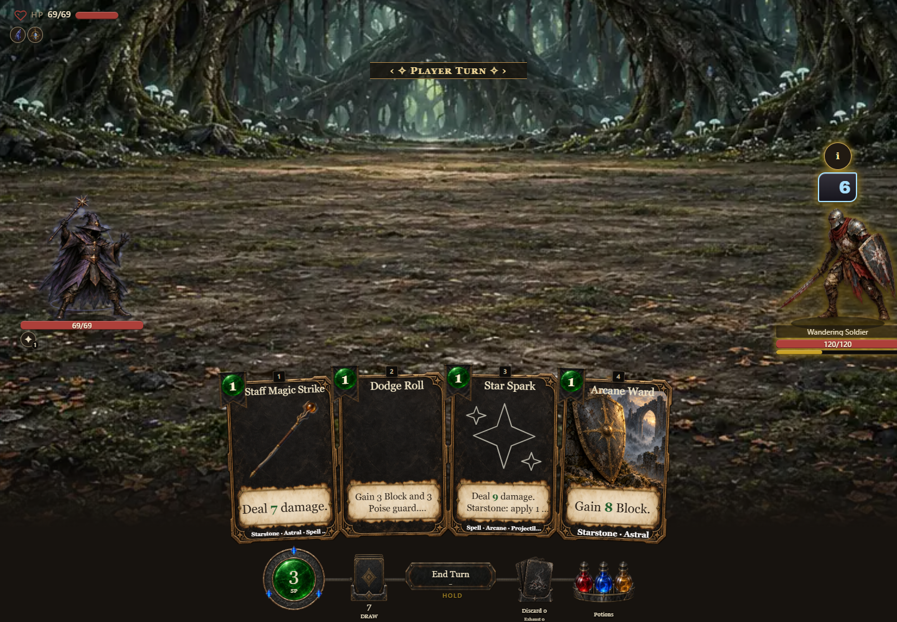
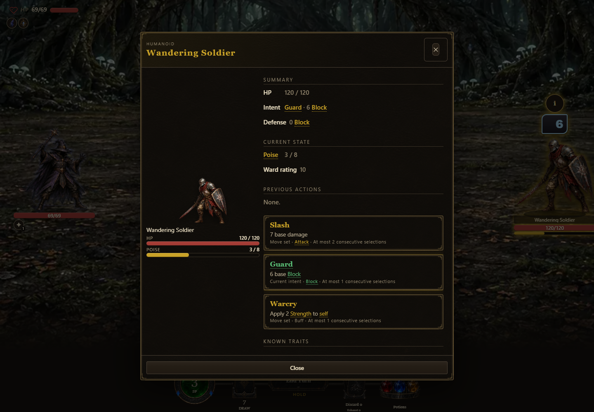
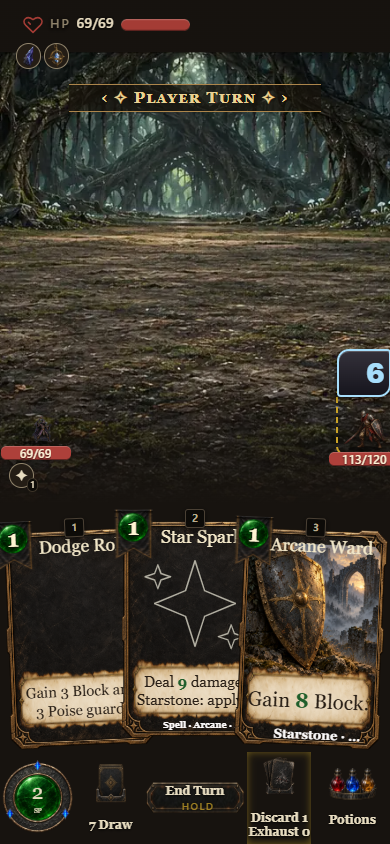

Shared-meter browser evidence for PR #1653. The deterministic source fixture uses the real `createRunCombat` and `mountCombat`, at desktop 1440×1000 and phone 390×844. It selects a fighter, opens its inspector, then plays Staff Magic Strike through the combat UI. `result.json` records the assertions and request/page-error checks. This is a bounded combat check; it does not claim a complete browser run.

