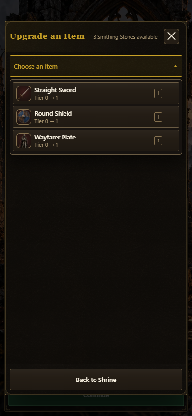
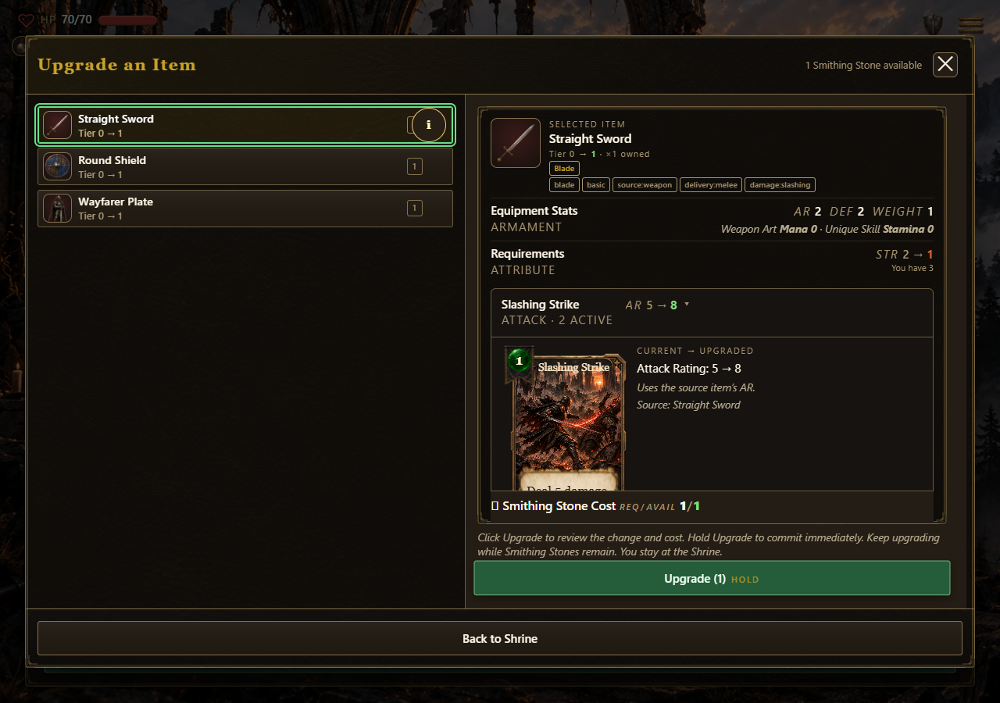
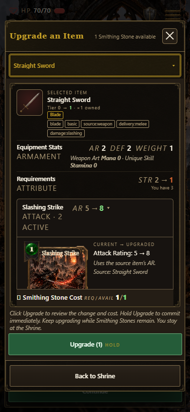

# Smith upgrade flow verification

PR #1675 implements the owner's October 6 request: open the item list immediately,
select an item with one press, expand every affected-card preview, and return to a
fresh item picker after each upgrade while Smithing Stones remain. The header
places the live purse before a single close glyph; Back spans the footer.

## Browser evidence

Edge was driven against the current-dev source checkout at 1280 × 900 and
390 × 844 (touch emulation). Both layouts passed:

- One press opens the modal and one press selects an item.
- Every affected-card row starts expanded; switching items restores that default.
- Canceling confirmation and closing the picker spend no stones.
- Three successive upgrades spend 3 → 2 → 1 → 0 and persist each upgrade.
- Each remaining-stone picker clears selection and displays the refreshed purse.
- The stone count ends before the close button; Back fills the footer.
- The close button draws one glyph (no generated duplicate), retains its 44 × 44
  hit target, closes in one press and restores focus to Upgrade an Item.
- Desktop keyboard Enter opens and selects; the page has no horizontal overflow.

Separate desktop fixtures verified normal one-use Shrine and shop entry paths,
two successive upgrades, persistence and final-stone exit behavior. No JavaScript
errors occurred. Existing optional holdTick_smithUpgrade.ogg and shrine.ogg
requests returned 404; these audio files are not introduced by this change.

## Automated checks and review

The nine focused smith/workspace tests passed. After updating the old two-tap
contract and fetching the pinned art release, all 75 tests across the previously
failing asset, music, book-art, card-interaction and component-catalog files plus
the new repeat-upgrade tests passed. The full initial runner passed 148 gates;
its test-discovery gate identified those missing assets and old contracts.

Self-review checked modal listener cleanup, no-spend cancel/exit, per-upgrade
persistence, fresh selection/tier/purse state, final-stone site behavior, current
dev's refined-stone display and disabled-action explanations. The shared co-op
presentation changes; its host-owned transaction rules are unchanged.

Physical touch/controller acceptance and independent review were not performed.
Build and final CI/promotion evidence belong to the PR.
