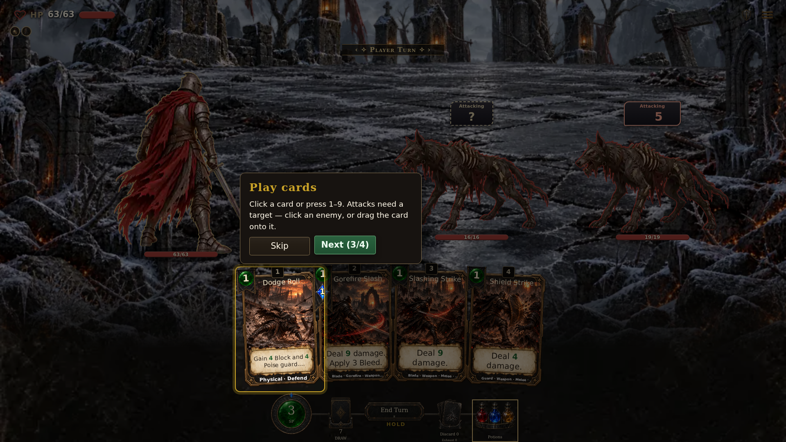

# Tagged combat in the alternative battlefield

Evidence for PR #1706. The isolated reconciliation retains the alternative branch’s figures, four-layer scenes, sprite fitting and shared idle carriers while integrating the primary combat rules. The authored UI overlaps were merged in combat.js, combat.css and the component catalog; the final registry-aware combat.js call is included.

All 897 alternative-only tree entries and their modes are preserved. Every one of the 266 runtime WebP exports was recovered from the existing alternative standalone artifact and verified against its pinned Git blob SHA before use. Archival and other binary entries retain their original repository SHAs.

| Check | Result |
| --- | --- |
| Focused combat, intent, equipment, targeting, typed receipts, Counter queues/source snapshots/fanout, ratings, alternative formation/motion and art tests | 133 passed, 0 failed |
| Real Chromium first-run tutorial and Escape ownership, latest source | 20 passed, 0 failed |
| Real Chromium tutorial reach at 1280×800 and the smallest supported viewport | 50 passed, 0 failed |
| Alternative battlefield idle, hit feedback and reduced-motion probe | 33 passed, 0 failed |
| Plant baseline | 425 sites; 22 known drifted; 46 unreadable; baseline matches |
| Combined changelog ordering | Passed |
| Light pack, portable bundle and current launcher aliases | Build passed; four aliases refreshed |

The first-run capture below was taken from the reconciled source at build 0.7.1.1078, before adding the #1706 receipt. It shows the custom battlefield, hidden and revealed enemy stances, and a tagged Defend card. The receipt and regenerated browser changelog produce the next derived build; they do not change the captured gameplay.

Five additional receipt regressions verify that typed damage components and Health shares sum to the final damage after guarded Smash, Counter reduction and retaliation, critical hits, immunity and zero-damage hits. These checks exercise the real attack/action pipeline. The receipt allocation fix changes reported component shares while retaining the same combat outcomes.

Eight Counter queue regressions cover solo and co-op replies that have already triggered before their source dies or is Staggered. Those interrupted replies no longer apply Health or listed Poise damage; ordinary typed riders remain queued, ordinary replies still resolve once, and a new Counter works after an earlier interruption. Forty rating tests include the same interruption behavior when a rating-driven break Staggers the player.

Eleven source-snapshot regressions verify that damage-less Counters retain their preparation-time equipment through payment and preparing hooks, later equipment swaps and save/reload. Hand overrides and explicit empty tags stay authoritative in solo and co-op. These Counter cases are not depicted in the first-run screenshot.

Five co-op fanout regressions verify that a Counter killing the acting enemy stops that enemy’s remaining seat targets and authored effects for physical damage, magical damage and direct Health loss. Living and merely Staggered sources still complete their current move, including both characters’ prepared Counters.



Commands run from the isolated source:

```sh
ASHEN_ART_SOURCE=cache node tools/launch.mjs --build-only
node --test tests/combat-card-profile.test.mjs tests/combat-intent-visibility.test.mjs tests/motion-probe-alternative.test.mjs tests/click-impact-card.test.mjs tests/combat-card-targets.test.mjs tests/alternative-formation.test.mjs tests/combat-matchups-live.test.mjs tests/combat-counter-defense.test.mjs tests/combat-card-equipment-ui.test.mjs tests/alternative-art.test.mjs tests/combat-tactical-receipts.test.mjs tests/combat-counter-queue.test.mjs tests/combat-ratings.test.mjs tests/combat-counter-sources.test.mjs tests/coop-counter-fanout.test.mjs
node tools/plantsites.mjs --check
node tools/about-changelog.mjs --check-order
ASHEN_ART_SOURCE=cache node tools/tutorial-reach.mjs --browser /tmp/ashen-headless/chrome-headless-shell-linux64/chrome-headless-shell --only 1280x800,smallest
ASHEN_ART_SOURCE=cache node tools/tutorial-reach.mjs --browser /tmp/ashen-headless/chrome-headless-shell-linux64/chrome-headless-shell --only first-run --screenshot alternative-first-run.png
ASHEN_ART_SOURCE=cache CHROME=/tmp/ashen-headless/chrome-headless-shell-linux64/chrome-headless-shell node tools/motion-probe.mjs
```

These browser checks use Chromium headless, English, Auto UI size, medium text, one Reaver character and solo combat. They do not establish touch, gamepad, other browsers, every text-size override or a rendered co-op battlefield. Focused engine/model tests cover co-op Counter ownership and intent concealment separately.

Architecture metadata is tied to the actual alternative merge candidate and final primary feature parent. Primary test ancestry is acquired later by routine promotion synchronization. Checkout-wide core checks require the candidate’s real Git graph; the source scaffold uses a faithful index of pinned leaf records.
