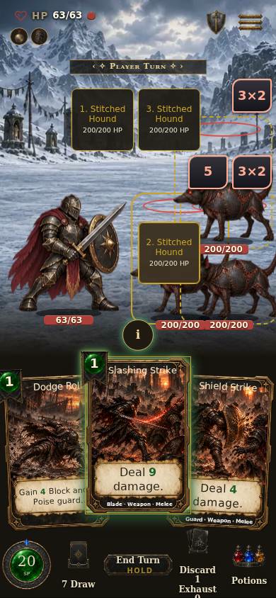
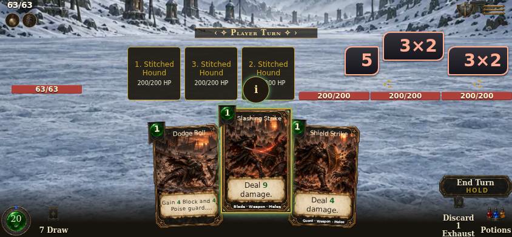
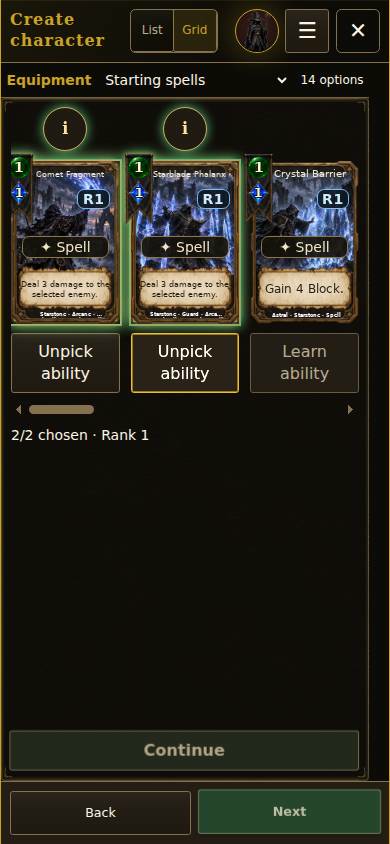
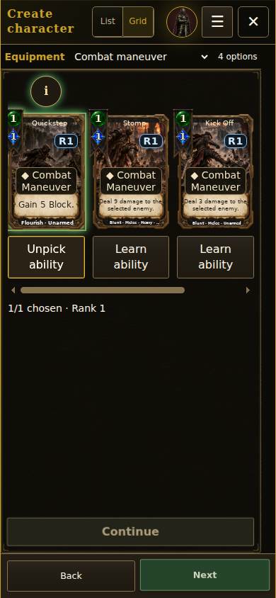
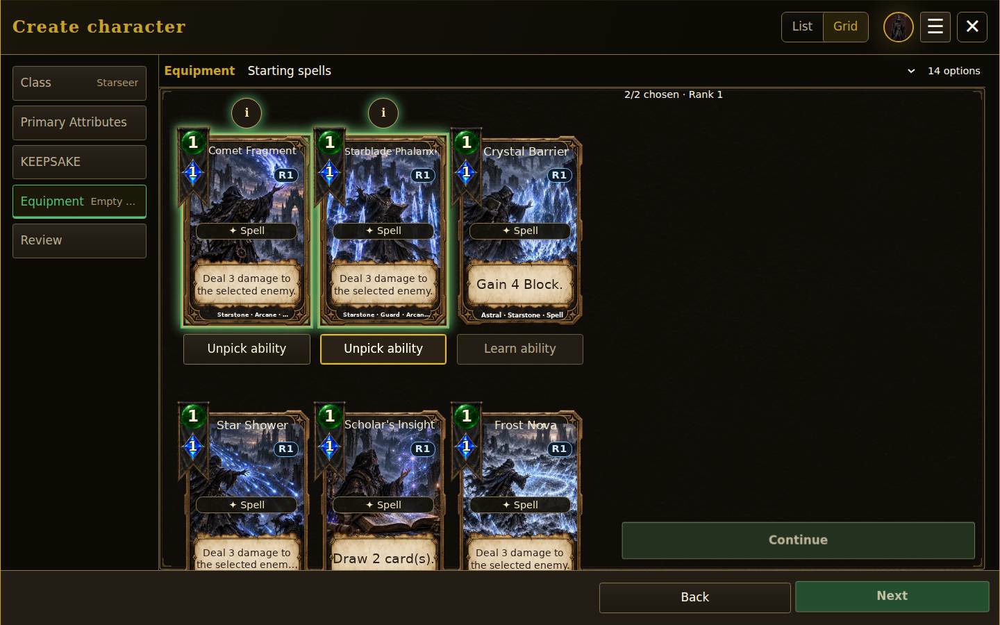

# Square targets and starting ability choices

PR #1703. Production Chromium screenshots at 390×844, 844×390 and 1440×900. SVG wrappers contain the captured JPEG screenshot pixels.

- Combat: 10 layouts, two/three foes, 44px minimum targets, square geometry, no button overlap, actual target input and wrong-side refusal.
- Creation: all four classes at phone/desktop size, required pick counts, undo picks, spell cap, actual newRun and saved Rank 1 deck. Reaver also empties both hands, reopens the maneuver pool and checks native disclosure open/close.
- Focused models: 15 passed. Lifecycle inventory: 14 passed.

