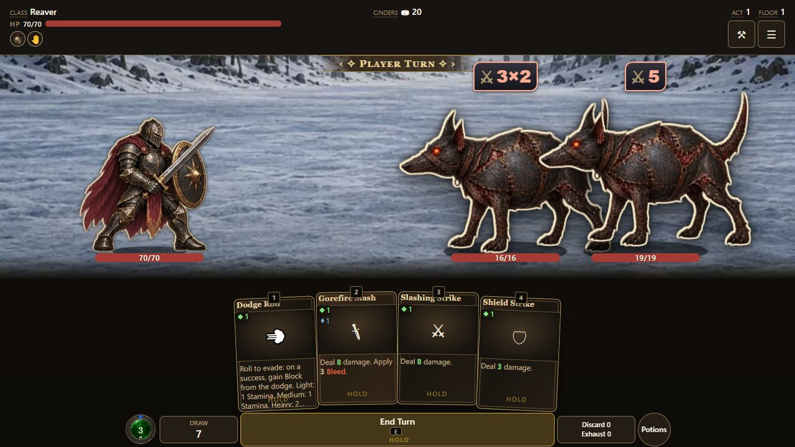
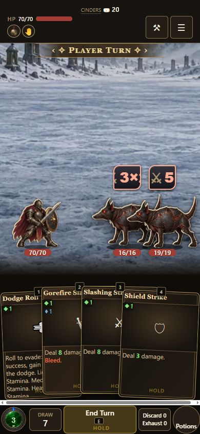
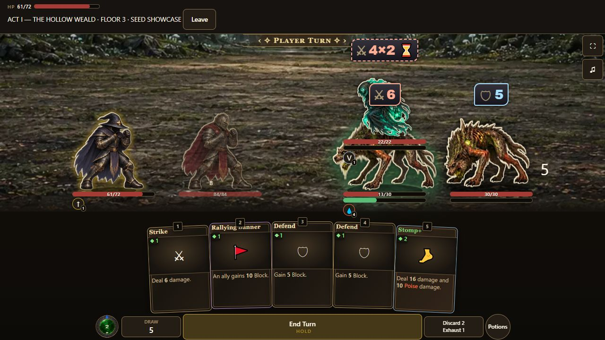

# Turn Stamina — October 3, 2026

Stamina replaces the separate action budget. New characters have a base of 3
Stamina for every class, plus independently floored contributions from DEX
(0.25), CON (0.25), WIS (0.2), INT (0.2), and each level after the first (0.1).
It refills at the beginning of each player turn;
unspent points and temporary gains do not carry into the next turn. Existing
turn-start bonuses and stagger penalties still apply. Mana remains separate.

Cards use their former action price as their Stamina price; the former
additional Stamina charge is removed from authored cards and upgrades. X
spends the remaining turn budget. Dodge retains its weight-priced Stamina
cost (1 Light, 1 Medium, 2 Heavy) with no additional action charge.

The top vitals bar shows HP; disabling Mana ring restores MP there. The combat footer and shared card renderer
use the former action diamond in green for Stamina. Card text, relic text,
cost tooltips, smithing labels and co-op affordability use the new vocabulary.
The former Actions settings and idle-Stamina recovery settings are retired
from the visible editor; their keys remain readable for imported settings.

## Compatibility

`cost`, `cost.action`, `gainEnergy`, `energySpent`, and related identifiers
remain compatibility names. On a live combat player, `energy` and `energyMax`
are accessors into `stamina` and `maxStamina`, so there is one mutable pool.
Snapshot restoration and transactional combat clones reinstall those
accessors. Both engines debit that pool once. Stamina card-upgrade tags modify
the same cost as legacy action tags.

Existing runs retain their snapshotted stat maxima. The base-3 default applies
to new runs. A resumed old combat carries its remaining action budget into
Stamina. Temporary overflow survives an exact combat save; the outer run's
persistent pool remains capped for save validation.

## Validation — integration receipt

Branch: `codex/turn-stamina-orb`, game PR #1530. Source preview evidence was
captured on commit `7604de170f783d980d807e7280cc9e1812bab929` plus the released
art-v7 pin/manifest adoption; the exact captured layout is committed in
`src/content/staminaOrb.js`. Later fixes preserve that approved composition.

- **PASS**: 121 engine checks, focused mechanics and orb tests, content/config
  generation, art-manifest checks, and UI copy/catalog checks.
- **PASS**: Codex in-app Chromium browser, source preview at localhost:8093,
  pointer input, 1280×720 desktop and 390×844 mobile viewport.
- **PASS**: Gorefire Slash spent 1 SP and 1 MP. Next turn restored SP to 3;
  spent MP stayed at 0. No captured JavaScript errors.
- **PASS**: co-op fixture showed 2/3 SP and 1/2 MP. Mana ring off restored
  the top MP bar. These are presentation fixtures, not a live LAN playthrough.
- **PASS**: original art masters and both runtime tiers were published in
  `hd-assets-v7`, with the three release-pack hashes pinned by the game.

Retained screenshots:

Packaged build and final CI status are recorded in PR #1530 and its build
receipt. This evidence does not claim physical-device or controller acceptance.