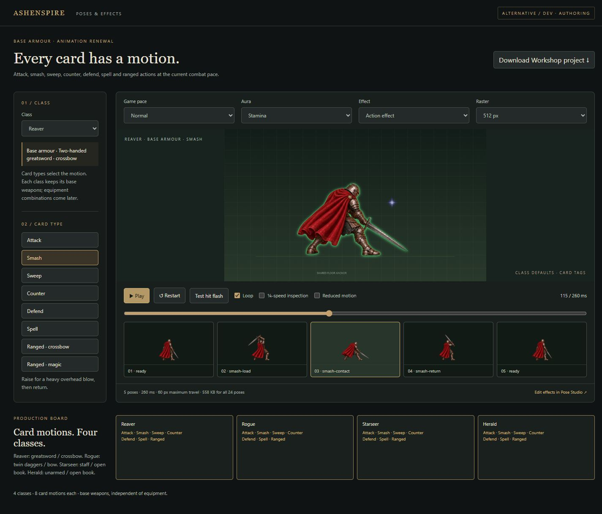

# Card-action review

Scope: class-default card animations in alternative/dev. Equipment combinations,
three stance families and new hurt/down drawings remain separate work.

All 90 exported poses were inspected in four contact sheets. Reaver retains the
continuous full cape; Rogue uses twin daggers and a left-held bow; Starseer has
an open left-hand book and upward right-hand staff; Herald uses fists and a
left-hand book. Source sheets and exact generation prompts accompany each set.

Browser evidence was captured from the source checkout at localhost:4329
(atelier) and localhost:4335 (game). A real Slashing Strike reduced a target
from 16 to 7 HP and the Reaver returned to ready. Desktop class previews,
160 ms Fast playback, reduced-motion suppression and a 390x844 phone preview
were checked. A two-seat co-op screenshot state loaded both class renderers;
seat switching and phone fitting were inspected. This is not a networked
co-op playthrough or owner/device acceptance.

Focused tests cover resolved tag objects, equipment-independent routing,
pose/effect projects, timing, interruption, hit masking, failure/Retry and
preview pause/disposal. All 180 exported runtime images match their recorded
hashes through the alternative common-pack loader. Full build and repository
checks are recorded on PR #1727; no test/release promotion is requested.

Self-review corrected a tag-object mismatch, removed a renderer/effects import
cycle, restored failed-image Retry and extended co-op's phone fitting rule to
the new canvas stage. Existing gameplay, card damage and costs are unchanged.
